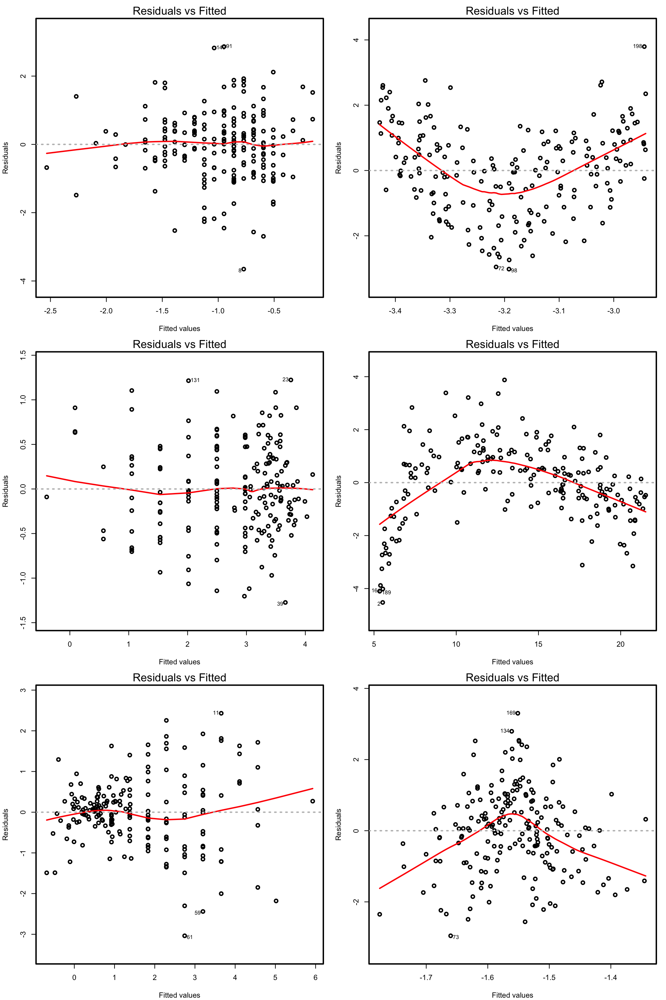
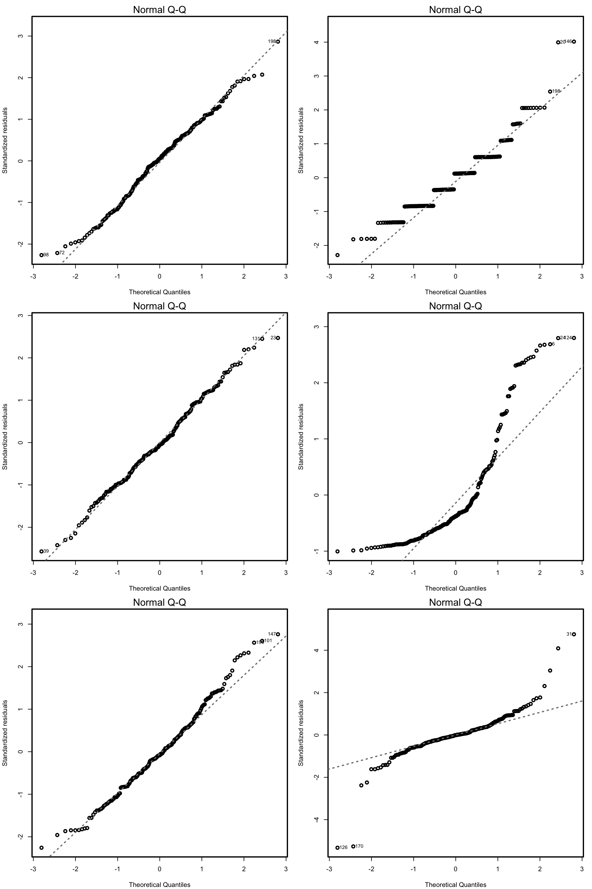
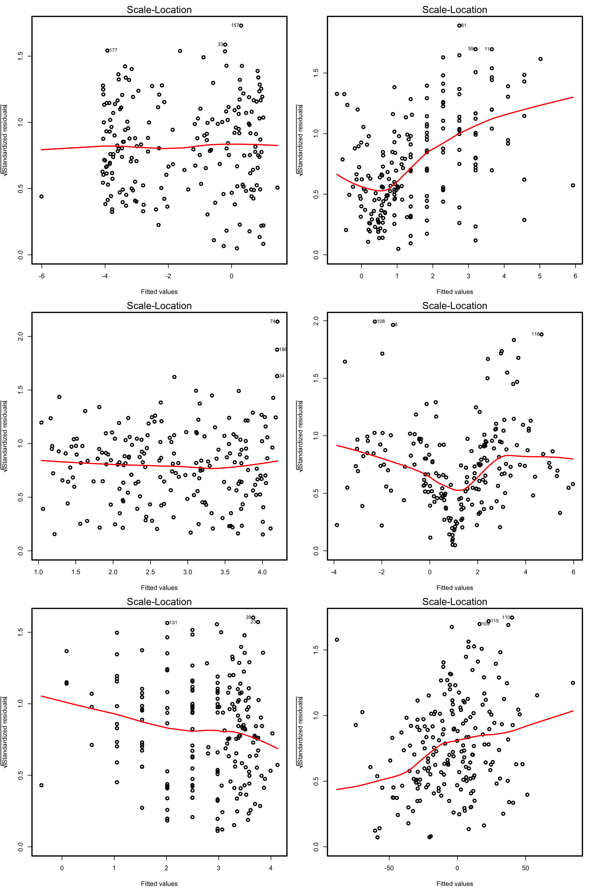
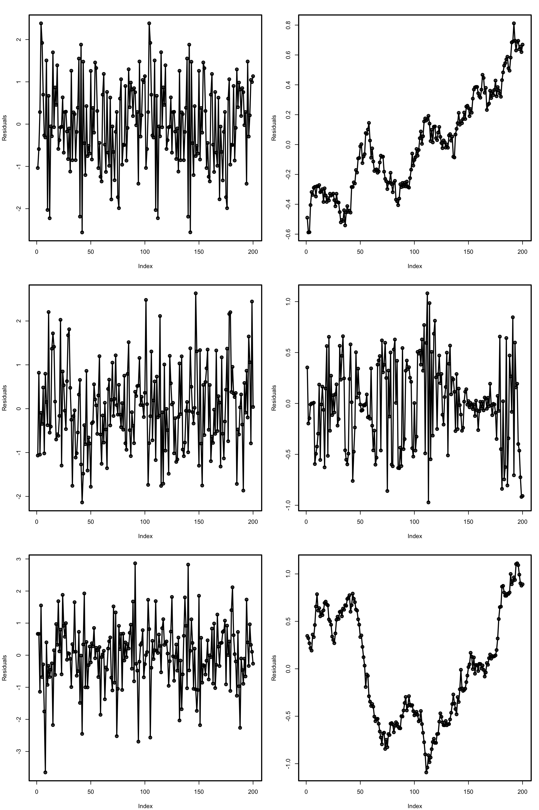

# Linear models II: model selection, extensions, and diagnostics {#lm-ii}

Given the response $Y$ and the predictors $X_1,\ldots,X_p$, many linear models can be build for predicting and explaining $Y$. In this chapter we will see how to address the problem of selecting the *best subset of predictors* $X_1,\ldots,X_p$ for explaining $Y$. Among others, we will also see how to extend the linear model to account for nonlinear relations between $Y$ and $X_1,\ldots,X_p$, and how to check whether the assumptions of the model are realistic in practice.

## Case study: *Housing values in Boston* {#lm-ii-lab-boston}

This case study is motivated by @Harrison1978, who proposed an *hedonic model* for determining the willingness of house buyers to pay for clean air. An hedonic model is a model that decomposes the price of an item into separate components that determine its price. For example, an hedonic model for the price of a house may decompose its price into the house characteristics, the kind of neighborhood, and the location. The study of @Harrison1978 employed data from the Boston metropolitan area, containing 560 suburbs and 14 variables. The `Boston` dataset is available through the file `Boston.xlsx` file ([download](https://raw.githubusercontent.com/egarpor/PM-UC3M/master/datasets/Boston.xlsx)) and through the dataset `Boston` in the `MASS` package.

The description of the related variables can be found in `?Boston` and @Harrison1978^[But be aware of the changes in units for `medv`, `black`, `lstat`, and `nox`.], but we summarize here the most important ones as they appear in `Boston`. They are aggregated into five topics:

- *Dependent* variable: `medv`, the median value of owner-occupied homes (in thousands of dollars).
- *Structural* variables indicating the house characteristics: `rm` (average number of rooms "in owner units") and `age` (proportion of owner-occupied units built prior to 1940).
- *Neighborhood* variables: `crim` (crime rate), `zn` (proportion of residential areas), `indus` (proportion of non-retail business area), `chas` (river limitation), `tax` (cost of public services in each community), `ptratio` (pupil-teacher ratio), `black` (variable $1000(B - 0.63)^2$, where $B$ is the black proportion of population -- low and high values of $B$ increase housing prices) and `lstat` (percent of lower status of the population).
- *Accesibility* variables: `dis` (distances to five Boston employment centers) and `rad` (accessibility to radial highways -- larger index denotes better accessibility).
- *Air pollution* variable: `nox`, the annual concentration of nitrogen oxide (in parts per ten million).

We begin by importing the data:
```{r, case2-1, echo = FALSE, collapse = TRUE, cache = TRUE}
library(readxl)
Boston <- read_excel(path = "datasets/Boston.xlsx", sheet = 1, col_names = TRUE)
```
```{r, case2-2, echo = TRUE, collapse = TRUE, cache = TRUE, eval = FALSE}
# Read data
library(readxl)
Boston <- read_excel(path = "Boston.xlsx", sheet = 1, col_names = TRUE)
```
A summary of the data is shown below:
```{r, case2-3, echo = TRUE, collapse = TRUE, cache = TRUE}
summary(Boston)
```

The two goals of this case study are:

- Q1. *Quantify the influence of the predictor variables in the housing prices.*
- Q2. *Obtain the "best possible" model for decomposing the housing prices and interpret it.*

We begin by making an exploratory analysis of the data with a matrix scatterplot. Since the number of variables is high, we opt to plot only five variables: `crim`, `dis`, `medv`, `nox`, and `rm`. Each of them represents the five topics in which variables were classified.

(ref:scat2title) Scatterplot matrix for `crim`, `dis`, `medv`, `nox`, and `rm` from the `Boston` dataset.

```{r, scat2, collapse = TRUE, out.width = '70%', fig.asp = 1, fig.pos = 'h!', fig.cap = '(ref:scat2title)', cache = TRUE}
scatterplotMatrix(~ crim + dis + medv + nox + rm, reg.line = lm, smooth = FALSE,
                  spread = FALSE, span = 0.5, ellipse = FALSE, levels = c(.5, .9),
                  id.n = 0, diagonal = 'density', data = Boston)
```
The diagonal panels are showing an estimate of the unknown density of each variable. Note the peculiar distribution of `crim`, very concentrated at zero, and the asymmetry in `medv`, with a second mode associated to the most expensive properties. Inspecting the individual panels, it is clear that some nonlinearity exists in the data and that some predictors are going to be more important than others (recall that we have plotted just a subset of all the predictors).

## Model selection {#lm-ii-modsel}

In Chapter \@ref(lm-i) we briefly saw that **the inclusion of more predictors is not for free**: there is a price to pay in terms of more variability on the coefficients estimates, harder interpretation, and possible inclusion of highly-dependent predictors. Indeed, there is a **maximum number of predictors $p$** that can be considered in a linear model for a sample size $n$: **$p\leq n-2$**. Or equivalently, there is a **minimum sample size $n$** required for fitting a model with $p$ predictors: **$n\geq p + 2$**.

The interpretation of this fact is simple if we think on the geometry for $p=1$ and $p=2$:

- If $p=1$, we need at least $n=2$ points to fit uniquely a line. However, this line gives no information on the vertical variation around it and hence $\hat\sigma^2$ can not be estimated (applying its formula, we would have $\hat\sigma^2=\infty$). Therefore we need at least $n=3$ points, or in other words $n\geq p + 2=3$.
- If $p=2$, we need at least $n=3$ points to fit uniquely a plane. But this plane gives no information on the variation of the data around it and hence $\hat\sigma^2$ can not be estimated. Therefore we need $n\geq p + 2=4$.

Another interpretation is the following:

> The fitting of a linear model with $p$ predictors involves the estimation the $p+2$ parameters $(\boldsymbol{\beta},\sigma^2)$ from $n$ data points. The closer $p+2$ and $n$ are, the more variable the estimates $(\hat{\boldsymbol{\beta}},\hat\sigma^2)$ will be, since less information is available for estimating each one. In the limit case $n=p+2$, each sample point determines a parameter estimate.

The *degrees of freedom* $n-p-1$ quantify the increasing on the variability of $(\hat{\boldsymbol{\beta}},\hat\sigma^2)$ when $n-p-1$ decreases. For example:

- $t_{n-p-1;\alpha/2}$ appears in \@ref(eq:normp2) and influences the length of the CIs for $\beta_j$, see \@ref(eq:cip). It also influences the length of the CIs for the prediction. As Figure \@ref(fig:dft) shows, when the degrees of freedom $n-p-1$ decrease, $t_{n-p-1;\alpha/2}$ increases, thus the intervals become wider.
- $\hat\sigma^2=\frac{1}{n-p-1}\sum_{i=1}^n\hat\varepsilon_i^2$ influences the $R^2$ and $R^2_\text{Adj}$. If no relevant variables are added to the model then $\sum_{i=1}^n\hat\varepsilon_i^2$ will not change substantially. However, the reducing factor $\frac{1}{n-p-1}$ will decrease as $p$ augments, inflating $\hat\sigma^2$ and its variance. This is exactly what happened in Figure \@ref(fig:R2).

```{r, dft, echo = FALSE, warning = FALSE, results = 'hide', out.width = '70%', fig.show = 'hold', fig.asp = 1, fig.pos = 'h!', fig.cap = 'Effect of $\\text{df}=n-p-1$ in $t_{\\text{df};\\alpha/2}$ for $\\alpha=0.10,0.05,0.01$.', cache = TRUE}
df <- 1:30
alpha <- 0.10
plot(df, qt(p = alpha/2, df = df, lower.tail = FALSE), type = "o",
     xlab = expression(df), ylab = expression(t[df * ";" * alpha/2]),
     ylim = c(0, 10), col = rainbow(3)[1], pch = 16)
alpha <- 0.05
lines(df, qt(p = alpha/2, df = df, lower.tail = FALSE), col = rainbow(3)[2],
      type = "o", pch = 16)
alpha <- 0.01
lines(df, qt(p = alpha/2, df = df, lower.tail = FALSE), col = rainbow(3)[3],
      type = "o", pch = 16)
legend("topright", lwd = 2, col = rainbow(3),
       legend = expression(alpha == 0.10, alpha == 0.05, alpha == 0.01))
```

Now that we have added more light into the problem of having an excess of predictors, we turn the focus into **selecting the most adequate predictors for a multiple regression model**. This is a challenging task without a unique solution, and what is worse, without a method that is guaranteed to work in all the cases. However, there is a well-established procedure that usually gives good results: the **stepwise model selection**. Its principle is to compare multiple linear regression models with different predictors (and, of course, with the same responses).

Before introducing the method, we need to understand what is an **information criterion**. An information criterion balances the fitness of a model with the number of predictors employed. Hence, it determines objectively the best model as the one that *minimizes the information criterion*. Two common criteria are the *Bayesian Information Criterion* (BIC) and the *Akaike Information Criterion* (AIC). Both are based on a **balance between the model fitness and its complexity**:
\begin{align}
\text{BIC}(\text{model}) = \underbrace{-2\log\ell(\text{model})}_{\text{Model fitness}} + \underbrace{\text{npar(model)}\times\log n}_{\text{Complexity}}, (\#eq:bic)
\end{align}
where $\ell(\text{model})$ is the *likelihood of the model* (how well the model fits the data) and $\text{npar(model)}$ is the number of parameters of the model, $p+2$ in the case of a multiple linear regression model with $p$ predictors. The AIC replaces $\log n$ by $2$ in \@ref(eq:bic) so, compared with BIC, it **penalizes less the more complex models** (recall that $\log n>2$ if $n\geq8$). This is one of the reasons why BIC is preferred by some practitioners for model comparison. Also, because is *consistent* in selecting the true model: if enough data is provided, the BIC is guaranteed to select the data-generating model among a list of candidate models.

The BIC and AIC can be computed in `R` through the functions `BIC` and `AIC`. They take a model as the input.
```{r, case2-4, collapse = TRUE, cache = TRUE}
# Two models with different predictors
mod1 <- lm(medv ~ age + crim, data = Boston)
mod2 <- lm(medv ~ age + crim + lstat, data = Boston)

# BICs
BIC(mod1)
BIC(mod2) # Smaller -> better

# AICs
AIC(mod1)
AIC(mod2) # Smaller -> better

# Check the summaries
summary(mod1)
summary(mod2)
```

Let's go back to the selection of predictors. If we have $p$ predictors, a naive procedure would be to check *all the possible* models that can be constructed with them and then select the best one in terms of BIC/AIC. This is the so-called *best subset selection*. The problem is that there are $2^{p+1}$ possible models! Fortunately, the `stepAIC` procedure helps us navigating this ocean of models by iteratively adding useful predictors and removing the non important ones. The function takes as input a *model employing all the available predictors*. Let's see how it works with the already studied `wine` dataset.
```{r, case2-5, echo = FALSE, collapse = TRUE, cache = TRUE}
wine <- read.csv(file = "datasets/wine.csv", header = TRUE)
```
```{r, case2-6, collapse = TRUE, cache = TRUE, eval = FALSE}
# Load data - notice that "Year" is also included
wine <- read.csv(file = "wine.csv", header = TRUE)
```
`stepAIC` takes the argument `k` as $2$ (default) or $\log n$, where $n$ is the sample size. With `k = 2` it uses the AIC criterion and with `k = log(n)` it considers the BIC. 
```{r, bic-1, collapse = TRUE, cache = TRUE}
# Full model
mod <- lm(Price ~ ., data = wine)

# With BIC
modBIC <- stepAIC(mod, k = log(nrow(wine)))
summary(modBIC)

# With AIC
modAIC <- stepAIC(mod, k = 2)
summary(modAIC)
```

Note that the selected models `modBIC` and `modAIC` are equivalent to the `modWine2` we selected in Section \@ref(lm-i-modfit-case) as the best model. This is an illustration that the model selected by `stepAIC` is often a good starting point for further additions or deletions of predictors. 

```{block, tipstep, type = 'rmdtip', cache = TRUE}
When applying `stepAIC` for BIC/AIC, different final models might be selected depending on the choice of `direction`. This is the interpretation:

- `"backward"`: starts from the full model, *removes* predictors sequentially.
- `"forward"`: starts from the simplest model, *adds* predictors sequentially.
- `"both"` (default): combination of the above.

The **advice** is to try several of these methods and retain the one with minimum BIC/AIC. Set `trace = 0` to omit lengthy outputs of information of the search procedure.
```

Further options with `stepAIC`:
```{r, bic-2, collapse = TRUE, cache = TRUE}
# Different search directions and omitting the trace,
# gives only the final model
modAICFor <- stepAIC(mod, trace = 0, direction = "forward")
modAICBack <- stepAIC(mod, trace = 0, direction = "backward")
modAICFor
modAICBack
```

```{block2, caustepaic, type = 'rmdcaution', cache = TRUE}
`stepAIC` assumes that no `NA`'s (missing values) are present in the data. It is advised to remove the missing values in the data before. Their presence might lead to errors. To do so, employ `data = na.omit(dataset)` in the call to `lm` (if your dataset is `dataset`). Also, see Appendix \@ref(app-nas).
```

We conclude highlighting a caveat on the use of the BIC and AIC: they are constructed assuming that the sample size $n$ is much larger than the number of parameters in the model ($p+2$). Therefore, they will work reasonably well if $n>>p+2$, but if this is not true they may favor unrealistic complex models. An illustration of this phenomena is Figure \@ref(fig:bic), which is the BIC/AIC version of Figure \@ref(fig:R2) for the experiment done in Section \@ref(lm-i-anova). The BIC and AIC curves tend to have local minimums close to $p=2$ and then increase. But when $p+2$ gets close to $n$, they quickly drop down. Note also how the BIC penalizes more the complexity than the AIC, which is more flat.

(ref:bictitle) Comparison of BIC and AIC for $n=200$ and $p$ ranging from $1$ to $198$. $M=100$ datasets were simulated with **only the first two** predictors being significant. The thicker curves are the mean of each color's curves.

```{r, bic, echo = FALSE, out.width = '70%', fig.pos = 'h!', fig.cap = '(ref:bictitle)', fig.show = 'hold', cache = TRUE}
knitr::include_graphics("images/R/BICandAIC.png")
```

### Case study application {#lm-ii-modsel-case}

We want to build a linear model for predicting and explaining `medv`. There are a good number of predictors and some of them might be of little use for predicting `medv`. However, there is no clear intuition of which predictors will yield better explanations of `medv` with the information at hand. Therefore, we can start by doing a linear model on *all* the predictors:
```{r, case2-7, collapse = TRUE, cache = TRUE}
modHouse <- lm(medv ~ ., data = Boston)
summary(modHouse)
```
There are a couple of non significant variables, but so far the model has an $R^2=0.74$ and the fitted coefficients are sensible with what it would be expected. For example, `crim`, `tax`, `ptratio`, and `nox` have negative effects on `medv`, while `rm`, `rad`, and `chas` have positive. However, the non significant coefficients are not significantly the model, but only adding artificial noise and decreasing the overall accuracy of the coefficient estimates.

Let's polish a little bit the previous model. Instead of removing manually each non significant variable to reduce the complexity, we employ `stepAIC` for selecting a candidate *best model*:
```{r, case2-8, collapse = TRUE, cache = TRUE}
# Best models
modBIC <- stepAIC(modHouse, k = log(nrow(Boston)))
modAIC <- stepAIC(modHouse, trace = 0, k = 2)

# Comparison
compareCoefs(modBIC, modAIC)
summary(modBIC)

# Confidence intervals
confint(modBIC)
```
Note how the $R^2_\text{Adj}$ has slightly increased with respect to the full model and how all the predictors are significant. Note also that `modBIC` and `modAIC` are the same.

We have quantified the influence of the predictor variables in the housing prices (Q1) and we can conclude that, in the final model (Q2) and with confidence level $\alpha=0.05$:

- `chas`, `age`, `rad`, and `black` have a **significantly positive** influence on `medv`.
- `nox`, `dis`, `tax`, `pratio`, and `lstat` have a **significantly negative** influence on `medv`.

```{block2, exadddrop, type = 'rmdexercise', cache = TRUE}
The `MASS` functions `addterm` and `dropterm` allow to add and remove all individual predictors to a given mode, and inform the BICs / AICs of the possible combinations. Check that:
- `modBIC` can not be improved in terms of BIC by removing predictors. Use `dropterm(modBIC, k = log(nobs(modBIC)))` for that.
- `modBIC` can not be improved in terms of BIC by adding predictors. Use `addterm(modBIC, scope = lm(medv ~ ., data  = Boston), k = log(nobs(modBIC)))` for that. `scope` must specify the maximal model or formula^[However, be careful because `addterm(modBIC, scope = medv ~ ., k = log(nobs(modBIC)))` will understand that `.` refers to all the predictors *in* `modBIC`, not in the `Boston` dataset, and will return an error. Calling `addterm(modBIC, scope = medv ~ . + indus + age, k = log(nobs(modBIC)))` gives the required result, at expenses of manually adding the remaining predictors.] to compare additions with.

```

## Use of qualitative predictors {#lm-ii-qualpred}

An important situation not covered so far is how to deal with *qualitative*, and not *quantitative*, predictors. Qualitative predictors, also known as *categorical* variables or, in `R`'s terminology, *factors*, are very common, for example in social sciences. Dealing with them requires some care and proper understanding of how these variables are represented.

The simplest case is the situation with **two levels**. A binary variable $C$ with two levels (for example, *a* and *b*) can be represented as
\[
D=\left\{\begin{array}{ll}
1,&\text{if }C=b,\\
0,&\text{if }C=a.
\end{array}\right.
\]
$D$ now is a *dummy variable*: it codifies with zeros and ones the two possible levels of the categorical variable. An example of $C$ could be *gender*, which has levels *male* and *female*. The dummy variable associated is $D=0$ if the gender is male and $D=1$ if the gender is female.

The advantage of this *dummification* is its interpretability in regression models. Since level *a* corresponds to $0$, it can be seen as the *reference level* to which level *b* is compared. This is the key point in dummification: **set one level as the reference and codify the rest as departures from it** with ones.

The previous interpretation translates easily to the linear model. Assume that the dummy variable $D$ is available together with other predictors $X_1,\ldots,X_p$. Then:
\[
\mathbb{E}[Y|X_1=x_1,\ldots,X_p=x_p,D=d]=\beta_0+\beta_1X_1+\ldots+\beta_pX_p+\beta_{p+1}D.
\]
The coefficient associated to $D$ is easily interpretable. $\beta_{p+1}$ is the increment in mean of $Y$ associated to changing $D=0$ (reference) to $D=1$, while the rest of the predictors are fixed. Or in other words, $\beta_{p+1}$ is the increment in mean of $Y$ associated to changing of the level of the categorical variable from *a* to *b*.

`R` does the dummification automatically (translates a categorical variable $C$ into its dummy version $D$) if it detects that a factor variable is present in the regression model. 

Let's see now the case with **more than two levels**, for example, a categorical variable $C$ with levels *a*, *b*, and *c*. If we take *a* as the reference level, this variable can be represented by *two* dummy variables:
\[
D_1=\left\{\begin{array}{ll}1,&\text{if }C=b,\\0,& \text{if }C\neq b\end{array}\right.
\]
and
\[
D_2=\left\{\begin{array}{ll}1,&\text{if }C=c,\\0,& \text{if }C\neq c.\end{array}\right.
\]
Then $C=a$ is represented by $D_1=D_2=0$, $C=b$ is represented by $D_1=1,D_2=0$ and $C=c$ is represented by $D_1=0,D_2=1$. The interpretation of the regression models with the presence of $D_1$ and $D_2$ is the very similar to the one before. For example, for the linear model, the coefficient associated to $D_1$ gives the increment in mean of $Y$ when the category of $C$ changes from *a* to *b*. The coefficient for $D_2$ gives the increment in mean of $Y$ when it changes from *a* to *c*.

In general, if we have a categorical variable with $J$ levels, then the number of dummy variables required is $J-1$. Again, `R` does the dummification automatically for you if it detects that a factor variable is present in the regression model. Let's see an example with the `iris` dataset.

```{r, qua, collapse = TRUE, cache = TRUE}
# Load the iris dataset - factors in the last column
data(iris)
summary(iris)

# Summary of a linear model
mod1 <- lm(Sepal.Length ~ ., data = iris)
summary(mod1)
# Speciesversicolor (D1) coefficient: -0.72356. The average increment of
# Sepal.Length when the species is versicolor instead of setosa (reference)
# Speciesvirginica (D2) coefficient: -1.02350. The average increment of
# Sepal.Length when the species is virginica instead of setosa (reference)
# Both dummy variables are significant

# How to set a different level as reference (versicolor)
iris$Species <- relevel(iris$Species, ref = "versicolor")

# Same estimates except for the dummy coefficients
mod2 <- lm(Sepal.Length ~ ., data = iris)
summary(mod2)
# Speciessetosa (D1) coefficient: 0.72356. The average increment of
# Sepal.Length when the species is setosa instead of versicolor (reference)
# Speciesvirginica (D2) coefficient: -0.29994.s The average increment of
# Sepal.Length when the species is virginica instead of versicolor (reference)
# Both dummy variables are significant

# Coefficients of the model
confint(mod2)
# The coefficients of Speciesversicolor and Speciesvirginica are significantly negative

# Show the dummy variables employed for encoding a factor
contrasts(iris$Species)
iris$Species <- relevel(iris$Species, ref = "setosa")
contrasts(iris$Species)
```

```{block, insdummy, type = 'rmdinsight', cache = TRUE}
It may happen that one dummy variable, say $D_1$ is not significant, while other dummy variables, say $D_2$, are significant. For example, this happens in the example above at level $\alpha=0.01$. 
```

```{block, caucateg, type = 'rmdcaution', cache = TRUE}
**Do not codify a categorical variable as a discrete variable**. This constitutes a major methodological fail that will flaw the subsequent statistical analysis.

For example if you have a categorical variable `party` with levels `partyA`, `partyB`, and `partyC`, do not encode it as a discrete variable taking the values `1`, `2`, and `3`, respectively. If you do so:

- You assume implicitly an order in the levels of `party`, since `partyA` is closer to `partyB` than to `partyC`.
- You assume implicitly that `partyC` is three times larger than `partyA`.
- The codification is completely arbitrary -- why not considering `1`, `1.5`, and `1.75` instead of?

The right way of dealing with categorical variables in regression is to set the variable as a factor and let `R` do internally the dummification.
```

### Case study application {#lm-ii-qualpred-case}

Let's see what are the dummy variables in the `Boston` dataset and what effect they have in `medv`.

```{r, case2-9, collapse = TRUE, cache = TRUE}
# Load the Boston dataset
library(MASS)
data(Boston)

# Structure of the data
str(Boston)
# chas is a dummy variable measuring if the suburb is close to the river (1)
# or not (0). In this case it is not codified as a factor but as a 0 or 1
# (so it is already dummyfied)

# Summary of a linear model
mod <- lm(medv ~ chas + crim, data = Boston)
summary(mod)
# The coefficient associated to chas is 5.57772. That means that if the suburb
# is close to the river, the mean of medv increases in 5.57772 units for 
# the same house and neighborhood conditions
# chas is significant (the presence of the river adds a valuable information
# for explaining medv)

# Summary of the best model in terms of BIC
summary(modBIC)
# The coefficient associated to chas is 2.71871. If the suburb is close to 
# the river, the mean of medv increases in 2.71871 units
# chas is significant as well in the presence of more predictors
```

We will see how to mix dummy and quantitative predictors in Section \@ref(lm-ii-nonlin-ints).

## Nonlinear relationships {#lm-ii-nonlin}

### Transformations in the simple linear model {#lm-ii-nonlin-simp}

The linear model is termed *linear* not because the regression curve is a plane, but because *the effects of the **parameters** are linear*. Indeed, the predictor $X$ may exhibit a nonlinear effect on the response $Y$ and still be a linear model! For example, the following models can be transformed into simple linear models:

  1. $Y=\beta_0+\beta_1X^2+\varepsilon$
  2. $Y=\beta_0+\beta_1\log(X)+\varepsilon$
  3. $Y=\beta_0+\beta_1(X^3-\log(|X|) + 2^{X})+\varepsilon$

The trick is to work with the transformed predictors ($X^2$, $\log(X)$, ...), instead of with the original predictor $X$. Then, rather than working with the sample $(X_1,Y_1),\ldots,(X_n,Y_n)$, we consider the transformed sample $(\tilde X_1,Y_1),\ldots,(\tilde X_n,Y_n)$ with (for the above examples):

  1. $\tilde X_i=X_i^2$, $i=1,\ldots,n$.
  2. $\tilde X_i=\log(X_i)$, $i=1,\ldots,n$.
  3. $\tilde X_i=X_i^3-\log(|X_i|) + 2^{X_i}$, $i=1,\ldots,n$.

An example of this simple but powerful trick is given as follows. The left panel of Figure \@ref(fig:quadratic) shows the scatterplot for some data `y` and  `x`, together with its fitted regression line. Clearly, the data does not follow a linear pattern, but a nonlinear one, similar to a parabola $y=x^2$. Hence, `y` might be better explained by the *square* of `x`, `x^2`, rather than by `x`. Indeed, if we plot `y` against `x^2` in the right panel of Figure \@ref(fig:quadratic), we can see that the relation of `y` and `x^2` is now linear!

```{r, quadratic, echo = FALSE, out.width = '45%', fig.show = 'hold', fig.asp = 1, fig.pos = 'h!', fig.cap = 'Left: quadratic pattern when plotting $Y$ against $X$. Right: linearized pattern when plotting $Y$ against $X^2$. In red, the fitted regression line.', cache = TRUE}
set.seed(345607)
x <- round(seq(-2, 5, l = 50), 1)
y <- round(0.5 * x^2 + rnorm(50), 1)
mod1 <- lm(y ~ x)
plot(x, y, pch = 16)
abline(mod1$coefficients, col = 2, lwd = 2)
mod2 <- lm(y ~ I(x^2))
plot(x^2, y, xlab = "x^2", pch = 16)
abline(mod2$coefficients, col = 2, lwd = 2)
```

In conclusion, with a simple trick we have increased drastically the explanation of the response. However, there is a catch: knowing which transformation is required in order to linearise the relation between response and the predictor is a kind of art which requires some good eye. One first approach is to consider one of the usual transformations, which are displayed in Figure \@ref(fig:nonlineartransf), depending on the pattern of the data. Figure \@ref(fig:transf) illustrates how to choose an adequate transformation for linearizing nonlinear data patterns.

```{r, nonlineartransf, echo = FALSE, warning = FALSE, results = 'hide', out.width = '45%', fig.show = 'hold', fig.asp = 1, fig.pos = 'h!', fig.cap = 'Some common nonlinear transformations and their negative counterparts. Recall the domain of definition of each transformation.', cache = TRUE}
x <- seq(-2, 5, l = 200)
plot(x, x, xlab = "x", ylab = "y", type = "l", col = 1, lwd = 2)
lines(x, x^2, col = 2, lwd = 2)
lines(x, x^3, col = 3, lwd = 2)
lines(x, sqrt(x), col = 4, lwd = 2)
lines(x, exp(x), col = 5, lwd = 2)
lines(x, exp(-x), col = 6, lwd = 2)
lines(x, log(x), col = 7, lwd = 2)
legend("bottomright", legend = expression(y == x, y == x^2, y == x^3, y == sqrt(x),
                                          y == exp(x), y == exp(-x), y == log(x)),
       lwd = 2, col = 1:7)
plot(x, -x, xlab = "x", ylab = "y", type = "l", col = 1, lwd = 2)
lines(x, -x^2, col = 2, lwd = 2)
lines(x, -x^3, col = 3, lwd = 2)
lines(x, -sqrt(x), col = 4, lwd = 2)
lines(x, -exp(x), col = 5, lwd = 2)
lines(x, -exp(-x), col = 6, lwd = 2)
lines(x, -log(x), col = 7, lwd = 2)
legend("topright", legend = expression(y == -x, y == -x^2, y == -x^3, y == -sqrt(x),
                                       y == -exp(-x), y == -exp(x), y == -log(x)),
       lwd = 2, col = 1:7)
```

(ref:transftitle) Illustration of the choice of the nonlinear transformation. Application also available [here](https://ec2-35-177-34-200.eu-west-2.compute.amazonaws.com/non-linear/).

```{r, transf, echo = FALSE, fig.cap = '(ref:transftitle)', screenshot.alt = "images/screenshots/non-linear.png", dev = 'png', cache = TRUE, fig.pos = 'h!', out.width = '90%'}
knitr::include_app('https://ec2-35-177-34-200.eu-west-2.compute.amazonaws.com/non-linear/', height = '550px')
```

```{block2, instransf, type = 'rmdinsight', cache = TRUE}
If you apply a nonlinear transformation, namely $f$, and fit the linear model $Y=\beta_0+\beta_1 f(X)+\varepsilon$, then there is no point in fit also the model resulting from the negative transformation $-f$. The model with $-f$ is exactly the same as the one with $f$ but with the sign of $\beta_1$ flipped!

As a rule of thumb, use Figure \@ref(fig:nonlineartransf) with the transformations to compare it with the data pattern, then choose the most similar curve, and finally apply the corresponding function with **positive sign**.
```

<!-- ```{block2, insmultico-3, type = 'rmdinsight', cache = TRUE} -->
<!-- As you might have realized, applying nonlinear transformations to the predictors is a **simple trick that extends enormously the functionality of the linear model**. This is particularly useful in real applications, where linearity is hardly verified. -->
<!-- ``` -->

Let's see how we can compute transformations of our predictors and perform a linear regression with them. The data for Figure \@ref(fig:quadratic) is:
```{r, datatra, cache = TRUE, collapse = TRUE}
# Data
x <- c(-2, -1.9, -1.7, -1.6, -1.4, -1.3, -1.1, -1, -0.9, -0.7, -0.6,
       -0.4, -0.3, -0.1, 0, 0.1, 0.3, 0.4, 0.6, 0.7, 0.9, 1, 1.1, 1.3,
       1.4, 1.6, 1.7, 1.9, 2, 2.1, 2.3, 2.4, 2.6, 2.7, 2.9, 3, 3.1,
       3.3, 3.4, 3.6, 3.7, 3.9, 4, 4.1, 4.3, 4.4, 4.6, 4.7, 4.9, 5)
y <- c(1.4, 0.4, 2.4, 1.7, 2.4, 0, 0.3, -1, 1.3, 0.2, -0.7, 1.2, -0.1,
       -1.2, -0.1, 1, -1.1, -0.9, 0.1, 0.8, 0, 1.7, 0.3, 0.8, 1.2, 1.1,
       2.5, 1.5, 2, 3.8, 2.4, 2.9, 2.7, 4.2, 5.8, 4.7, 5.3, 4.9, 5.1,
       6.3, 8.6, 8.1, 7.1, 7.9, 8.4, 9.2, 12, 10.5, 8.7, 13.5)

# Data frame (a matrix with column names)
nonLinear <- data.frame(x = x, y = y)

# We create a new column inside nonLinear, called x2, that contains the
# newvariable x^2
nonLinear$x2 <- nonLinear$x^2
# If you wish to remove it
# nonLinear$x2 <- NULL

# Regressions
mod1 <- lm(y ~ x, data = nonLinear)
mod2 <- lm(y ~ x2, data = nonLinear)
summary(mod1)
summary(mod2) 
# mod2 has a larger R^2. Also notice the intercept is not significative
```

```{block, tipx2, type = 'rmdtip', cache = TRUE}
A fast way of performing and summarizing the quadratic fit is

    summary(lm(y ~ I(x^2), data = nonLinear))

The `I()` function wrapping `x^2` is fundamental when applying arithmetic operations in the predictor. The symbols `+`, `\*`, `^`, ... have **different meaning** when inputted in a formula, so is required to use `I()` to indicate that they must be interpreted in their arithmetic meaning and that the result of the expression denotes a new predictor variable. For example, use `I((x - 1)^3 - log(3 \* x))` if you want to apply the transformation `(x - 1)^3 - log(3 * x)`.

```

```{block2, exassump-4, type = 'rmdexercise', cache = TRUE}
Load the dataset `assumptions.RData`. We are going to work with the regressions `y2 ~ x2`, `y3 ~ x3`, `y8 ~ x8`, and `y9 ~ x9`, in order to identify which transformation of Figure \@ref(fig:nonlineartransf) gives the best fit. (For the purpose of illustration, we do not care if the assumptions are respected.) For these, do the following:

- Find the transformation that yields the largest $R^2$.
- Compare the original and the transformed linear models.

Some hints:

- `y2 ~ x2` has a negative dependence, so look at the right panel of Figure \@ref(fig:transf).
- `y3 ~ x3` seems to have just a subtle nonlinearity... Will it be worth to attempt a transformation?
- For `y9 ~ x9`, try with also with `exp(-abs(x9))`, `log(abs(x9))`, and `2^abs(x9)`.

```

### Polynomial transformations {#lm-ii-nonlin-poly}

A powerful nonlinear extension of the linear model are **polynomial models**. These are constructed from replacing each predictor $X_j$ by the set of monomials $(X_j,X_j^2,\ldots,X_j^k)$ that are formed from $X_j$. In the case with a single predictor $X$, we have the $k$-th order polynomial fit:
\[
Y=\beta_0+\beta_1X+\ldots+\beta_kX^k+\varepsilon.
\]
With this approach, a highly flexible model is produced, as it was shown in Figure \@ref(fig:overfitting). The creation of such models can be automated by the use of the function `poly`, which for the observations $(X_1,\ldots,X_n)$ of $X$ creates the matrices
$$
\begin{pmatrix}
X_{1} & X_{1}^2 & \ldots & X_{1}^k \\
\vdots & \vdots   & \ddots & \vdots \\
X_{n} & X_{n}^2 & \ldots & X_{n}^k \\
\end{pmatrix}\text{ or }
\begin{pmatrix}
p_1(X_{1}) & p_2(X_{1}) & \ldots & p_k(X_{1}) \\
\vdots & \vdots   & \ddots & \vdots \\
p_1(X_{n}) & p_2(X_{n}) & \ldots & p_k(X_{n}) \\
\end{pmatrix},
$$
where $p_1,\ldots,p_k$ are *orthogonal*^[In theory this means that $\int p_j(x)p_l(x)\mathrm{d}x=0$ for $j\neq l$, which in practice translates to $\sum_{i=1}^{n} p_j(X_i)p_l(X_i)=0$, thus uncorrelation.] polynomials of orders $1,\ldots.k$, respectively.

Let's see a couple of examples:
```{r, pol-1, echo = TRUE, collapse = TRUE, cache = TRUE, fig.asp = 1}
x1 <- 1:5
poly(x = x1, degree = 2, raw = TRUE) # (X, X^2)
poly(x = x1, degree = 2) # By default, it employs orthogonal polynomials
```
These matrices can now be used as inputs in the predictor side of `lm`. Let's see this in an example.
```{r, pol-2, echo = TRUE, collapse = TRUE, cache = TRUE, out.width = '70%', fig.pos = 'h!'}
# Data containing speed (mph) and stopping distance (ft) of cars from 1920
data(cars)
plot(cars, xlab = "Speed (mph)", ylab = "Stopping distance (ft)")

# Fit a linear model of dist ~ speed
mod1 <- lm(dist ~ speed, data = cars)
abline(coef = mod1$coefficients, col = 2)

# Quadratic
mod2 <- lm(dist ~ poly(speed, degree = 2), data = cars)
# The fit is not a line, we must look for an alternative approach
d <- seq(0, 25, length.out = 200)
lines(d, predict(mod2, new = data.frame(speed = d)), col = 3)

# Cubic
mod3 <- lm(dist ~ poly(speed, degree = 3), data = cars)
lines(d, predict(mod3, new = data.frame(speed = d)), col = 4)

# 10th order - overfitting
mod10 <- lm(dist ~ poly(speed, degree = 10), data = cars)
lines(d, predict(mod10, new = data.frame(speed = d)), col = 5)

# BICs - the linear model is better!
BIC(mod1, mod2, mod3, mod10)

# poly computes by default orthogonal polynomials. These are not 
# X^1, X^2, ..., X^p but combinations of them such that the polynomials are
# orthogonal. 'Raw' polynomials are possible with raw = TRUE. They give the
# same fit, but the coefficient estimates are different.
mod2Raw <- lm(dist ~ poly(speed, degree = 2, raw = TRUE), data = cars)
plot(cars, xlab = "Speed (mph)", ylab = "Stopping distance (ft)")
lines(d, predict(mod2, new = data.frame(speed = d)), col = 1)
lines(d, predict(mod2Raw, new = data.frame(speed = d)), col = 2)

# However: different coefficient estimates, but same R^2. How is possible?
summary(mod2)
summary(mod2Raw)

# Because the predictors in mod2Raw are highly related between them, and the ones in
# mod2 are uncorrelated between them!
scatterplotMatrix(mod2$model[, -1])
scatterplotMatrix(mod2Raw$model[, -1])
cor(mod2$model[, -1])
cor(mod2Raw$model[, -1])
```

```{block2, insortho, type = 'rmdinsight', cache = TRUE}
The use of **orthogonal polynomials** is advised for a high order polynomial fits, since it avoids numerical unstabilities and excessive linear dependencies between the predictors. However, the coefficients of orthogonal polynomials are less interpretable than the ones from raw polynomials.
```

### Interactions {#lm-ii-nonlin-ints}

When two or more predictors $X_1$ and $X_2$ are present, it may be of interest to explore the **interaction** between them $X_1X_2$. This is a new variable that affects positively (negatively) the response $Y$ when both $X_1$ and $X_2$ are positive or negative at the same time (at different times): 
\[
Y=\beta_0+\beta_1X_1+\beta_2X_2+\beta_3X_1X_2+\varepsilon
\]
The coefficient $\beta_3$ in $Y=\beta_0+\beta_1X_1+\beta_2X_2+\beta_3X_1X_2+\varepsilon$ can be interpreted as the **increment of the effect of the predictor $X_1$ in the mean of $Y$ for a unit increment in $X_2$** (the roles of $X_1$ and $X_2$ in can be interchanged). Significance testing on these coefficients can be carried as usual.

The way of adding these interactions in `lm` is through `:` and `*`. The operator `:` only adds the term $X_1X_2$ and `*` adds $X_1$, $X_2$, and $X_1X_2$. Let's see an example in the `Boston` dataset.
```{r, int-1, echo = TRUE, collapse = TRUE, cache = TRUE}
# Interaction between lstat and age
summary(lm(medv ~ lstat + lstat:age, data = Boston))
# For a unit increment in age, the effect of lstat in the response 
# increases positively by 0.004103 units, shifting from -1.388161 to -1.384058
# Thus, the fact that age increases makes lstat is affecting less 
# negatively medv. Note that the same intepretation does NOT hold if we
# switching the roles of age and lstat because age is not present as a sole
# predictor!

# First order interaction
summary(lm(medv ~ lstat * age, data = Boston))

# Second order interaction
summary(lm(medv ~ lstat * age * indus, data = Boston))
```

**Stepwise regression** can also be done with interaction terms. `stepAIC` supports interaction terms, but their inclusion must be asked for in the `scope` argument. By default, `scope` considers the largest model in which to perform stepwise regression as the formula of the model in `object`, the first argument. In order to set the largest model to search for the best subset of predictors as the one that contains first-order interactions, we proceed as follows:
```{r, int-2, echo = TRUE, collapse = TRUE, cache = TRUE}
# Include first-order interactions in the search for the best model in
# terms of BIC, not just single predictors
modIntBIC <- stepAIC(object = lm(medv ~ ., data = Boston), scope = medv ~ .^2, 
                     k = log(nobs(modBIC)), trace = 0)
summary(modIntBIC)

# There is no improvement by removing terms in modIntBIC
dropterm(modIntBIC, k = log(nobs(modIntBIC)), sorted = TRUE)

# Neither by including other terms interactions
addterm(modIntBIC, scope = lm(medv ~ .^2, data = Boston), 
        k = log(nobs(modIntBIC)), sorted = TRUE)
```

```{block, tipcircum, type = 'rmdtip', cache = TRUE}
A fast way of accounting interactions between predictors is to use the `^` operator in `lm`: 

- `lm(y ~ (x1 + x2 + x3)^2)` equals `lm(y ~ x1 + x2 + x3 + x1:x2 + x1:x3 + x2:x3)`. Higher powers like `lm(y ~ (x1 + x2 + x3)^3)` serve to include up to second-order interactions like `x1:x2:x3`. 
- It is possible to regress on all the predictors and the first order interactions using `lm(y ~ .^2)`. 
- Further flexibility in `lm` is possible, e.g. removing a particular interaction with `lm(y ~ .^2 - x1:x2)` or forcing the intercept to be zero with `lm(y ~ 0 + .^2)`.

```

Interactions are also possible with categorical variables. For example, for one predictor $X$ and one dummy variable $D$ encoding a factor with two levels, we have seven possible linear models stemming from how we want to combine $X$ and $D$:

1. *Predictor and no dummy variable*. Then we have the usual simple linear model:
\[
Y=\beta_0+\beta_1X+\varepsilon
\]
2. *Predictor and dummy variable*. Then $D$ affects the intercept of the linear fit, which is different for each group:
\[
Y=\beta_0+\beta_1X+\beta_2D+\varepsilon=\begin{cases}\beta_0+\beta_1X+\varepsilon,&\text{if }D=0,\\(\beta_0+\beta_2)+\beta_1X+\varepsilon,&\text{if }D=1.\end{cases}
\]
3. *Predictor and dummy variable, with interaction*. Then $D$ affects the intercept *and* the slope of the linear fit, and both are different for each group:
\[
Y=\beta_0+\beta_1X+\beta_2D+\beta_3(X\cdot D)+\varepsilon=\begin{cases}\beta_0+\beta_1X+\varepsilon,&\text{if }D=0,\\(\beta_0+\beta_2)+(\beta_1+\beta_3)X+\varepsilon,&\text{if }D=1.\end{cases}
\]
4. *Predictor and interaction with dummy variable*. Then $D$ affects only the slope of the linear fit, which is different for each group:
\[
Y=\beta_0+\beta_1X+\beta_2(X\cdot D)+\varepsilon=\begin{cases}\beta_0+\beta_1X+\varepsilon,&\text{if }D=0,\\\beta_0+(\beta_1+\beta_2)X+\varepsilon,&\text{if }D=1.\end{cases}
\]
5. *Dummy variable and no predictor*. Then $D$ controls the intercept of a constant fit, depending on each group:
\[
Y=\beta_0+\beta_1 D+\varepsilon=\begin{cases}\beta_0+\varepsilon,&\text{if }D=0,\\(\beta_0+\beta_1)+\varepsilon,&\text{if }D=1.\end{cases}
\]
6. *Dummy variable and interaction with predictor*. Then $D$ adds the predictor $X$ for one group and affects the intercept, which is different for each group:
\[
Y=\beta_0+\beta_1D+\beta_2(X\cdot D)+\varepsilon=\begin{cases}\beta_0+\varepsilon,&\text{if }D=0,\\(\beta_0+\beta_1)+\beta_2X+\varepsilon,&\text{if }D=1.\end{cases}
\]
7. *Interaction of dummy and predictor*. Then $D$ the predictor $X$ for one group and both intercepts are the same:
\[
Y=\beta_0+\beta_1(X\cdot D)+\varepsilon=\begin{cases}\beta_0+\varepsilon,&\text{if }D=0,\\\beta_0+\beta_1X+\varepsilon,&\text{if }D=1.\end{cases}
\]
Let's see the visualization of these seven possibilities.
```{r, int-3, echo = TRUE, collapse = TRUE, cache = TRUE, fig.asp = 1, out.width = '90%', fig.pos = 'h!'}
# 1. No dummy variable
(mod1 <- lm(medv ~ lstat, data = Boston))
plot(medv ~ lstat, data = Boston, col = chas + 3, pch = 16, cex = 0.5, 
     main = "1")
abline(coef = mod1$coefficients, col = 2, lwd = 2)

# The rest of plots
par(mfrow = c(2, 3))

# 2. Dummy variable
(mod2 <- lm(medv ~ lstat + chas, data = Boston))
plot(medv ~ lstat, data = Boston, col = chas + 3, pch = 16, cex = 0.5, 
     main = "2")
abline(a = mod2$coefficients[1], b = mod2$coefficients[2], col = 3, lwd = 2)
abline(a = mod2$coefficients[1] + mod2$coefficients[3], 
       b = mod2$coefficients[2], col = 4, lwd = 2)

# 3. Dummy variable, with interaction
(mod3 <- lm(medv ~ lstat * chas, data = Boston))
plot(medv ~ lstat, data = Boston, col = chas + 3, pch = 16, cex = 0.5, 
     main = "3")
abline(a = mod3$coefficients[1], b = mod3$coefficients[2], col = 3, lwd = 2)
abline(a = mod3$coefficients[1] + mod3$coefficients[3], 
       b = mod3$coefficients[2] + mod3$coefficients[4], col = 4, lwd = 2)

# 4. Dummy variable only present in interaction
(mod4 <- lm(medv ~ lstat + lstat:chas, data = Boston))
plot(medv ~ lstat, data = Boston, col = chas + 3, pch = 16, cex = 0.5, 
     main = "4")
abline(a = mod4$coefficients[1], b = mod4$coefficients[2], col = 3, lwd = 2)
abline(a = mod4$coefficients[1], 
       b = mod4$coefficients[2] + mod4$coefficients[3], col = 4, lwd = 2)

# 5. Dummy variable and no predictor
(mod5 <- lm(medv ~ chas, data = Boston))
plot(medv ~ lstat, data = Boston, col = chas + 3, pch = 16, cex = 0.5, 
     main = "5")
abline(a = mod5$coefficients[1], b = 0, col = 3, lwd = 2)
abline(a = mod5$coefficients[1] + mod5$coefficients[2], b = 0, col = 4, lwd = 2)

# 6. Dummy variable. Interaction in the intercept and slope
(mod6 <- lm(medv ~ chas + lstat:chas, data = Boston))
plot(medv ~ lstat, data = Boston, col = chas + 3, pch = 16, cex = 0.5, 
     main = "6")
abline(a = mod6$coefficients[1], b = 0, col = 3, lwd = 2)
abline(a = mod6$coefficients[1] + mod6$coefficients[2], 
       b = mod6$coefficients[3], col = 4, lwd = 2)

# 7. Dummy variable. Interaction in the intercept and slope
(mod7 <- lm(medv ~ lstat:chas, data = Boston))
plot(medv ~ lstat, data = Boston, col = chas + 3, pch = 16, cex = 0.5, 
     main = "7")
abline(a = mod7$coefficients[1], b = 0, col = 3, lwd = 2)
abline(a = mod7$coefficients[1], b = mod7$coefficients[2], col = 4, lwd = 2)
```

From the above illustration, it is clear that the effect of adding a dummy variable is to **fit simultaneously two linear models (with varying flexibility) to the two groups of data encoded by the dummy variable**, and merge this simultaneous fit within a single linear model. We can check this in more detail using the `subset` option of `lm`:
```{r, int-4, echo = TRUE, collapse = TRUE, cache = TRUE}
# Model using a dummy variable in the full dataset
lm(medv ~ lstat + chas + lstat:chas, data = Boston)

# Individual model for the group with chas == 0
lm(medv ~ lstat, data = Boston, subset = chas == 0)
# Notice that the intecept and lstat coeffient are the same as before

# Individual model for the group with chas == 1
lm(medv ~ lstat, data = Boston, subset = chas == 1)
# Notice that the intecept and lstat coeffient equal the ones from the 
# joint model, plus the specific terms associated to chas
```

This discussion can be extended to the situation where we have a factor with several levels, and hence more dummy variables. Such as for example in the `iris` dataset, where there are three groups. The next code shows how three group-specific linear regressions are modeled together by means of two dummy variables:
```{r, int-5, echo = TRUE, collapse = TRUE, cache = TRUE, fig.asp = 1, out.width = '70%', fig.pos = 'h!'}
# Does not take into account the groups in the data
(modIris <- lm(Sepal.Width ~ Petal.Width, data = iris))

# Adding interactions with the groups
(modIrisSpecies <- lm(Sepal.Width ~ Petal.Width * Species, data = iris))

# Joint regression line shows negative correlation, but each group
# regression line shows a positive correlation
plot(Sepal.Width ~ Petal.Width, data = iris, col = as.integer(Species) + 1, 
     pch = 16)
abline(a = modIris$coefficients[1], b = modIris$coefficients[2], lwd = 2)
abline(a = modIrisSpecies$coefficients[1], b = modIrisSpecies$coefficients[2], 
       col = 2, lwd = 2)
abline(a = modIrisSpecies$coefficients[1] + modIrisSpecies$coefficients[3], 
       b = modIrisSpecies$coefficients[2] + modIrisSpecies$coefficients[5], 
       col = 3, lwd = 2)
abline(a = modIrisSpecies$coefficients[1] + modIrisSpecies$coefficients[4], 
       b = modIrisSpecies$coefficients[2] + modIrisSpecies$coefficients[6], 
       col = 4, lwd = 2)
```


```{block, inssimpson, type = 'rmdinsight', cache = TRUE}
The last scatterplot is an illustration of the **Simpson's paradox**. The simplest case of the paradox arises in simple linear regression, when there are two or more well-defined groups in the data such that:

1. Within each group, there is a clear and common correlation pattern between the response and the predictor.
2. When the groups are aggregated, the response and the predictor exhibit an *opposite* correlation pattern.

```

### Case study application {#lm-ii-nonlin-case}

```{block2, exharrison, type = 'rmdexercise', cache = TRUE}
The model employed in @Harrison1978 is different from the `modBIC` model. In the paper, several nonlinear transformations of the predictors and the response are done to improve the linear fit. Also, different units are used for `medv`, `black`, `lstat`, and `nox`. The authors considered these variables:

- *Response*: `log(1000 * medv)`
- *Linear predictors*: `age`, `black / 1000` (this variable corresponds to their $(B-0.63)^2$), `tax`, `ptratio`, `crim`, `zn`, `indus`, and `chas`.
- *Nonlinear predictors*: `rm^2`, `log(dis)`, `log(rad)`, `log(lstat / 100)`, and `(10 * nox)^2`.

Do the following:

1. Check if the model with such predictors corresponds to the one in the first column, Table VII, page 100 of @Harrison1978
(open-access paper available [here](https://deepblue.lib.umich.edu/bitstream/handle/2027.42/22636/0000186.pdf)). To do so, save this model as `modelHarrison` and summarize it.

2. Make a `stepAIC` selection of the variables in `modelHarrison` (use BIC) and save it as `modelHarrisonSel`. Summarize the fit.

3. Which model has a larger $R^2$? And adjusted $R^2$? Which is simpler and has more significant coefficients?

```
<!--
lm(I(log(medv*1000)) ~ I(rm^2) + age + log(dis) + log(rad) + tax + ptratio + I(black/1000) + I(log(lstat/100)) + crim + zn + indus + chas + I((10*nox)^2), data = Boston)
-->

## Model diagnostics {#lm-ii-diagnostics}

As we saw in Section \@ref(lm-i-assumps), checking the assumptions of the multiple linear model through the visualization of the data becomes tricky even when $p=2$. To solve this issue, a series of *diagnostic tools* have been designed in order to evaluate graphically and systematically the validity of the assumptions. 

We will illustrate them in the `wine` dataset, which you can download as an `.RData`  ([here](https://raw.githubusercontent.com/egarpor/PM-UC3M/master/datasets/wine.RData)).

```{r, case2-10, cache = TRUE, collapse = TRUE, include = FALSE}
load("datasets/wine.RData")
mod <- lm(Price ~ Age + AGST + HarvestRain + WinterRain, data = wine)
summary(mod)
```
```{r, case2-11, cache = TRUE, collapse = TRUE, eval = FALSE}
load("wine.RData")
mod <- lm(Price ~ Age + AGST + HarvestRain + WinterRain, data = wine)
summary(mod)
```

```{block, cauassumpfail, type = 'rmdcaution', cache = TRUE}
When one assumption fails, it is likely that this failure will affect to other assumptions. For example, if linearity fails, then most likely homoscedasticity and normality will fail also too. The key point is to identify the **root cause** of the assumptions failure in order to try to find a patch.
```

### Linearity {#lm-ii-diagnostics-1}

Linearity between the response $Y$ and the predictors $X_1,\ldots,X_p$ is the building block of the linear model. If this assumption fails, *i.e.*, if there is a nonlinear trend linking $Y$ and at least one of the predictors $X_1,\ldots,X_p$ in a significant way, then all the conclusions we might extract from the analysis are suspected to be flawed. Therefore it is a **key assumption**.

#### How to check it {-}

The so-called **residuals vs. fitted values plot** is the scatterplot of $(\hat\varepsilon_i,\hat Y_i)$, $i=1,\ldots,n$, and is a very useful for detecting linearity departures using a single graphical device. Under linearity, we expect that there is *no trend in the residuals* $\hat\varepsilon_i$ with respect to $\hat Y_i$. For example:

```{r, diag-1, collapse = TRUE, cache = TRUE, fig.asp = 1, out.width = '70%', fig.pos = 'h!'}
plot(mod, 1)
```

**Under linearity, we expect the red line** (a flexible fit of the mean of the residuals) **to capture no trend**. If nonlinearities are observed, it is worth to plot the *regression terms* of the model. These are the $p$ scatterplots $(Y_i,X_{ij})$, $i=1,\ldots,n$, that are accompanied by the regression lines $y=\hat\beta_0+\hat\beta_jx$ (important: $\hat\beta_j$, $j=1,\ldots,p$, come from the *multiple* linear fit that gives $\hat{\boldsymbol\beta}$, not from individual *simple* linear regressions). They help on detecting which predictor is having  nonlinear effects on $Y$.
```{r, diag-2, collapse = TRUE, cache = TRUE, fig.asp = 1, out.width = '70%', fig.pos = 'h!'}
par(mfrow = c(2, 2)) # We have 4 predictors
termplot(mod, partial.resid = TRUE)
```

```{r, diagnostics1, echo = FALSE, out.width = '90%', fig.pos = 'h!', fig.cap = 'Residuals vs. fitted values plots for datasets respecting (left column) and violating (right column) the linearity assumption.', cache = TRUE}

```

#### What to do if fails {-}

Using an adequate nonlinear transformation for the problematic predictors or adding interaction terms, as we saw in Section \@ref(lm-ii-nonlin). Alternatively, using a nonlinear transformation $f$ *for the response* $Y$ (of course, at the price of predicting $f(Y)$ rather than $Y$), as we will see in the case study of Section \@ref(lm-ii-diagnostics-case). Let's see the transformation of predictors in the example that motivated Section \@ref(lm-ii-nonlin).
```{r, diag-3, collapse = TRUE, cache = TRUE, fig.asp = 1, out.width = '70%', fig.pos = 'h!'}
plot(lm(y ~ x, data = nonLinear), 1) # Nonlinear
plot(lm(y ~ I(x^2), data = nonLinear), 1) # Linear
```

### Normality {#lm-ii-diagnostics-2}

The normality in the errors $\varepsilon_i$, $i=1,\ldots,n$, allows to make *exact* inference in the linear model, in the sense that the distribution of $\hat{\boldsymbol{\beta}}$ given in \@ref(eq:normp) is exact for $n$, is not asymptotic with $n\to\infty$ or approximate. If normality does not hold, then the inference we did (confidence intervals for $\beta_j$, hypothesis testing, confidence intervals for prediction) is to be *somehow* suspected. Why just *somehow*? Roughly speaking, the reason is that the central limit theorem will make $\hat{\boldsymbol{\beta}}$ *asymptotically* normal, even if the errors are not. However, the speed of this asymptotic convergence greatly depends on how non normal is the distribution of the errors.

As a rule of thumb: **non severe^[Distributions that are not heavy tailed, not heavy multimodal, and not heavy skewed.] departures from normality yield valid (asymptotic) inference for relatively large sample sizes $n$**. Therefore, the failure of normality is less problematic than other assumptions.

#### How to check it {-}

The **QQ-plot** (Theoretical Quantile vs. Empirical Quantile) allows to check if the *standardized* residuals follow a $\mathcal{N}(0,1)$. What it does is to compare the theoretical quantiles of a $\mathcal{N}(0,1)$ with the quantiles of the sample of standardized residuals.
```{r, diag-4, collapse = TRUE, cache = TRUE, fig.asp = 1, out.width = '70%', fig.pos = 'h!'}
plot(mod, 2)
```

**Under normality, we expect the points to align with the diagonal line**, which represents the ideal position of the points if those were sampled from a $\mathcal{N}(0,1)$. It is usual to have departures from the diagonal in the extremes than in the center, even under normality, although these departures are more evident if the data is non normal.

There are formal tests to check the null hypothesis of normality in our residuals:
```{r, diag-5, echo = TRUE, cache = TRUE, collapse = TRUE}
# Shapiro-Wilks test of normality
shapiro.test(mod$residuals) # Allows up to 5000 observations
# We do not reject normality

# Lilliefors test - an adaptation of Kolmogorov-Smirnov test
library(nortest)
lillie.test(mod$residuals)
# We do not reject normality
```

```{r, diagnostics2, echo = FALSE, out.width = '90%', fig.pos = 'h!', fig.cap = 'QQ-plots for datasets respecting (left column) and violating (right column) the normality assumption.', cache = TRUE}

```

#### What to do if fails {-}

Patching non-normality is not easy and most of the times requires from the consideration of other models, like the ones to be seen in Chapter \@ref(glm). One possibility is to transform $Y$ by means of a Box-Cox transformation of the form $\frac{Y^\lambda-1}{\lambda}$, $\lambda\neq0$ or $\log(Y)$, of course at the price of modelling the transformed response rather than $Y$. It is also possible to patch it if it is a consequence of the failure of linearity or homoscedasticity, which translates the problem into fixing those assumptions.

### Homoscedasticity {#lm-ii-diagnostics-3}

The constant-variance assumption of the errors is also key for obtaining the inferential results we saw. For example, if the assumption does not hold, then the confidence intervals for prediction will be wider or shorter than the *adequate* (meaning that the confidence is not respected).

#### How to check it {-}

Heteroskedasticity can be detected by looking into irregular *vertical* dispersion patterns in the residuals vs. fitted values plot. However, it is simpler to use the **scale-location plot**, where the standardized residuals are transformed by a square root (of its absolute value) to look only for deviations in the positive axis.

```{r, diag-6, collapse = TRUE, cache = TRUE, fig.asp = 1, out.width = '70%', fig.pos = 'h!'}
plot(mod, 3)
```

**Under homoscedasticity, we expect the red line to show no trend.** If there are consistent nonlinear patterns, then there is evidence of heteroskedasticity. 

There are formal tests to check the null hypothesis of homoscedasticity in our residuals. For example:
```{r, diag-7, echo = TRUE, cache = TRUE, collapse = TRUE}
# Breusch-Pagan test
ncvTest(mod)
# We do not reject homoscedasticity
```

```{r, diagnostics3, echo = FALSE, out.width = '90%', fig.pos = 'h!', fig.cap = 'Scale-location plots for datasets respecting (left column) and violating (right column) the homoscedasticity assumption.', cache = TRUE}

```

```{block2, cauhomos, type = 'rmdcaution', cache = TRUE}
The Breusch-Pagan test checks homoscedasticity against a nonconstant, *linearly increasing with respect to the predictors*, variance in the residuals. This fact means that the test can be *fooled* by a nonlinear pattern in the variance of the residuals that results in a flat plane fit (e.g., a quadratic pattern). It is advised then to **check the scale-location plot in addition to performing the Breusch-Pagan test** in order to identify evident non constant variances driven by possibly tricky nonlinearities. The following code illustrates this with two examples:

    # Heteroskedastic models
    set.seed(123456)
    x <- rnorm(100)
    y1 <- 1 + 2 * x + rnorm(100, sd = x^2)
    y2 <- 1 + 2 * x + rnorm(100, sd = 1 + x * (x > 0))
    modHet1 <- lm(y1 ~ x)
    modHet2 <- lm(y2 ~ x)
    
    # Heteroskedasticity not detected
    ncvTest(modHet1)
    plot(modHet1, 3)
    
    # Heteroskedasticity correctly detected
    ncvTest(modHet2)
    plot(modHet2, 3)

```

#### What to do if fails {-}

Using a nonlinear transformation *for the response* $Y$ may help controlling the variance. Typical choices are $\log Y$ and $\sqrt{Y}$, which reduce the scale of the larger responses and leads to a reduction of heteroskedasticity. Let's see a quick example of this. 
```{r, diag-8, collapse = TRUE, cache = TRUE, fig.asp = 1/2, out.width = '70%', fig.pos = 'h!'}
# Artificial data with heteroskedasticity
set.seed(12345)
x <- rnorm(500)
e <- rnorm(500, sd = sqrt(0.1 + 2 * (x + 3)^2))
y <- 1 + x + e

# Original
par(mfrow = c(1, 2))
plot(x, y)
plot(lm(y ~ x), 3) # Very heteroskedastic

# Transformed
par(mfrow = c(1, 2))
plot(x, log(abs(y)))
plot(lm(I(log(abs(y))) ~ x), 3) # Much less hereroskedastic
```

### Independence {#lm-ii-diagnostics-4}

Independence is also a key assumption: it guarantees that the amount of information that we have on the relationship between $Y$ and $X_1,\ldots,X_p$ with $n$ observations is *maximal*. **If there is dependence, then information is repeated**, and as a consequence the variability of the estimates will be larger. For example, our $95\%$ confidence intervals will be smaller than the *adequate*, meaning that they will not contain with a $95\%$ confidence the unknown parameter, but with a lower confidence (say $80\%$). 

An extreme case is the following: suppose we have two samples of sizes $n$ and $2n$, where the $2n$ sample contains the elements of the $n$ sample twice. The information in both samples is the same, and so are the estimates for the coefficients $\boldsymbol{\beta}$. Yet in the $2n$ sample the length of the confidence intervals is $C\sqrt{2n}^{-1}$, whereas in the $n$ sample they have length $C\sqrt{n}^{-1}$. A reduction by a factor of $\sqrt{2}$ in the confidence interval has happened, but we have the same information! This will give us a wrong sense of confidence in our model, and the root of the evil was the dependence between observations.

#### How to check it {-}

The set of possible dependence structures is immense, and there is no simple  way of checking all of them. Usually what it is examined is the presence of *autocorrelation*, which appears when there is some kind of time dependence in the measurement of observations. The **serial plot of the residuals** allows to detect time trends in them.

```{r, diag-9, collapse = TRUE, cache = TRUE, fig.asp = 1, out.width = '70%', fig.pos = 'h!'}
plot(mod$residuals, type = "o")
```

**Under uncorrelation, we expect the series to show no *tracking* of the residuals**. This is, that the closer observations do not take similar values, but rather change without any kind of distinguishable pattern.

There are also formal tests for testing for the absence of autocorrelation (null hypothesis):
```{r, diag-10, collapse = TRUE, cache = TRUE}
# Durbin-Watson test
durbinWatsonTest(mod)
# Does not reject at alpha = 0.05
```
```{r, diagnostics4, echo = FALSE, out.width = '90%', fig.pos = 'h!', fig.cap = 'Serial plots of the residuals for datasets respecting (left column) and violating (right column) the independence assumption.', cache = TRUE}

```

#### What to do if fails {-}

Little can be done if there is dependence in the data, once this has been collected. We must rely on the family of statistical models meant to deal with serial dependence: *time series*. 

However, there is a simple trick worth to mention. If the observations of the response $Y$, say $Y_1,Y_2,\ldots,Y_n$, present serial dependence, a differentiation of the sample that yields $Y_1-Y_2,Y_2-Y_3,\ldots,Y_{n-1}-Y_n$ may lead to independent observations. These are called the *innovarions* of the series of $Y$. 

```{block, exassump3d, type = 'rmdexercise', cache = TRUE}
Load the dataset `assumptions3D.RData`([download](https://raw.githubusercontent.com/egarpor/PM-UC3M/master/datasets/assumptions3D.RData)) and compute the regressions `y.3 ~ x1.3 + x2.3`, `y.4 ~ x1.4 + x2.4`, `y.5 ~ x1.5 + x2.5`, and `y.8 ~ x1.8 + x2.8`. Use the presented diagnostic tools to test the assumptions of the linear model and look out for possible problems.
```

### Multicollinearity {#lm-ii-diagnostics-6}

A common problem that arises in multiple linear regression is **multicollinearity**. This is the situation when two or more predictors are highly *linearly* related between them. Multicollinearitiy has important effects on the fit of the model:

- It **reduces the precision of the estimates**. As a consequence, signs of fitted coefficients may be reversed and valuable predictors may appear as non significant.
- It is **difficult to determine how each of the highly related predictors affects the response**, since one masks the other. Also, this may result in numerical instabilities because $\mathbf{X}'\mathbf{X}$ will be close to being singular.

```{block, insmultico-1, type = 'rmdinsight', cache = TRUE}
Intuitively, multicollinearity can be visualized as a card (fitting plane) that is hold on its opposite corners and that spins on its diagonal (where the data is concentrated). Then very different planes will fit almost equally good the data, which results in a large variability of the selected plane. 
```

An approach is to detect multicollinearity is to compute the correlation matrix between the predictors by `cor`
```{r, multico-1, collapse = TRUE, cache = TRUE}
cor(wine)
```
Here we can see what we already knew from Section \@ref(lm-i-lab-wine), that `Age` and `Year` are perfectly linearly related and that `Age` and `FrancePop` are highly linearly related. Then one approach will be to directly remove one of the highly-correlated predictors.

However, **is not enough to inspect pair by pair correlations in order to get rid of multicollinearity**. It is possible to build counterexamples that show non suspicious pairwise correlations but problematic more complex linear relations that remain hidden. Here is one:
```{r, multico-2, collapse = TRUE, cache = TRUE}
# Create predictors with multicollinearity: x4 depends on the rest
set.seed(45678)
x1 <- rnorm(100)
x2 <- 0.5 * x1 + rnorm(100)
x3 <- 0.5 * x2 + rnorm(100)
x4 <- -x1 + x2 + rnorm(100, sd = 0.25)

# Response
y <- 1 + 0.5 * x1 + 2 * x2 - 3 * x3 - x4 + rnorm(100)
data <- data.frame(x1 = x1, x2 = x2, x3 = x3, x4 = x4, y = y)

# Correlations - none seems suspicious
cor(data)
```

A better approach to detect multicollinearity is to compute the **Variance Inflation Factor** (VIF) of each coefficient $\hat\beta_j$. This is a *measure of how linearly dependent is $X_j$ with the rest of predictors* and is defined as
\[
\text{VIF}(\hat\beta_j)=\frac{1}{1-R^2_{X_j|X_{-j}}}
\]
where $R^2_{X_j|X_{-j}}$ represents the $R^2$ from the regression of $X_j$ into the remaining predictors. The next simple rule of thumb gives direct insight into which predictors are multicollinear:

> - VIF close to 1: absence of multicollinearity.
> - **VIF larger than 5 or 10: problematic amount of multicollinearity**. Advised to remove the predictor with largest VIF.

VIF is computed with the `vif` function and takes as argument a linear model. We continue with the previous example.
```{r, multico-3, collapse = TRUE, cache = TRUE}
# Abnormal variance inflation factors: largest for x4, we remove it
modMultiCo <- lm(y ~ x1 + x2 + x3 + x4)
vif(modMultiCo)

# Without x4
modClean <- lm(y ~ x1 + x2 + x3)

# Comparison
compareCoefs(modMultiCo, modClean)
confint(modMultiCo)
confint(modClean)

# Sumamries
summary(modMultiCo)
summary(modClean)

# Variance inflation factors are normal
vif(modClean)
```

```{block2, insmultico-2, type = 'rmdinsight', cache = TRUE}
Note that multicollinearity is another instance of the **model correctness vs. usefulness**. A model with multicollinearity might be perfectly valid in the sense of respecting the assumptions of the model. As we saw in Section \@ref(lm-i-assumps), it does not matter whether the predictors are related or not. At least for the verification of the assumptions. But the model will be useless if the multicollinearity is high, since it can inflate the variability of the estimation without any kind of bound.
```

### Outliers and high-leverage points {#lm-ii-diagnostics-5}

Outliers and high-leverage points are particular observations that have a large impact in the final linear model, either on the estimates or on the properties of the model.

- **Outliers** are the observations with a *response $Y_i$ far away from the regression plane*. They typically do not affect the estimate of the plane, unless one of the predictors is also extreme (see next point). But they affect $\hat\sigma$ and as a consequence the $R^2$ of the model (drawing it down) and the confidence intervals (expanding them).
- **High-leverage points** are observations with an *extreme predictor $X_{ij}$ located far away from the rest of points*. These observations are highly influential and may drive the fitting of the linear model. the reason is the squared distance in the RSS: an individual extremal point contributes a large portion of the RSS.

Both outliers and high-leverage points can be identified with the **residuals vs leverage plot**:
```{r, outl-1, collapse = TRUE, cache = TRUE, fig.asp = 1, out.width = '70%', fig.pos = 'h!'}
plot(mod, 5)
```

The rule of thumb for declaring outliers and high-leverage points are:

> - If the standardised residual of an observation is larger than $3$ in absolute value, then it it may be an outlier.
> - If the leverage statistic is *greatly exceeding* $(p+1)/n$, then it may be suspected of having a high leverage.

Let's see an artificial example.
```{r, outl-2, collapse = TRUE, cache = TRUE, fig.asp = 1/2, out.width = '70%', fig.pos = 'h!'}
# Create data 
set.seed(12345)
x <- rnorm(100)
e <- rnorm(100, sd = 0.5)
y <- 1 + 2 * x + e

# Leverage expected value
2 / 101 # (p + 1) / n

# Base model
m0 <- lm(y ~ x)
par(mfrow = c(1, 2))
plot(x, y)
abline(coef = m0$coefficients, col = 2)
plot(m0, 5)
summary(m0)

# Make an outlier
x[101] <- 0; y[101] <- 30
m1 <- lm(y ~ x)
par(mfrow = c(1, 2))
plot(x, y)
abline(coef = m1$coefficients, col = 2)
plot(m1, 5)
summary(m1)

# Make a high-leverage point
x[101] <- 10; y[101] <- 5
m2 <- lm(y ~ x)
par(mfrow = c(1, 2))
plot(x, y)
abline(coef = m2$coefficients, col = 2)
plot(m2, 5)
summary(m2)
```

The leverage statistic associated to the $i$-th datum corresponds to the $i$-th diagonal entry of the hat matrix $\mathbf{H}$:
\[
h_{i}:=\mathbf{H}_{ii}=(\mathbf{X}(\mathbf{X}'\mathbf{X})^{-1}\mathbf{X}')_{ii}
\]
and it can be seen that $\frac{1}{n}\leq h_i\leq 1$ and that the mean $\bar{h}=\frac{1}{n}\sum_{i=1}^nh_i=\frac{p+1}{n}$. This can be clearly seen in the case of simple linear regression, where the leverage statistic has the explicit form
\[
h_{i}=\frac{1}{n}+\frac{(X_i-\bar{X})^2}{\sum_{j=1}^n(X_j-\bar{X})^2}.
\]
Interestingly, this expression shows that the leverage statistic is directly dependent on the distance to the center of the predictor. A measure of how much $h_i$ exceeds the expected value $\bar{h}$ can be given if the predictors are assumed to be jointly normal. In this case, $nh_i-1\sim\chi^2_{p}$ [@Pena2002] and hence the $i$-th point is declared as a *potential high-leverage point* if $h_i>\frac{\chi^2_{p;\alpha}+1}{n}$, where $\chi^2_{p;\alpha}$ is the *$\alpha$-upper quantile of the $\chi^2_p$* distribution and $\alpha$ can be taken as $0.05$ or $0.01$.

The functions `influence`, `hat`, and `rstandard` allow to have a finer inspection of a the leverage statistics 

```{r, outl-3, collapse = TRUE, cache = TRUE, fig.asp = 1, out.width = '70%', fig.pos = 'h!'}
# Access leverage statistics
influence(model = m2, do.coef = FALSE)$hat

# Another option
h <- hat(x = x)

# 1% most influential points
n <- length(x)
p <- 1
hist(h)
abline(v = (qchisq(0.99, df = p) + 1) / n, col = 2)

# Standardized residuals
rs <- rstandard(m2)
plot(m2, 2) # QQ-plot
points(qnorm(ppoints(n = n)), sort(rs), col = 2, pch = '+') # Manually computed
```

### Case study application {#lm-ii-diagnostics-case}

```{block2, exmoore, type = 'rmdexercise', cache = TRUE}
*Moore's law* [@Moore1965] is an empirical law that states that the power of a computer doubles approximately every two years. Translated into a mathematical formula, Moore's law is
\begin{align*}
\text{transistors}\approx 2^{\text{years}/2}.
\end{align*}
Applying logarithms to both sides gives
\begin{align*}
\log(\text{transistors})\approx \frac{\log(2)}{2}\text{years}.
\end{align*}
We can write the above formula more generally as
\begin{align*}
\log(\text{transistors})=\beta_0+\beta_1 \text{years}+\varepsilon,
\end{align*}
where $\varepsilon$ is a random error. This is a linear model!

The dataset `cpus.txt` ([download](https://raw.githubusercontent.com/egarpor/PM-UC3M/master/datasets/cpus.txt)) contains the transistor counts for the CPUs appeared in the time range 1971--2015. For this data, do the following:

- Import conveniently the data and name it as `cpus`.
- Show a scatterplot of `Transistor.count` vs `Date.of.introduction` with a linear regression.
- Are the assumptions verified in `Transistor.count ~ Date.of.introduction`? Which ones are which are more "problematic"?
- Create a new variable, named `Log.Transistor.count`, containing the logarithm of `Transistor.count`.
- Show a scatterplot of `Log.Transistor.count` vs `Date.of.introduction`  with a linear regression.
- Are the assumptions verified in `Log.Transistor.count ~ Date.of.introduction`? Which ones are which are more "problematic"?
- Regress `Log.Transistor.count ~ Date.of.introduction`.
- Summarize the fit. What are the estimates $\hat\beta_0$ and $\hat\beta_1$? Is $\hat\beta_1$ close to $\frac{\log(2)}{2}$?
- Compute the CI for $\beta_1$ at $\alpha=0.05$. Is $\frac{\log(2)}{2}$ inside it? What happens at levels $\alpha=0.10,0.01$?
- We want to forecast the average log-number of transistors for the CPUs to be released in 2017. Compute the adequate prediction and CI.
- A new CPU design is expected for 2017. What is the range of log-number of transistors expected for it, at a 95% level of confidence?
- Compute the ANOVA table for `Log.Transistor.count ~ Date.of.introduction`. Is $\beta_1$ significant?

```

```{block, exgpus, type = 'rmdexercise', cache = TRUE}
The dataset `gpus.txt` ([download](https://raw.githubusercontent.com/egarpor/PM-UC3M/master/datasets/gpus.txt)) contains the transistor counts for the GPUs appeared in the period 1997--2016. Repeat the previous analysis for this dataset.
```

## Dimension reduction techniques {#lm-ii-dimred}

As we have seen in Section \@ref(lm-ii-modsel), the selection of the best linear model from a set of $p$ predictors is a challenging task that increases with the *dimension* of the problem, this is, with $p$. In addition to the expansion of the set of possible models as $p$ grows, the model space becomes more and more complicated to explore due to the potential multicollinearity among the predictors. We will see in this section two methods to deal simultaneously with these two problems.

### Review on principal component analysis {#lm-ii-dimred-pca}

Principal Component Analysis (PCA) is a multivariate technique designed to summarize the most important features and relations of $p$ numerical random variables $X_1,\ldots,X_p$. PCA computes a new set of variables, the **principal components** $\text{PC}_1,\ldots, \text{PC}_p$, that contain the same information as $X_1,\ldots,X_p$ but expressed in a more convenient way. The goal is to retain only a limited number $1\leq l<p$ of principal components such that they explain most of the information and do *dimension reduction*. 

If $X_1,\ldots,X_p$ are *centred* (this is, $\mathbb{E}[X_j]=0$, $j=1,\ldots,p$ -- this is important since PCA is sensitive to the centering of the data), then the principal components are *orthonormal linear combinations* of $X_1,\ldots,X_p$:
\begin{align}
\text{PC}_j:=a_{1j}X_1+a_{2j}X_2+\ldots+a_{pj}X_p=\mathbf{a}_j'\mathbf{X},\quad j=1,\ldots,p,(\#eq:pcalin)
\end{align}
where $\mathbf{a}_j:=(a_{1j},\ldots,a_{pj})'$, $\mathbf{X}:=(X_1,\ldots,X_p)'$, and the *orthonormality* condition is
\[
\mathbb{a}_i'\mathbb{a}_j=\begin{cases}1,&\text{if } i=j,\\0,&\text{if } i\neq j.\end{cases}
\]
Remarkably, PCA computes the principal components in an *ordered* way: $\text{PC}_1$ is the principal component that explains the most of the *information* (quantified as the variance) of $X_1,\ldots,X_p$, and then the explained information decreases monotonically down to $\text{PC}_p$, the principal component that explains the least information. Precisely:
\begin{align}
\mathbb{V}\mathrm{ar}[\text{PC}_1]\geq \mathbb{V}\mathrm{ar}[\text{PC}_2]\geq\ldots\geq\mathbb{V}\mathrm{ar}[\text{PC}_p].(\#eq:varsort)
\end{align}
Mathematically, PCA reduces to compute the *spectral decomposition*^[Recall that the covariance matrix is a real, symmetric, semi-positive definite matrix.] of the covariance matrix $\boldsymbol\Sigma:=\mathbb{V}\mathrm{ar}[\mathbf{X}]$:
\[
\boldsymbol\Sigma=\mathbf{A}'\boldsymbol\Lambda\mathbf{A},
\]
where $\boldsymbol\Lambda=\mathrm{diag}(\lambda_1,\ldots,\lambda_p)$ contains the eigenvalues of $\boldsymbol\Sigma$ and $\mathbf{A}$ is the orthogonal matrix that contains the unit-norm eigenvectors of $\boldsymbol\Sigma$ as columns. $\mathbf{A}$ gives, thus, the coefficients of the orthonormal linear combinations:
\[
\mathbf{A}=\begin{pmatrix}
\mathbf{a}_1 & \mathbf{a}_2 & \cdots & \mathbf{a}_p 
\end{pmatrix}=\begin{pmatrix}
a_{11} & a_{12} & \cdots & a_{1p} \\
a_{21} & a_{22} & \cdots & a_{2p} \\
\vdots & \vdots & \ddots & \vdots \\
a_{p1} & a_{p2} & \cdots & a_{pp} 
\end{pmatrix}.
\]
If the data is not centered, the computation of the principal components is done by first subtracting $\boldsymbol\mu=\mathbb{E}[\mathbf{X}]$ and then premultiplying with $\mathbf{A}^{-1}$:
\begin{align}
\mathbf{PC}=\mathbf{A}'(\mathbf{X}-\boldsymbol{\mu}),(\#eq:pc)
\end{align}
where $\mathbf{PC}=(\mathrm{PC}_1,\ldots,\mathrm{PC}_p)'$, $\mathbf{X}=(X_1,\ldots,X_p)'$, and $\boldsymbol{\mu}=(\mu_1,\ldots,\mu_p)'$. From \@ref(eq:pc), it is evident than we can express the random variables $\mathbf{X}$ in terms of $\mathbf{PC}$:
\begin{align}
\mathbf{X}=\boldsymbol{\mu}+\mathbf{A}\mathbf{PC},(\#eq:pc2)
\end{align}
which admits an insightful interpretation: the $\mathbf{PC}$ are uncorrelated variables that, once *rotated* by $\mathbf{A}$ and *translated* to the location $\boldsymbol{\mu}$, produce exactly $\mathbf{X}$.

From \@ref(eq:pc), the linearity of the expectation \@ref(eq:linexp), and the spectral decomposition, it is trivial to show that: (*i*) \@ref(eq:varsort) holds; (*ii*) the **principal components are centred and uncorrelated between them**:
\[
\mathbb{E}[\mathrm{PC}_i]=0\text{ and }\mathrm{Cov}[\mathrm{PC}_i,\mathrm{PC}_j]=\begin{cases}\lambda_i,&\text{if } i=j,\\0,&\text{if } i\neq j.\end{cases}
\]
The **proportion of variance explained** by $l\leq p$ principal components is $\frac{\sum_{j=1}^l\lambda_j}{\sum_{j=1}^p\lambda_j}$.

In the sample case where $\mathbf{X}_1,\ldots,\mathbf{X}_n$ is given and $\boldsymbol\mu$ and $\boldsymbol\Sigma$ are unknown, $\boldsymbol\mu$ is replaced by $\bar{\mathbf{X}}$ and $\boldsymbol\Sigma$ by $\mathbf{S}=\frac{1}{n}\sum_{i=1}^n(\mathbf{X}_i-\bar{\mathbf{X}})(\mathbf{X}_i-\bar{\mathbf{X}})'$, and then the spectral decomposition of $\mathbf{S}$ is computed. This gives $\hat{\mathbf{A}}$ and produces the *scores*
\[
\hat{\mathbf{PC}}_1:=\hat{\mathbf{A}}'(\mathbf{X}_1-\bar{\mathbf{X}}),\ldots,\hat{\mathbf{PC}}_n:=\hat{\mathbf{A}}'(\mathbf{X}_n-\bar{\mathbf{X}}),
\]
a transformation of the sample that makes the scores *centred*, *uncorrelated*, and with sample *variances* in each vector's entry *sorted* in a decreasing way. 

```{block, caunp, type = 'rmdcaution', cache = TRUE}
We implicitly assume that $n>p$. Otherwise, the maximum number of principal components is $\min(n-1,p)$.
```

Let's see an example of these concepts in *La Liga 2015/2016* ([download](https://raw.githubusercontent.com/egarpor/PM-UC3M/master/datasets/la-liga-2015-2016.xlsx)) dataset. It contains the standings and team statistics for La Liga 2015/2016.
```{r, laliga-1, echo = FALSE, message = FALSE, warning = FALSE, cache = TRUE}
library(readxl)
laliga <- read_excel("datasets/la-liga-2015-2016.xlsx", sheet = 1, col_names = TRUE)
laliga <- as.data.frame(laliga)
```
```{r, laliga-2, echo = TRUE, message = FALSE, warning = FALSE, cache = TRUE, eval = FALSE}
library(readxl)
laliga <- read_excel("la-liga-2015-2016.xlsx", sheet = 1, col_names = TRUE)
laliga <- as.data.frame(laliga) # Avoid tibble since it drops row.names
```
A quick preprocessing gives:
```{r, laliga-3, collapse = TRUE, echo = TRUE, message = FALSE, warning = FALSE, cache = TRUE}
rownames(laliga) <- laliga$Team # Set teams as case names
laliga$Team <- NULL 
laliga <- laliga[, -c(2, 8)] # Do not add relevant information
summary(laliga)
```
Let's check that `R`'s function for PCA, `princomp`, returns the same principal components we outlined in the theory.
```{r, pca-1, collapse = TRUE, out.width = '70%', fig.pos = 'h!', fig.asp = 1, cache = TRUE}
# PCA
pcaLaliga <- princomp(laliga)
summary(pcaLaliga) 
# The standard deviations are the square roots of the eigenvalues
# The cumulative proportion of variance explained accumulates the 
# variance explained starting at the first component

# Plot of variances of each component (screeplot)
plot(pcaLaliga, type = "l")
# Useful for detecting an "elbow" in the graph whose location gives the
# "right" number of components to retain. Ideally, this elbow appears at
# when the next variances are almost similar and notably smaller when 
# compared with the previous

# Plot of the cumulated percentage of variance
barplot(cumsum(pcaLaliga$sdev^2) / sum(pcaLaliga$sdev^2))

# Computation of PCA from the spectral decomposition
n <- nrow(laliga)
eig <- eigen(cov(laliga) * (n - 1) / n)
A <- eig$vectors

# Same eigenvalues
pcaLaliga$sdev^2 - eig$values

# The eigenvectors are in $loadings
pcaLaliga$loadings

# The scores is the representation of the data in the principal
# components - it has the same information as laliga
head(pcaLaliga$scores)

# Uncorrelated
head(cov(pcaLaliga$scores))

# The scores are A' * (X_i - mu). We center the data with scale()
# and then multiply each row by A'
scores <- scale(laliga, center = TRUE, scale = FALSE) %*% A

# Same as (but this is much slower)
# scores <- t(apply(scale(laliga, center = TRUE, scale = FALSE), 1, 
#                   function(x) t(A) %*% x))

# Same scores (up to possible changes in signs)
sum(abs(abs(pcaLaliga$scores) - abs(scores)))

# Reconstruct the data from the principal components
sweep(pcaLaliga$scores %*% t(pcaLaliga$loadings), 2, pcaLaliga$center, "+")
```
An important issue when doing PCA is the **scale** of the variables, since the variance depends on the units in which the variable is measured. Therefore, a sample of lengths measured in centimeters will have a variance $10^4$ times larger than the same sample measured in meters -- yet it is the same information! The same phenomenon may happen when variables with different ranges are mixed: the variability of one may dominate the other as an artifact of the scale. To prevent this, we **standardize the dataset prior to a PCA**.

```{r, pca-2, collapse = TRUE, out.width = '70%', fig.pos = 'h!', fig.asp = 1, cache = TRUE}
# Use cor = TRUE to standardize variables (all have unit variance) 
# and avoid scale distortions
pcaLaligaStd <- princomp(x = laliga, cor = TRUE)
summary(pcaLaligaStd)

# The effects of the distorsion can be clearly seen with the biplot
# Variability absorbed by Shots, Shots.on.goal, Fouls.made
biplot(pcaLaliga, cex = 0.75)

# The effects of the variables are more balanced
biplot(pcaLaligaStd, cex = 0.75)
```

The biplot provides a powerful and succinct way of displaying the relevant information for up to two principal components. It shows:
  
1. The **scores of the data in $\text{PC}_1$ and $\text{PC}_2$** by points (with optional text labels, depending if there are case names). This is the representation of the data in the first two PCs.
2. The **variables represented in the $\text{PC}_1$ and $\text{PC}_2$ by the arrows**. These arrows are centered at $(0, 0)$.

Let's examine the arrow associated to the variable $X_j$. $X_j$ is expressed in terms of $\text{PC}_1$ and $\text{PC}_2$ by the *weights* $a_{j1}$ and $a_{j2}$:
\[
X_j=a_{j1}\text{PC}_{1} + a_{j2}\text{PC}_{2} + \ldots + a_{jk}\text{PC}_{p}\approx a_{j1}\text{PC}_{1} + a_{j2}\text{PC}_{2}.
\]
$a_{j1}$ and $a_{j2}$ have the same sign as $\mathrm{Cor}(X_j,\text{PC}_{1})$ and $\mathrm{Cor}(X_j,\text{PC}_{2})$, respectively. The arrow associated to $X_j$ is given by the segment joining $(0,0)$ and $(a_{j1},a_{j2})$. Therefore:

- If the arrow *points right* ($a_{j1}>0$), there is *positive correlation between $X_j$ and $\text{PC}_1$*. Analogous if the arrow points left.
- If the arrow is *approximately vertical* ($a_{j1}\approx0$), there is *uncorrelation between $X_j$ and $\text{PC}_1$*.

Analogously:

- If the arrow *points up* ($a_{j2}>0$), there is *positive correlation between $X_j$ and $\text{PC}_2$*. Analogous if the arrow points down.
- If the arrow is *approximately horizontal* ($a_{j2}\approx0$), there is *uncorrelation between $X_j$ and $\text{PC}_2$*.

In addition, the **magnitude of the arrow informs about the correlation**.

The biplot also provides the direct relation between variables, at sight of their expressions in $\text{PC}_1$ and $\text{PC}_2$. The **angle** of the arrows of variable $X_j$ and $X_k$ gives an **approximation to the correlation between them**, $\mathrm{Cor}(X_j,X_k)$:

- If $\text{angle}\approx 0^\circ$, the two variables are highly positively correlated.
- If $\text{angle}\approx 90^\circ$, they are approximately uncorrelated.
- If $\text{angle}\approx 180^\circ$, the two variables are highly negatively correlated.

```{block, insvarexp, type = 'rmdinsight', cache = TRUE}
The insights obtained on the correlations between the variables and principal components are as *valid* as the percentage of variance explained by $\text{PC}_1$ and $\text{PC}_2$.
```

Some interesting insights in La Liga 2015/2016 biplot are:
  
  - $\text{PC}_1$ can be regarded as the *non-performance of a team* during the season. It is negatively correlated with `Wins`, `Points`,\ldots and positively correlated with `Draws`, `Loses`, `Yellow.cards`,\ldots The best performing teams are not surprising: Barcelona, Real Madrid, and Atlético Madrid. On the other hand, among the worst-performing teams are Levante, Getafe, and Granada.
  - $\text{PC}_2$ can be seen as the *inefficiency of a team* (conceding points with little participation in the game). Using this interpretation we can see that Rayo Vallecano and Real Madrid were the most inefficient teams and Atlético Madrid and Villareal were the most efficient.
  - `Offsides` is approximately uncorrelated with `Red.cards`.
  - $\text{PC}_3$ does not have a clear interpretation.
  
```{r, pca-4, collapse = TRUE, out.width = '90%', fig.pos = 'h!', fig.asp = 1, cache = TRUE}
biplot(pcaLaligaStd, cex = 0.75)
```

A 3D representation of the biplot can be computed through:
```{r, pca3d, webgl = knitr:::is_html_output(), cache = TRUE, eval = knitr:::is_html_output(), echo = TRUE, eval = FALSE}
library(pca3d)
pca3d(pcaLaligaStd, show.labels = TRUE, biplot = TRUE)
```

### Principal components regression {#lm-ii-dimred-pcr}

The key idea behind *Principal Components Regression* (PCR) is to regress the response $Y$ in a set of principal components $\mathrm{PC}_1,\ldots,\mathrm{PC}_l$ obtained from the predictors $X_1,\ldots,X_p$, where $l<p$. The motivation is that often a small number of principal components is enough to explain most of the variability of the predictors *and consequently their relationship with $Y$*^[This does not need to be true, but it is often the case.]. Therefore, we look for fitting the linear model
\begin{align}
Y=\alpha_0+\alpha_1\mathrm{PC}_1+\ldots+\alpha_l\mathrm{PC}_l+\varepsilon.(\#eq:pcr1)
\end{align}
The main advantages of PCR are two:

1. **Multicollinearity is avoided** by design: $\mathrm{PC}_1,\ldots,\mathrm{PC}_l$ are uncorrelated between them.
2. **The number of coefficients to estimate, $l$, is smaller**, hence the accuracy of the estimation increases.

However, keep in mind that PCR affects the linear model in two fundamental ways:

1. *Interpretation of the coefficients is not inmediatly related with the predictors*, but with the principal components. Hence, the interpretability of a given coefficient is inherited from the interpretability of the associated principal component.
2. *Prediction needs from an extra step*, since it is required to obtain the scores of the new observations of the predictors in the principal components.

The first point is worth to discuss now. The PCR model \@ref(eq:pcr1) can be seen as a linear model expressed in terms of the original predictors. To make this point clearer, let re-express  \@ref(eq:pcr1) as
\begin{align}
Y=\alpha_0+\mathbf{PC}_{1:l}'\boldsymbol{\alpha}_{1:l}+\varepsilon,(\#eq:pcr2)
\end{align}
where the subindex $1:l$ denotes the inclusion of the vector entries from $1$ to $l$. Then, we can express the PCR problem \@ref(eq:pcr2) in terms of the original predictors, since we know that $\mathrm{PC}_j=\mathbf{a}_j'(\mathbf{X}-\boldsymbol{\mu})$ (check \@ref(eq:pcalin) for the centered case):
\begin{align}
Y&=\alpha_0+(\mathbf{a}_1'(\mathbf{X}-\boldsymbol{\mu}),\ldots,\mathbf{a}_l'(\mathbf{X}-\boldsymbol{\mu}))'\boldsymbol{\alpha}_{1:l}+\varepsilon\nonumber\\
&=\alpha_0+(\mathbf{A}_{1:l}'(\mathbf{X}-\boldsymbol{\mu}))'\boldsymbol{\alpha}_{1:l}+\varepsilon\nonumber\\
&=(\alpha_0-\boldsymbol{\mu}'\mathbf{A}_{1:l}\boldsymbol{\alpha}_{1:l})+\mathbf{X}'\mathbf{A}_{1:l}\boldsymbol{\alpha}_{1:l}+\varepsilon,(\#eq:pcr3)
\end{align}
where $\mathbf{A}_{1:l}$ represents the $\mathbf{A}$ matrix with only its first $l$ columns. In other words, the $\boldsymbol{\alpha}_{1:l}$ of the coefficients of the PCR done with $l$ principal components in \@ref(eq:pcr2) yield the $\boldsymbol{\beta}$ coefficients associated to the linear model $Y=\gamma_0+\gamma_1X_1+\ldots+\gamma_pX_p+\varepsilon$:
\[
\gamma_0=\alpha_0-\boldsymbol{\mu}'\mathbf{A}_{1:l}\boldsymbol{\alpha}_{1:l},\quad \boldsymbol{\gamma}_{1:p}=\mathbf{A}_{1:l}\boldsymbol{\alpha}_{1:l}.
\]
In the sample case, we have that
\begin{align}
\hat{\gamma}_0=\hat\alpha_0-\bar{\mathbf{X}}'\hat{\mathbf{A}}_{1:l}\hat{\boldsymbol{\alpha}}_{1:l},\quad \hat{\boldsymbol{\gamma}}_{1:p}=\hat{\mathbf{A}}_{1:l}\hat{\boldsymbol{\alpha}}_{1:l}.(\#eq:gamma)
\end{align}
Notice that $\hat{\boldsymbol{\gamma}}$ is **not the least squares estimator** we have denoted by $\hat{\boldsymbol{\beta}}$, but just the coefficient of the PCR associated to the original predictors. $\hat{\boldsymbol{\gamma}}$ is useful for interpretation of the linear model produced by PCR.

Finally, remember that the **usefulness** of PCR relies on how well we are able to reduce the dimensionality of the predictors (if $l=p$, then PCR is equivalent to the least squares estimation) and the veracity of the assumption that the $l$ principal components are related with $Y$.

```{block, caupcay, type = 'rmdcaution', cache = TRUE}
Keep in mind that PCR considers the **PCA done in the set of predictors**, this is, we exclude the response for obvious reasons (a perfect and useless fit). It is important to remove the response from the call to `princomp` if we want to use the output in `lm`.
```

We see now two approaches for performing PCR, which we illustrate in `laliga` dataset. The objective is to predict `Points` using the remaining variables (except from the directly related variables `Wins`, `Draws`, and `Loses`) in order to quantify, explain, and predict the final points of a team from its performance. 

The first approach combines the use of the `princomp` and `lm` functions. Its strong points are that is both able to predict and explain, and is linked with techniques we have employed so far. The weak point is that it requires some extra coding.
```{r, pcr-1, collapse = TRUE, cache = TRUE, out.width = '90%', fig.pos = 'h!'}
# A linear model is problematic
mod <- lm(Points ~ . - Wins - Draws - Loses - Matches.without.conceding, 
          data = laliga)
summary(mod) # Lots of non significant predictors

# We try to clean the model
modBIC <- stepAIC(mod, k = log(nrow(laliga)), trace = 0)
summary(modBIC) # Better, but...

# Huge multicollinearity
vif(modBIC)

# PCA without Points, Wins, Draws, Loses, and Matches.without.conceding
# A quick way of removing columns without knowing its position
laligaRed <- subset(laliga, select = -c(Points, Wins, Draws, Loses,
                                        Matches.without.conceding))
pcaLaligaRed <- princomp(x = laligaRed, cor = TRUE)
summary(pcaLaligaRed) # l = 3 gives 86% of variance explained

# Interpretation of PC1 and PC2
biplot(pcaLaligaRed)
# PC1: attack performance of the team

# Create a new dataset with the response + principal components
laligaPCA <- data.frame("Points" = laliga$Points, pcaLaligaRed$scores)

# Regression on all principal components
modPCA <- lm(Points ~ ., data = laligaPCA)
summary(modPCA) # Predictors clearly significative - same R^2 as mod
vif(modPCA) # No problems at all

# Using the first three components
modPCA3 <- lm(Points ~ Comp.1 + Comp.2 + Comp.3, data = laligaPCA)
summary(modPCA3)

# Coefficients associated to each original predictor (gamma)
alpha <- modPCA3$coefficients
gamma <- pcaLaligaRed$loadings[, 1:3] %*% alpha[-1] # Slopes
gamma <- c(alpha[1] - pcaLaligaRed$center %*% gamma, gamma) # Intercept
gamma

# We can overpenalize to have a simpler model - also one single 
# principal component does quite well
modPCABIC <- stepAIC(modPCA, k = 2 * log(nrow(laliga)), trace = 0)
summary(modPCABIC)
# Note the order of the principal components does not correspond
# exactly to its importance in the regression

# To perform prediction we need to compute first the scores associated to the 
# new values of the predictors, conveniently preprocessed
# Predictions for FCB and RMA (although they are part of the training sample)
newPredictors <- laligaRed[1:2, ] 
newPredictors <- scale(newPredictors, center = pcaLaligaRed$center, 
                       scale = pcaLaligaRed$scale) # Centred and scaled
newScores <- t(apply(newPredictors, 1,
                     function(x) t(pcaLaligaRed$loadings) %*% x))

# We need a data frame for prediction
newScores <- data.frame("Comp" = newScores)
predict(modPCABIC, newdata = newScores, interval = "prediction")

# Reality
laliga[1:2, 1]
```

The second approach employs the function `pcr` from the `pls` library and is more direct, yet less connected with the techniques we have seen so far. It employs a model object different from the `lm` object and, as a consequence, functions like `summary`, `BIC`, `stepAIC`, or `plot` do not work properly. This implies that inference, model selection, and model validation are not so simple. In exchange, `pcr` allows for model fitting in an easier way and model selection through the use of cross-validation. In summary, this is a more *predictive* approach than *predictive and explicative*.

```{r, pcr-2, collapse = TRUE, cache = TRUE, out.width = '70%', fig.pos = 'h!'}
# Create a dataset without the problematic predictors and with the response
laligaRed2 <- subset(laliga, select = -c(Wins, Draws, Loses,
                                         Matches.without.conceding))

# Simple call to pcr
library(pls)
modPcr <- pcr(Points ~ ., data = laligaRed2, scale = TRUE)
# Notice we do not need to create a data.frame with PCA, it is automatically
# done within pcr. We also have flexibility to remove predictors from the PCA
# scale = TRUE means that the variables are scaled prior to compute PCA

# The summary of the model is different
summary(modPcr)
# First row: percentage of variance explained of the predictors
# Second row: percentage of variance explained of Y (the R^2)
# Note we have the same R^2 for 3 and 12 components as in the previous approach

# Slots of information in the model - most of them as 3-dim arrays with the
# third dimension indexing the number of components considered
names(modPcr)

# The coefficients of the original predictors, not of the components!
modPcr$coefficients[, , 12]
# pcr() computes up to ncomp (in this case, 12) linear models, each one 
# considering one extra principal component. $coefficients returns in a 
# 3-dim array the coefficients of all the linear models

# Prediction is simpler and can be done for different number of components
predict(modPcr, newdata = laligaRed2[1:2, ], ncomp = 12)

# Selecting the number of components to retain. All the components up to ncomp
# are selected, no further flexibility is possible
modPcr2 <- pcr(Points ~ ., data = laligaRed2, scale = TRUE, ncomp = 3)
summary(modPcr2)

# Selecting the number of components to retain by Leave-One-Out
# cross-validation
modPcrCV1 <- pcr(Points ~ ., data = laligaRed2, scale = TRUE, 
                 validation = "LOO")
summary(modPcrCV1)

# View cross-validation Mean Squared Error in Prediction
validationplot(modPcrCV1, val.type = "MSEP") # l = 8 gives the minimum CV

# Selecting the number of components to retain by 10-fold Cross-Validation
# (k = 10 is the default)
modPcrCV10 <- pcr(Points ~ ., data = laligaRed2, scale = TRUE, 
                  validation = "CV")
summary(modPcrCV10)
validationplot(modPcrCV10, val.type = "MSEP") # l = 6 gives the minimum CV
```

```{block2, caupcr, type = 'rmdcaution', cache = TRUE}
`pcr()` does an internal scaling of the predictors by their *quasi-standard deviations*. This means that each variable is divided by  $\frac{1}{\sqrt{n-1}}$, when in `princomp` a scaling of $\frac{1}{\sqrt{n}}$ is applied (the *standard deviations* are employed). This results in a minor discrepancy in the `scores` object of both methods that is easily patchable. The `scores` of `princomp()` are the ones of `pcr()` **multiplied** by $\sqrt{\frac{n}{n-1}}$. This problem is inherited to the coefficients, which assume scores divided by $\frac{1}{\sqrt{n-1}}$. Therefore, the $\hat{\boldsymbol{\gamma}}$ coefficients described in \@ref(eq:gamma) are obtained by **dividing** the `coefficients` of `pcr()` by $\sqrt{\frac{n}{n-1}}$.
```

The next chunk of code illustrates the previous warning.

```{r, pcr-3, collapse = TRUE, cache = TRUE, out.width = '70%', fig.pos = 'h!'}
# Equality of loadings from princomp() and pcr()
sum(abs(abs(pcaLaligaRed$loadings[, 1:3]) - abs(modPcr$loadings[, 1:3])))

# Equality of scores from princomp() and pcr() (with the same standardization)
sum(abs(abs(pcaLaligaRed$scores[, 1:3]) - 
          abs(modPcr$scores[, 1:3] * sqrt(n / (n - 1)))))

# Equality of the gamma coefficients obtained previously for 3 PCA 
# (with the same standardization)
modPcr$coefficients[, , 3] / sqrt(n / (n - 1))
gamma[-1]

# Coefficients associated to the principal components - same as in modPCA3
lm(Points ~ ., data = data.frame("Points" = laliga$Points, 
                                 modPcr$scores[, 1:3] * sqrt(n / (n - 1))))
modPCA3
# Of course, flipping of signs is always possible with PCA
```

The selection of $l$ by **cross-validation** attempts to minimize the *Mean Squared Error in Prediction* (MSEP) or, equivalently, the *Root MSEP* (RMSEP), of the model. (Alternatively, the "*in Prediction*" part of the latter terms is dropped and they are just referred as the MSE and RMSE.) This is a **jackknife method** valid for the selection of any tuning parameter $\lambda$ that affects the form of the estimate $\hat m_\lambda$ of the regression function $m$ (remember \@ref(eq:ym)). Given the sample $(\mathbf{X}_1,Y_1),\ldots,(\mathbf{X}_n,Y_n)$, *leave-one-out cross-validation* considers the tuning parameter
\[
\hat{\lambda}_\mathrm{CV}:=\arg\min_\lambda \sum_{i=1}^n (Y_i-\hat m_{\lambda,-i}(\mathbf{X}_i))^2,
\]
where $\hat m_{\lambda,-i}$ represents the fit of the model $\hat m_\lambda$ without the $i$-th observation $(\mathbf{X}_i,Y_i)$.

A less computationally expensive variation on leave-one-out cross-validation is *$k$-fold cross-validation*, which partitions the data into $k$ folds $F_1,\ldots, F_k$ of approximately equal size, trains the model $\hat m_\lambda$ in the aggregation of $k-1$ folds and evaluates its MSEP in the remaining fold:
\[
\hat{\lambda}_{k-\mathrm{CV}}:=\arg\min_\lambda \sum_{j=1}^k \sum_{i\in F_j} (Y_i-\hat m_{\lambda,-F_{j}}(\mathbf{X}_i))^2,
\]
where $\hat m_{\lambda,-F_{j}}$ represents the fit of the model $\hat m_\lambda$ excluding the data from the $j$-th fold $F_{j}$. Recall that leave-one-out cross-validation is a particular case of $k$-fold cross-validation with $k=n$.

```{block2, caukfold, type = 'rmdcaution', cache = TRUE}
$k$-fold cross validation with $k<n$ has an inconvenience to be aware of: it depends on the choice of the folds for splitting the data (*i.e.*, how each datum is assigned to each of the $k$ folds). Some statistical software do this assignment **randomly**, which means that the selection of $\hat{\lambda}_{k-\mathrm{CV}}$ may vary from one run to another. Thus, fixing the seed prior to the parameter selection is important to ensure reproducibility. Another alternative is to aggregate the results of several cross-validations in a convenient way.

Notice that this problematic is not present in leave-one-out cross-validation (where $k=n$).
```

```{block2, cauinference, type = 'rmdcaution', cache = TRUE}
Inference in PCR can be carried out in the same way as it was done for the standard linear model. The key point is to realize that the inferences are about the coefficients $\boldsymbol{\alpha}_{0:l}$ associated to the $l$ principal components, and that it can be carried out by the `summary()` function on the output of `lm()`. These are the ones that are estimated by least squarest when considering the scores of the $l$ principal components as our data. The inference is **not about** $\boldsymbol{\gamma}$, which on the other hand is directly interpretable in terms of the predictors.
```

```{block2, insinference, type = 'rmdinsight', cache = TRUE}
Inference in PCR is based on the assumptions of the linear model being satisfied for the principal components we are considering. The evaluation of the assumptions can be done using the exact same tools described in Section \@ref(lm-ii-diagnostics), but considering the principal components instead of the predictors. 

**PCA is a linear transformation of the data**. Therefore:

- If the **linearity** assumption fails for the predictors $X_1,\ldots,X_p$, then it will likely fail for $\mathrm{PC}_1,\ldots,\mathrm{PC}_l$, since the transformation will not introduce nonlinearities able to capture the nonlinear effects.
- Similarly, if the **homoscedasticity, normality, or independence** assumptions fail for $X_1,\ldots,X_p$, then they will likely fail for $\mathrm{PC}_1,\ldots,\mathrm{PC}_l$. 

Exceptions to the previous common implications are possible, and may involve the association of one or several *problematic* predictors (e.g., have nonlinear effects on the response) to the principal components that are excluded from the model. Up to which extent the failure of the assumptions in the original predictors can be mitigated by PCR depends on each application.

```

### Partial least squares {#lm-ii-dimred-pls}

PCR works by replacing the predictors $X_1,\ldots,X_p$ by a set of principal components $\mathrm{PC}_1,\ldots,\mathrm{PC}_l$ under the hope that these directions, that explain most of the variability of the predictors, are also the best directions for predicting the response $Y$. However, this is not guaranteed, and the idea behind *Partial Least Squares* (PLS) is to regress the response $Y$ in a set of new variables $\mathrm{PLS}_1,\ldots,\mathrm{PLS}_l$ that are constructed with the objective of *best predicting the response $Y$ from the predictors $X_1,\ldots,X_p$*.

As with PCA, the idea to find linear combinations of the predictors $X_1,\ldots,X_p$, this is to have:
\[
\mathrm{PLS}_1:=\sum_{j=1}^pa_{j1}X_j,\,\ldots,\,\mathrm{PLS}_p:=\sum_{j=1}^pa_{jp}X_j.
\]
The question is how to choose the coefficients $a_{jk}$, $j,k=1,\ldots,p$. PLS does it by *placing the most weight in the predictors that are most strongly correlated with $Y$*. After standardizing the variables, for $\mathrm{PLS}_1$ this is achieved by setting $a_{j1}$ equal to the theoretical slope coefficient of regressing $Y$ into $X_j$, this is (recall \@ref(eq:3) for the sample version):
\[
a_{j1}:=\beta_{j1}:=\frac{\mathrm{Cov}[X_j,Y]}{\mathbb{V}\mathrm{ar}[X_j]},
\]
where $\beta_{j1}$ stems from $Y=\beta_{0}+\beta_{j1}X_j+\varepsilon$. The second partial least squares direction, $\mathrm{PLS}_2$, is computed in a similar way, but once the linear effects of the $\mathrm{PLS}_1$ are removed. This is achieved by:

1. Regressing each of $X_1,\ldots,X_p$ on $\mathrm{PLS}_1$. This is, fit the $p$ simple linear models
\[
X_j=\beta_0+\beta_{j1}\mathrm{PLS}_1+\varepsilon_j,\quad j=1,\ldots,p.
\]
2. Regress $Y$ in each of the $p$ random errors $\varepsilon_{1},\ldots,\varepsilon_{p}$ (they play the role of $X_1,\ldots,X_p$ in the computation of $\mathrm{PLS}_1$) from the above regressions, yielding
\[
a_{j2}:=\beta_{j2}:=\frac{\mathrm{Cov}[\varepsilon_j,Y]}{\mathbb{V}\mathrm{ar}[\varepsilon_j]},
\]
where $\beta_{j2}$ stems from $Y=\beta_{0}+\beta_{j2}\varepsilon_j+\varepsilon$. If the process is iterated, the coefficients for $\mathrm{PLS}_j$, $j>2$, can be computed^[Of course, in practice, the computations need to be done in terms of the sample.]. Once $\mathrm{PLS}_1,\ldots,\mathrm{PLS}_l$ are obtained, then PLS proceeds as PCR and fits the model
\[
Y=\beta_0+\beta_1\mathrm{PLS}_1+\ldots+\beta_l\mathrm{PLS}_l+\varepsilon.
\]

The implementation of PLS can be done by the function `plsr` from the `pls` package. It has an analogous syntax to `pcr`.
```{r, pls-1, collapse = TRUE, cache = TRUE, out.width = '70%', fig.pos = 'h!', eval=FALSE}
# Simple call to plsr - very similar to pcr
modPls <- plsr(Points ~ ., data = laligaRed2, scale = TRUE)

# The summary of the model
summary(modPls)
# First row: percentage of variance explained of the predictors
# Second row: percentage of variance explained of Y (the R^2)
# Note we have the same R^2 for 12 components as in the linear model

# Slots of information in the model
names(modPls)

# PLS scores
head(modPls$scores)

# Also uncorrelated
head(cov(modPls$scores))

# The coefficients of the original predictors, not of the components!
modPls$coefficients[, , 2]

# Obtaining the coefficients of the PLS components
lm(formula = Points ~., data = data.frame("Points" = laliga$Points, 
                                          modPls$scores[, 1:3]))

# Prediction
predict(modPls, newdata = laligaRed2[1:2, ], ncomp = 12)

# Selecting the number of components to retain
modPls2 <- plsr(Points ~ ., data = laligaRed2, scale = TRUE, ncomp = 2)
summary(modPls2)

# Selecting the number of components to retain by Leave-One-Out cross-validation
modPlsCV1 <- plsr(Points ~ ., data = laligaRed2, scale = TRUE, 
                  validation = "LOO")
summary(modPlsCV1)

# View cross-validation Mean Squared Error Prediction
validationplot(modPlsCV1, val.type = "MSEP") # l = 4 gives the minimum CV

# Selecting the number of components to retain by 10-fold Cross-Validation
# (k = 10 is the default)
modPlsCV10 <- plsr(Points ~ ., data = laligaRed2, scale = TRUE, 
                   validation = "CV")
summary(modPlsCV10)
validationplot(modPlsCV10, val.type = "MSEP") 
# l = 4 is close to the minimum CV

# Regress manually Points in the scores, in order to have an lm object
# Create a new dataset with the response + PLS components
laligaPLS <- data.frame("Points" = laliga$Points, cbind(modPls$scores))

# Regression on all principal components
modPLS <- lm(Points ~ Comp.1 + Comp.2, data = laligaPLS)
summary(modPLS) # Predictors clearly significative - same R^2 as in modPls2
vif(modPLS) # No problems at all
```

```{block2, inspcrpls, type = 'rmdinsight', cache = TRUE}
For regression, PLS does a more clever selection of the directions of dimensionality reduction than PCA. However, **in practise PCR and PLS tend to perform similarly**, since PLS potentially increases the variance of the directions with respect to PCR.
```

```{block2, cauplsinf, type = 'rmdcaution', cache = TRUE}
Inference for PLS is more involved since, differently to what happens in PCR, the PLS directions are dependent on the response. We do not go into details on how to perform inference on PLS in these notes. 
```

```{block2, exapcrpls, type = 'rmdexercise', cache = TRUE}
Let's perform PCR and PLS in the `iris` dataset. Recall that this dataset contains a factor variable, which can not be treated directly by `princomp` but can be used in PCR/PLS (it is transformed internally to two dummy variables). Do:

- Compute the PCA of `iris`, excluding `Species`. What is the percentage of variability explained with two components? 
- Draw the biplot and look for interpretations of the principal components.
- Plot the PCA scores in a `scatterplotMatrix` plot such that the scores are coloured by the levels in `Species` (you can use the `groups` argument).
- Compute the PCR and PLS regressions of `Petal.Width` with $l=2$ (exclude `Species`). Inspect by CV the best selection of $l$ for each regression. 
- Plot the PLS scores of the data in a `scatterplotMatrix` plot such that the scores are coloured by the levels in `Species`. Compare with the PCA scores. (A quick and dirty way of converting the `scores` to a matrix is with `rbind`.)

```

