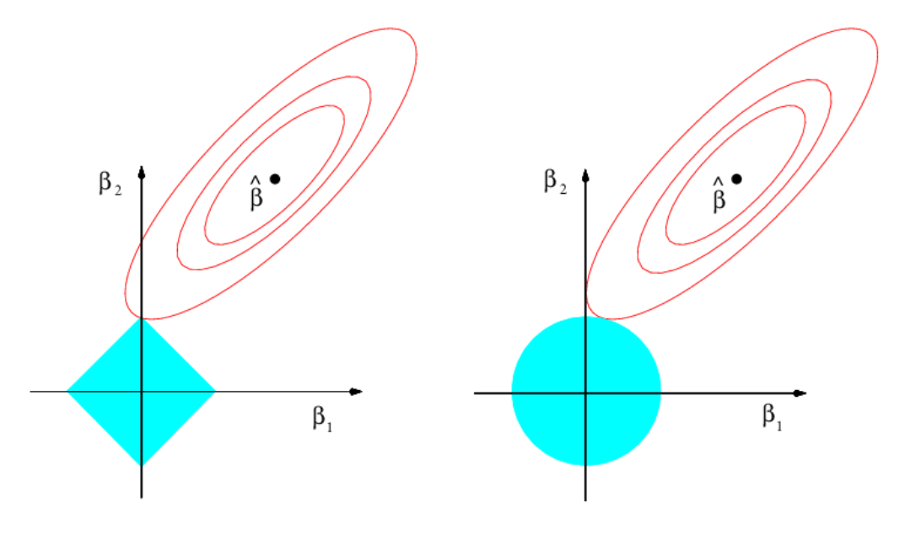

# Linear models III: shrinkage and Big Data {#lm-iii}

<!-- ## Case study: Credit scoring {#lm-lab-iii-credit} -->

## Shrinkage {#lm-iii-shrink}

As we saw in Section \@ref(lm-i-inference-dists), the least squares estimates $\hat{\boldsymbol{\beta}}$ of the linear model
\[
Y = \beta_0 + \beta_1 X_1 + \ldots + \beta_p X_p + \varepsilon,
\]
were the minimizers of the residual sum of squares
\[
\text{RSS}(\boldsymbol{\beta})=\sum_{i=1}^n(Y_i-\beta_0-\beta_1X_{i1}-\ldots-\beta_pX_{ip})^2.
\]
Under the validity of the assumptions of Section \@ref(lm-i-assumps), in Section \@ref(lm-i-inference) we saw that
\[
\hat{\boldsymbol{\beta}}\sim\mathcal{N}_{p+1}\left(\boldsymbol{\beta},\sigma^2(\mathbf{X}'\mathbf{X})^{-1}\right).
\]
A particular consequence of this result is that $\hat{\boldsymbol{\beta}}$ is *unbiased* in estimating $\boldsymbol{\beta}$, this is, $\hat{\boldsymbol{\beta}}$ does not make any systematic error in the estimation. However, bias is only one dimension of the quality of an estimate: variance is also important. Indeed, the *bias-variance trade-off* (see Section \@ref(intro-what-is)) arises from the bias-variance decomposition of the Mean Squared Error (MSE) of an estimate. For example, for the estimate $\hat\beta_j$ of $\beta_j$, we have
\begin{align}
\mathrm{MSE}[\hat\beta_j]:=\mathbb{E}[(\hat\beta_j-\beta_j)^2]=\underbrace{(\mathbb{E}[\hat\beta_j]-\beta_j)^2}_{\mathrm{Bias}^2}+\underbrace{\mathbb{V}\mathrm{ar}[\hat\beta_j]}_{\mathrm{Variance}}.(\#eq:biasvar)
\end{align}

*Shrinkage* methods pursue the following idea: 

> Add a small amount of *smart bias* to $\hat{\boldsymbol{\beta}}$ in order to reduce its variance, in such a way that we obtain *simpler interpretations* from the biased version of $\hat{\boldsymbol{\beta}}$.

This is done by enforcing *sparsity*, this is, by biasing the estimates of $\boldsymbol{\beta}$ towards being non-null only in the most important relations between the response and predictors. The two methods covered in this section, **ridge regression** and **lasso** (*least absolute shrinkage and selection operator*), use this idea in a different way. Both methods considered the standard linear model, what it is different now is *the way of estimating $\boldsymbol{\beta}$*. 

The way they enforce sparsity in the estimates is by minimizing the RSS plus a penalty term that favors sparsity on the estimated coefficients:
\begin{align}
\text{RSS}(\boldsymbol{\beta})+\lambda\sum_{j=1}^p |\beta_j|^{(2-\alpha)}.(\#eq:pen1)
\end{align}
**Ridge regression corresponds to $\alpha=1$** (quadratic penalty), **and lasso to consider $\alpha=0$** (linear penalty). Obviously, if $\lambda=0$, we are back to the least squares problem and theory. The optimization of \@ref(eq:pen1) gives
\begin{align}
\hat{\boldsymbol{\beta}}_\lambda:=\arg\min_{\boldsymbol{\beta}\in\mathbb{R}^{p+1}}\left\{ \text{RSS}(\boldsymbol{\beta})+\lambda\sum_{j=1}^p |\beta_j|^{(2-\alpha)}\right\},(\#eq:pen2)
\end{align}
which is the penalized estimation of $\boldsymbol{\beta}$. Note that the sparsity is enforced in the slopes, not in the intercept, since this depends on the scale of $Y$. $\lambda$ is a tuning parameter that will need to be chosen suitably. What it is important now is to recall that the *predictors need to be standardized*, or otherwise its scale will distort the optimization of \@ref(eq:pen1).

An equivalent way of viewing \@ref(eq:pen2) that helps on visualizing the differences between the ridge and lasso regressions try to solve 
\begin{align}
\hat{\boldsymbol{\beta}}_\lambda:=\arg\min_{\boldsymbol{\beta}\in\mathbb{R}^{p+1}:\sum_{j=1}^p |\beta_j|^{(2-\alpha)}\leq s_\lambda} \text{RSS}(\boldsymbol{\beta}),(\#eq:pen3)
\end{align}
where $s_\lambda$ is certain scalar that does not depend on $\boldsymbol{\beta}$.

(ref:ridgelassotitle) Comparison of ridge and lasso solutions from the optimization problem \@ref(eq:pen3) with $p=2$. The elliptical contours show the regions with equal $\mathrm{RSS}(\beta_1,\beta_2)$, the objective function, for $(\beta_1,\beta_2)\in\mathbb{R}^2$ ($\beta_0=0$ is assumed). The diamond ($\alpha=0$) and circular ($\alpha=1$) regions show the feasibility regions determined by $\sum_{j=1}^p |\beta_j|^{(2\alpha-1)}\leq s_\lambda$ for the optimization problem. The *sharpeness* of the diamond makes the lasso to attain solutions with many coefficients *exactly* zero, in a similar situation to the one depicted. Extracted from @James2013. 

```{r, ridgelasso, echo = FALSE, out.width = '90%', fig.pos = 'h!', fig.cap = '(ref:ridgelassotitle)', fig.show = 'hold', cache = TRUE}

```

We will work with the `Hitters` dataset from the `ISLR` package. It contains statistics and salaries from baseball players from the 1986 and 1987 seasons. The objective will be to predict the `Salary` from the remaining predictors.
```{r, shrinkage, echo = TRUE, collapse = TRUE, cache = TRUE, fig.asp = 1, out.width = '70%', fig.pos = 'h!'}
# Load data - baseball players statistics
library(ISLR)
data(Hitters)

# Discard NA's
Hitters <- na.omit(Hitters)

# The glmnet function works with the design matrix of predictors (without
# the ones). This can be obtained easily through model.matrix()
x <- model.matrix(Salary ~ ., data = Hitters)[, -1]

# Interestingly, note that in Hitters there are two-level  factors and these 
# are automatically transformed into dummy variables in x
head(Hitters[, 14:20])
head(x[, 14:19])

# We also need the vector of responses
y <- Hitters$Salary
```

### Ridge regression {#lm-iii-shrink-ridge}

#### Fitting {-}

```{r, ridge-1, echo = TRUE, collapse = TRUE, cache = TRUE, fig.asp = 1, out.width = '70%', fig.pos = 'h!'}
# Call to the main function - use alpha = 0 for ridge regression
library(glmnet)
ridgeMod <- glmnet(x = x, y = y, alpha = 0) 
# By default, it computes the ridge solution over a set of lambdas
# automatically chosen. It also standardizes the variables by default to make
# the model fitting since the penalization is scale-sensitive. Importantly, 
# the coefficients are returned on the original scale of the predictors

# Plot of the solution path - gives the value of the coefficients for different
# measures in xvar (penalization imposed to the model or fitness)
plot(ridgeMod, xvar = "norm", label = TRUE) 
# xvar = "norm" is the default: L1 norm of the coefficients sum_j abs(beta_j)

# Versus lambda
plot(ridgeMod, label = TRUE, xvar = "lambda")

# Versus the percentage of deviance explained - this is a generalization of the
# R^2 for generalized linear models. Since we have a linear model, this is the
# same as the R^2
plot(ridgeMod, label = TRUE, xvar = "dev")
# The maximum R^2 is slightly above 0.5

# Indeed, we can see that R^2 = 0.5461
summary(lm(Salary ~., data = Hitters))$r.squared

# Some persistently important predictors are 15, 14, and 19
colnames(x)[c(15, 14, 19)]

# What is inside glmnet's output?
names(ridgeMod)

# lambda versus R^2 - fitness decreases when sparsity is introduced, in 
# in exchange of better variable interpretation and avoidance of overfitting
plot(log(ridgeMod$lambda), ridgeMod$dev.ratio, type = "l",
     xlab = "log(lambda)", ylab = "R2")
ridgeMod$dev.ratio[length(ridgeMod$dev.ratio)] 
# Slightly different to lm's because of compromises in accuracy for speed

# The coefficients for different values of lambda are given in $a0 (intercepts)
# and $beta (slopes) or, alternatively, both in coef(ridgeMod) 
length(ridgeMod$a0)
dim(ridgeMod$beta)
length(ridgeMod$lambda) # 100 lambda's were automatically chosen

# Inspecting the coefficients associated to the 50th lambda
coef(ridgeMod)[, 50]
ridgeMod$lambda[50]

# Zoom in path solution
plot(ridgeMod, label = TRUE, xvar = "lambda", 
     xlim = log(ridgeMod$lambda[50]) + c(-2, 2), ylim = c(-30, 10))
abline(v = log(ridgeMod$lambda[50]))
points(rep(log(ridgeMod$lambda[50]), 19), ridgeMod$beta[, 50], 
       pch = 16, col = 1:6)

# The squared l2-norm of the coefficients decreases as lambda increases
plot(log(ridgeMod$lambda), sqrt(colSums(ridgeMod$beta^2)), type = "l", 
     xlab = "log(lambda)", ylab = "l2 norm")
```

#### Tuning parameter selection {-}

```{r, ridge-2, echo = TRUE, collapse = TRUE, cache = TRUE, fig.asp = 1, out.width = '70%', fig.pos = 'h!', message = FALSE}
# If we want, we can choose manualy the grid of penalty parameters to explore
# The grid should be descending
ridgeMod2 <- glmnet(x = x, y = y, alpha = 0, lambda = 100:1)
plot(ridgeMod2, label = TRUE, xvar = "lambda") # Not a good choice!

# Lambda is a tuning parameter that can be chosen by cross-validation, using as
# error the MSE (other possible error can be considered for generalized models 
# using the argument type.measure)

# 10-fold cross-validation. Change the seed for a different result.
set.seed(12345)
kcvRidge <- cv.glmnet(x = x, y = y, alpha = 0, nfolds = 10)
# The lambda grid in which CV is done is automatically selected

# The lambda that minimises the CV error is
kcvRidge$lambda.min

# Equivalent to
indMin <- which.min(kcvRidge$cvm)
kcvRidge$lambda[indMin]

# The minimum CV error
kcvRidge$cvm[indMin]
min(kcvRidge$cvm)

# Potential problem! Minimum occurs at one extreme of the lambda grid in which
# CV is done. This was automatically selected, but can be manually inputted
range(kcvRidge$lambda)
lambdaGrid <- 10^seq(log10(kcvRidge$lambda[1]), log10(0.1), 
                     length.out = 150)
kcvRidge2 <- cv.glmnet(x = x, y = y, nfolds = 10, alpha = 0, 
                       lambda = lambdaGrid)

# Much better
plot(kcvRidge2)
kcvRidge2$lambda.min

# But the CV curve is random, since it depends on the sample. Its variability
# can be estimated by considering the CV curves of each fold. An alternative
# approach to select lambda is to choose the largest within one standard 
# deviation of the minimum error, in order to favour simplicity of the model
# around the optimal lambda value. This is know as the "one standard error rule"
kcvRidge2$lambda.1se

# Location of both optimal lambdas in the CV loss function in dashed vertical
# lines, and lowest CV error and lowest CV error + one standard error
plot(kcvRidge2)
abline(h = kcvRidge2$cvm[indMin] + c(0, kcvRidge2$cvsd[indMin]))
# The consideration of the one standard error rule for selecting lambda makes
# special sense when the CV function is quite flat around the minimum (hence an
# overpenalization that gives more sparsity does not affect so much the CV loss)

# Leave-one-out cross-validation. More computationally intense but completely
# objective in the choice of the fold-assignment
ncvRidge <- cv.glmnet(x = x, y = y, alpha = 0, nfolds = nrow(Hitters),
                      lambda = lambdaGrid)

# Location of both optimal lambdas in the CV loss function
plot(ncvRidge)
```

#### Prediction {-}

```{r, ridge-3, echo = TRUE, collapse = TRUE, cache = TRUE, fig.asp = 1, out.width = '70%', fig.pos = 'h!', message = FALSE}
# The glmnet fit is inside the output of cv.glmnet
modRidgeCV <- kcvRidge2$glmnet.fit

# Inspect the best models
plot(modRidgeCV, label = TRUE, xvar = "lambda")
abline(v = log(c(kcvRidge2$lambda.min, kcvRidge2$lambda.1se)))

# The model associated to lambda.1se (or any other lambda not included in the
# original path solution - obtained by an interpolation) can be retrieved with
predict(modRidgeCV, type = "coefficients", s = kcvRidge2$lambda.1se)

# Predictions for the first two observations
predict(modRidgeCV, type = "response", s = kcvRidge2$lambda.1se, 
        newx = x[1:2, ])

# Predictions for the first observation, for all the lambdas. We can see how
# the prediction for one observation changes according to lambda
plot(log(modRidgeCV$lambda), 
     predict(modRidgeCV, type = "response", newx = x[1, , drop = FALSE]), 
     type = "l", xlab = "log(lambda)", ylab = " Prediction")
```

### Lasso {#lm-iii-shrink-lasso}

#### Fitting and model selection {-}

```{r, lasso-1, echo = TRUE, collapse = TRUE, cache = TRUE, fig.asp = 1, out.width = '70%', fig.pos = 'h!'}
# Call to the main function - use alpha = 1 for lasso regression (the default)
lassoMod <- glmnet(x = x, y = y, alpha = 1) 
# Same defaults as before, same object structure

# Plot of the solution path - now the paths are not smooth when decreasing to
# zero (they are zero exactly). This is a consequence of the l1 norm
plot(lassoMod, xvar = "lambda", label = TRUE)
# Some persistently important predictors are 15, 14, and 19

# Versus the R^2 - same maximum R^2 as before
plot(lassoMod, label = TRUE, xvar = "dev")

# Now the l1-norm of the coefficients decreases as lambda increases
plot(log(lassoMod$lambda), colSums(abs(lassoMod$beta)), type = "l", 
     xlab = "log(lambda)", ylab = "l1 norm")

# 10-fold cross-validation. Change the seed for a different result.
set.seed(12345)
kcvLasso <- cv.glmnet(x = x, y = y, alpha = 1, nfolds = 10)

# The lambda that minimises the CV error is
kcvLasso$lambda.min

# The "one standard error rule" for lambda
kcvLasso$lambda.1se

# Location of both optimal lambdas in the CV loss function
plot(kcvLasso)
abline(h = kcvLasso$cvm[indMin] + c(0, kcvLasso$cvsd[indMin]))
# No problems now: minimum does not occur at one extreme
# Interesting: note that the numbers on top of the figure gives the number of
# coefficients *exactly* different from zero - the number of predictors
# effectively considered in the model!
# In this case, the one standard error rule makes also sense

# Leave-one-out cross-validation
ncvLasso <- cv.glmnet(x = x, y = y, alpha = 1, nfolds = nrow(Hitters),
                      lambda = lambdaGrid)

# Location of both optimal lambdas in the CV loss function
plot(ncvLasso)
```

#### Prediction {-}

```{r, lasso-2, echo = TRUE, collapse = TRUE, cache = TRUE, fig.asp = 1, out.width = '70%', fig.pos = 'h!', message = FALSE}
# Inspect the best models
modLassoCV <- kcvLasso$glmnet.fit
plot(modLassoCV, label = TRUE, xvar = "lambda")
abline(v = log(c(kcvLasso$lambda.min, kcvLasso$lambda.1se)))

# The model associated to lambda.min (or any other lambda not included in the
# original path solution - obtained by an interpolation) can be retrieved with
predict(modLassoCV, type = "coefficients", 
        s = c(kcvLasso$lambda.min, kcvLasso$lambda.1se))

# Predictions for the first two observations
predict(modLassoCV, type = "response", 
        s = c(kcvLasso$lambda.min, kcvLasso$lambda.1se),
        newx = x[1:2, ])
```

#### Variable selection {-}

```{r, lasso-3, echo = TRUE, collapse = TRUE, cache = TRUE, fig.asp = 1, out.width = '70%', fig.pos = 'h!', message = FALSE}
# We can use lasso for model selection!
selPreds <- predict(modLassoCV, type = "coefficients", 
                    s = c(kcvLasso$lambda.min, kcvLasso$lambda.1se))[-1, ] > 0
x1 <- x[, selPreds[, 1]]
x2 <- x[, selPreds[, 2]]

# Least squares fit with variables selected by lasso
summary(lm(y ~ x1))
summary(lm(y ~ x2))

# Comparison with stepwise selection
modBIC <- stepAIC(lm(Salary ~ ., data = Hitters), k = log(nrow(Hitters)), 
                  trace = 0)
summary(modBIC)
# The lasso selections are similar, although the model is slightly worse in
# terms of adjusted R^2 and significance of the predictors. However, keep in 
# mind that lasso is solving a constrained least squares problem, so it is 
# expected to achieve better R^2 and adjusted R^2 via a selection procedure 
# that employs solution s of unconstrained least squares. What it is remarkable
# is the speed of lasso on selecting variables, and the fact that gives quite
# good starting points for performing further model selection
```

<!-- ```{block, caulassovarsel, type = 'rmdcaution', cache = TRUE} -->
<!-- Inferences from the resulting model of a model-selection procedure, such as stepwise, lasso, ridge, or other method are to be suspected. Why is so? Because we use the data twice: one for selecting the model and other for making inference, violating in the process the that has been TODO. Unrealistically small. Why? Inference was derived assuming.  -->

<!-- A simple solution to this problem, if inference is wanted, is to split the dataset in two, one for model-selection and other for performing inference o the coefficients. -->
<!-- ``` -->

```{block, exaridlasso, type = 'rmdexercise', cache = TRUE}
Consider [`la-liga-2015-2016.xlsx`](https://raw.githubusercontent.com/egarpor/PM-UC3M/master/datasets/la-liga-2015-2016.xlsx) dataset. We will predict `Points` after removing the perfectly related linear variables to it. Do:

- Lasso regression. Select $\lambda$ by cross-validation. Obtain the estimated coefficients for the chosen lambda.
- Use the predictors with non-null coefficients for creating a model with `lm`.
- Summarize the model and check for multicollinearity.

```

```{block, caulassovarsel, type = 'rmdcaution', cache = TRUE}
Inferences from models that result from model-selection procedures, such as stepwise regression, ridge, or lasso, have to analysed with caution. The reason is because *we are using the sample twice*: one for selecting the most significant / informative predictors in order to be included in the model, and other for making inference using the same sample. While making this, we are biasing the significance tests, and thus obtaining **unrealistically small $p$-values**. In other words, when included in the model, some selected predictors will be shown as significant when in reality they are not.

A simple solution for performing valid inference in a data-driven selected model is to split the dataset in two parts: one part for model-selection, and other for performing inference on the coefficients.
```

The next simulation exercise exemplifies the previous remark. Consider the following linear model
\begin{align}
Y=\beta_1X_1+\beta_2X_2+\beta_3X_3+\beta_4X_4+\varepsilon,
\end{align}
where $\beta_1=\beta_2=1$, $\beta_3=\beta_4=0$, and $\varepsilon\sim\mathcal{N}(0,1)$. The next chunk of code analyses the significances of the four coefficients for:

1. **The model with all the predictors**. The inferences for the coefficients are correct: the distribution of the $p$-values (`pvalues1`) is uniform whenever $H_0:\beta_j=0$ holds (for $j=3,4$) and concentrated around $0$ when $H_0$ does not hold (for $j=1,2$).
2. **The model with selected predictors by stepwise regression**. The inferences for the coefficients are biased: when $X_3$ and $X_4$ are included in the model is because they are highly significant for the given sample by mere chance. Therefore, the distribution of the $p$-values (`pvalues2`) is not uniform but concentrated at $0$.
3. **The model with selected predictors by stepwise regression, but fitted in a separate dataset**. In this case, the $p$-values (`pvalues3`) are not unrealistically small if the non-significant predictors are included in the model.

```{r, lasso-4, echo = TRUE, collapse = TRUE, cache = TRUE, fig.asp = 1, out.width = '70%', fig.pos = 'h!', message = FALSE}
# Simulation setting
n <- 2e2
p <- 4
p0 <- p %/% 2
beta <- c(rep(1, p0), rep(0, p - p0))

# Generate two sets of independent data following the same linear model 
# with coefficients beta and null intercept
x1 <- matrix(rnorm(n * p), nrow = n, ncol = p)
data1 <- data.frame("x" = x1)
xbeta1 <- x1 %*% beta
x2 <- matrix(rnorm(n * p), nrow = n, ncol = p)
data2 <- data.frame("x" = x2)
xbeta2 <- x2 %*% beta

# Objects for the simulation
M <- 5e4
pvalues1 <- pvalues2 <- pvalues3 <- matrix(NA, nrow = M, ncol = p)
set.seed(12345678)
data1$y <- xbeta1 + rnorm(n)
nam <- names(lm(y ~ 0 + ., data = data1)$coefficients)

# Simulation
for (i in 1:M) {
  
  # Generate new data
  data1$y <- xbeta1 + rnorm(n)
  
  # Obtain the significances of the coefficients for the usual linear model
  mod1 <- lm(y ~ 0 + ., data = data1)
  s1 <- summary(mod1)
  pvalues1[i, ] <- s1$coefficients[, 4]
  
  # Obtain the significances of the coefficients for a data-driven selected
  # linear model (in this case, by stepwise regression using BIC)
  mod2 <- stepAIC(mod1, k = log(n), trace = 0)
  s2 <- summary(mod2)
  ind <- match(x = names(s2$coefficients[, 4]), table = nam)
  pvalues2[i, ind] <- s2$coefficients[, 4]
  
  # Generate independent data
  data2$y <- xbeta2 + rnorm(n)
  
  # Significances of the coefficients by the data-driven selected model 
  s3 <- summary(lm(y ~ 0 + ., data = data2[, c(ind, p + 1)]))
  pvalues3[i, ind] <- s3$coefficients[, 4]
  
}

# Percentage of NA's: NA = predictor excluded
apply(pvalues2, 2, function(x) mean(is.na(x)))

# Boxplots of significances
boxplot(pvalues1, names = expression(beta[1], beta[3], beta[3], beta[4]),
        main = "p-values in the full model", ylim = c(0, 1))
boxplot(pvalues2, names = expression(beta[1], beta[3], beta[3], beta[4]),
        main = "p-values in the stepwise model", ylim = c(0, 1))
boxplot(pvalues3, names = expression(beta[1], beta[3], beta[3], beta[4]),
        main = "p-values in the model with the predictors selected by 
        stepwise regression, and fitted in an independent sample", 
        ylim = c(0, 1))
```

<!-- ## Big Data considerations {#lm-iii-bigdata} -->

<!-- This allows linear regression on data sets larger than memory. -->

<!-- ```{r, biglm, echo = TRUE, collapse = TRUE, cache = TRUE} -->
<!-- library(biglm) -->
<!-- # Not really "Big Data"" but for the sake of illustration -->
<!-- set.seed(12345) -->
<!-- x <- matrix(rnorm(1e7), nrow = 1e5, ncol = 1e2) -->
<!-- y <- 1 + x %*% c(1, -1, rep(0, 98)) + rnorm(1e5) -->
<!-- bigData <- data.frame("resp" = y, "pred" = x) -->

<!-- # biglm has a very similar syntaxis to lm -->
<!-- bigMod <- biglm(formula = y ~ x, data = bigData) -->

<!-- bigMod <- lm(formula = resp ~ ., data = bigData) -->

<!-- # Online update -->
<!-- biglm(y~x,data=Hitters) -->

<!-- ``` -->

<!-- ### Case study {#lm-iii-bigdata-case} -->
