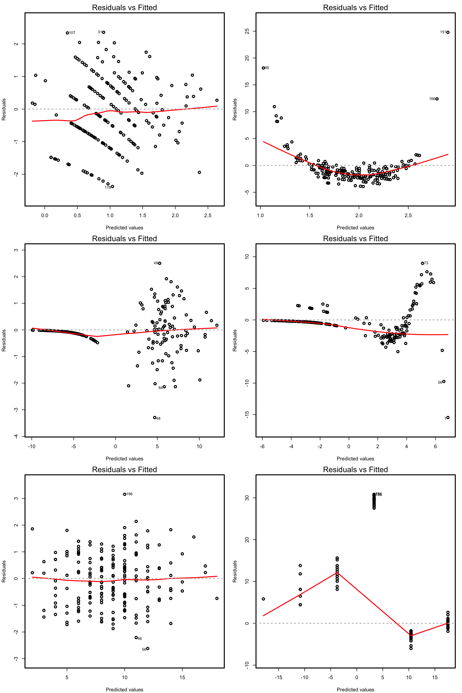
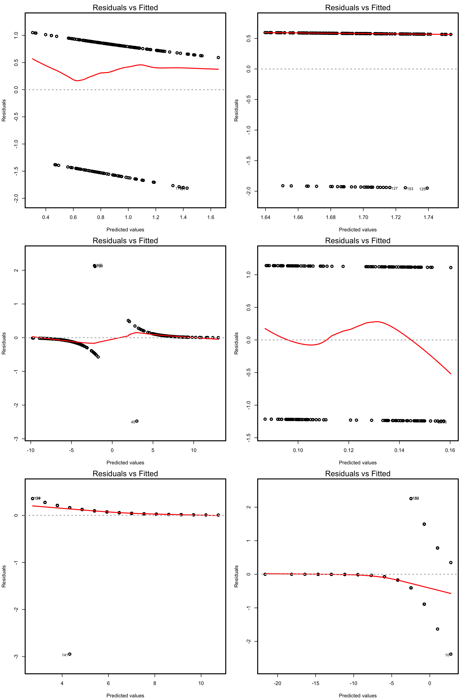
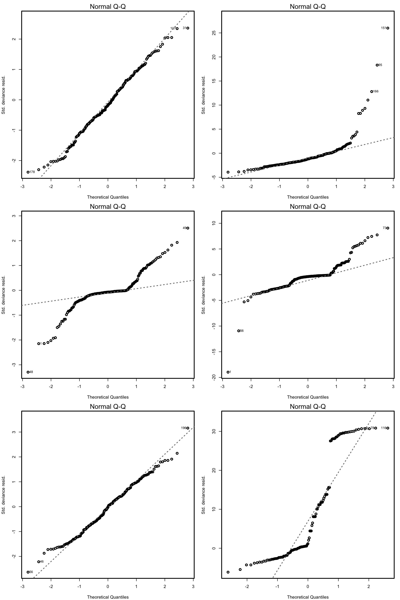
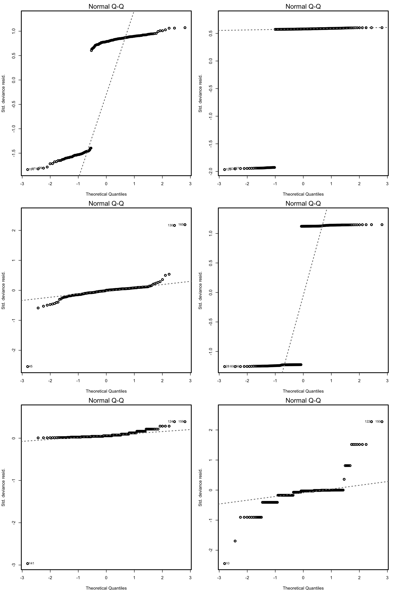
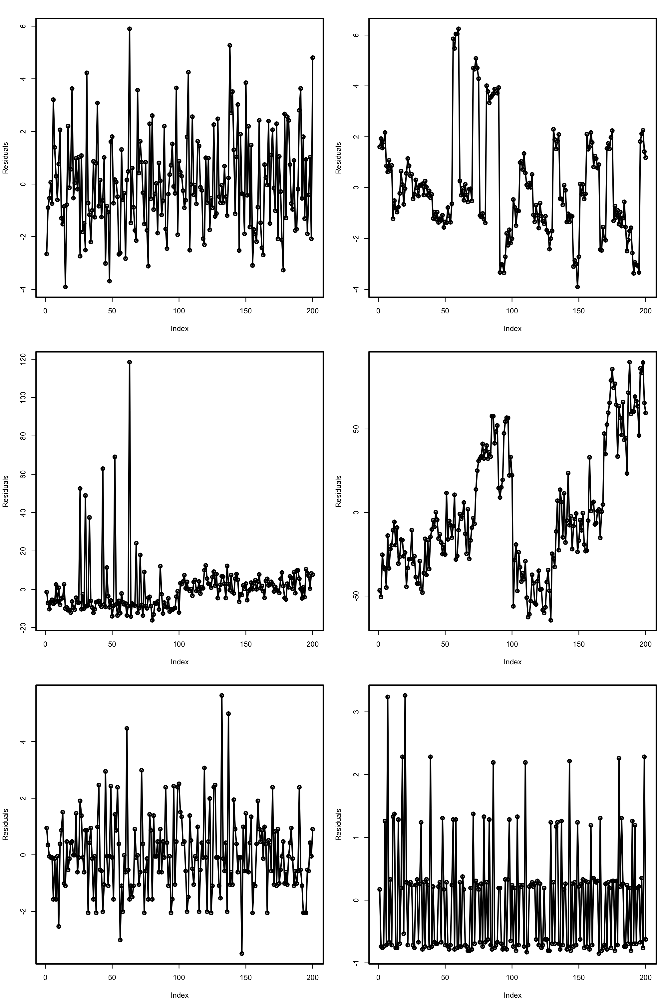
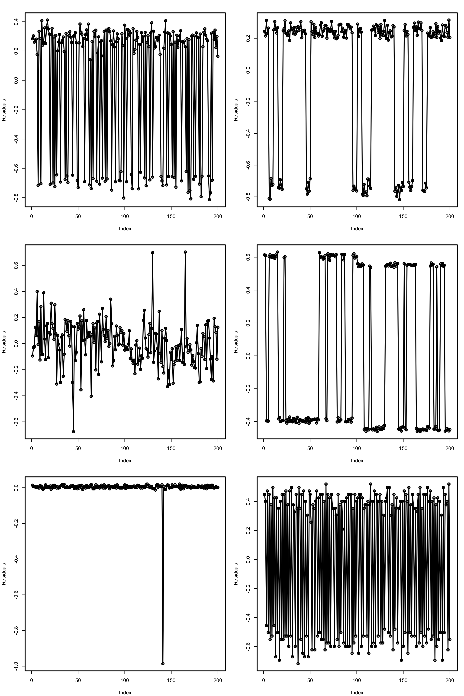

# Generalized linear models {#glm}

As we saw in Chapter \@ref(lm-i), linear regression assumes that the response variable $Y$ is such that
\[
Y|(X_1=x_1,\ldots,X_p=x_p)\sim \mathcal{N}(\beta_0+\beta_1x_1+\ldots+\beta_px_p,\sigma^2)
\]
and hence
\[
\mathbb{E}[Y|X_1=x_1,\ldots,X_p=x_p]=\beta_0+\beta_1x_1+\ldots+\beta_px_p.
\]
This, in particular, implies that $Y$ is *continuous*. In this chapter we will see how *generalized linear models* can deal with other kind of distributions for $Y|(X_1=x_1,\ldots,X_p=x_p)$, particularly with *discrete* responses, by modelling the *transformed* conditional expectation. The simplest generalized linear model is *logistic regression*, which is arises when $Y$ is a *binary* response, that is, a variable encoding two categories with $0$ and $1$. This model would be useful, for example, to predict $Y$ given $X$ from a sample $(X_1,Y_1),\ldots,(X_n,Y_n)$ like the one in Figure \@ref(fig:logrel).

(ref:logreltitle) Scatterplot of a sample $(X_1,Y_1),\ldots,(X_n,Y_n)$ sampled from a logistic regression.

```{r, logrel, echo = FALSE, out.width = '70%', fig.pos = 'h!', fig.cap = '(ref:logreltitle)', cache = TRUE, fig.asp = 1}
set.seed(234567)
x <- rnorm(200)
y <- rbinom(200, size = 1, prob = 1/(1 + exp(-(1 + 2 * x))))
plot(x, y, pch = 16, xlab = "X", ylab = "Y")
```

## Case study: *The Challenger disaster* {#glm-challenger}

The *Challenger* disaster occurred on the 28th January of 1986, when the NASA Space Shuttle orbiter *Challenger* broke apart and disintegrated at 73 seconds into its flight, leading to the deaths of its seven crew members. The accident had serious consequences for the NASA credibility and resulted in an interruption of 32 months in the shuttle program. The Presidential *Rogers Commission* (formed by astronaut Neil A. Armstrong and Nobel laureate Richard P. Feynman, among others) was created in order to investigate the causes of the disaster.

```{r, video2, echo = FALSE, fig.pos = 'h!', fig.cap = 'Challenger launch and posterior explosion, as broadcasted live by NBC in 28/01/1986.', screenshot.opts = list(delay = 15), dev = 'png', cache = TRUE}
knitr::include_url("https://www.youtube.com/embed/fSTrmJtHLFU")
```

The Rogers Commission elaborated a report [@Roberts1986] with all the findings. The commission determined that the disintegration began with the failure of an O-ring seal in the solid rocket motor due to the unusual cold temperature ($-0.6$ Celsius degrees) during the launch. This failure produced a breach of burning gas through the solid rocket motor that compromised the whole shuttle structure, resulting in its disintegration due to the extreme aerodynamic forces. The problematic with O-rings was something known: the night before the launch, there was a three-hour teleconference between motor engineers and NASA management, discussing the effect of low temperature forecasted for the launch on the O-ring performance. The conclusion, influenced by Figure \@ref(fig:rogerts)a, was:

> "Temperature data [is] not conclusive on predicting primary O-ring blowby."

(ref:rogertstitle) Number of incidents in the O-rings (filed joints) versus temperatures. Panel *a* includes *only flights with incidents*. Panel *b* contains all flights (with and *without* incidents).

```{r, rogerts, echo = FALSE, out.width = '70%', fig.pos = 'h!', fig.cap = '(ref:rogertstitle)', fig.show = 'hold', cache = TRUE}
knitr::include_graphics("images/figures/challenger.png")
```

The Rogers Commission noted a major flaw in Figure \@ref(fig:rogerts)a: the *flights with zero incidents were excluded* from the plot because *it was felt* that **these flights did not contribute any information about the temperature effect** (Figure \@ref(fig:rogerts)b). The Rogers Commission concluded:

> "A careful analysis of the flight history of O-ring performance would have revealed the correlation of O-ring damage in low temperature".

The purpose of this case study, inspired by @Dalal1989, is to quantify what was the influence of the temperature in the probability of having at least one incident related with the O-rings. Specifically, we want to address the following questions:

- Q1. *Is the temperature associated with O-ring incidents?*
- Q2. *In which way was the temperature affecting the probability of O-ring incidents?*
- Q3. *What was the predicted probability of an incidient in an O-ring for the temperature of the launch day?*

To try to answer these questions we have the `challenger` dataset ([download](https://raw.githubusercontent.com/egarpor/PM-UC3M/master/datasets/challenger.txt)). The dataset contains (shown in Table \@ref(tab:challengertable)) information regarding the state of the solid rocket boosters after launch^[After the shuttle exits the atmosphere, the solid rocket boosters separate and descend to land using a parachute where they are carefully analyzed.] for 23 flights. Each row has, among others, the following variables:

- `fail.field`, `fail.nozzle`: binary variables indicating whether there was an incident with the O-rings in the field joints or in the nozzles of the solid rocket boosters. `1` codifies an incident and `0` its absence. On the analysis, we focus on the O-rings of the field joint as being the most determinants for the accident.
- `temp`: temperature in the day of launch. Measured in Celsius degrees.
- `pres.field`,	`pres.nozzle`: leak-check pressure tests of the O-rings. These tests assured that the rings would seal the joint.

(ref:challengertabletitle) The `challenger` dataset.

```{r, challengertable, echo = FALSE, out.width = '90%', fig.pos = 'h!', cache = TRUE}
challenger <- read.table(file = "datasets/challenger.txt", header = TRUE, sep = "\t")
knitr::kable(
  challenger[, c(1, 2, 5:7)],
  booktabs = TRUE,
  longtable = TRUE,
  caption = '(ref:challengertabletitle)'
)
```

Let's begin the analysis by replicating Figures \@ref(fig:rogerts)a and \@ref(fig:rogerts)b and checking that linear regression is not the right tool for answering Q1--Q3.
```{r, challengerfigs, out.width = '70%', fig.pos = 'h!', collapse = TRUE, cache = TRUE}
library(car)
scatterplot(nfails.field ~ temp, reg.line = lm, smooth = FALSE, spread = FALSE,
            boxplots = FALSE, data = challenger, subset = nfails.field > 0)
scatterplot(nfails.field ~ temp, reg.line = lm, smooth = FALSE, spread = FALSE,
            boxplots = FALSE, data = challenger)
```

There is a fundamental problem in using linear regression for this data: the response is not continuous. As a consequence, there is no linearity and the errors around the mean are not normal (indeed, they are strongly non-normal). Let's check this with the corresponding diagnostic plots:
```{r, nasadiag, out.width = '70%', fig.pos = 'h!', collapse = TRUE, cache = TRUE}
mod <- lm(nfails.field ~ temp, data = challenger)
par(mfrow = 1:2)
plot(mod, 1)
plot(mod, 2)
```

Albeit linear regression is not the adequate tool for this data, it is able to detect the obvious difference between the two plots:

1. **The trend for launches with incidents is flat, hence suggesting there is no dependence on the temperature** (Figure \@ref(fig:rogerts)a). This was one of the arguments behind NASA's decision of launching the rocket at a temperature of $-0.6$ Celsius degrees.
2. However, **the trend for *all* launches indicates a clear negative dependence between temperature and number of incidents!** (Figure \@ref(fig:rogerts)b). Think about it in this way: the minimum temperature for a launch without incidents ever recorded was above $18$ Celsius degrees, and the Challenger was launched at $-0.6$ without clearly knowing the effects of such low temperatures.

## Model formulation and estimation {#glm-model}

For simplicity, we study first the logistic regression and then study the general case of a generalized linear model.

### Logistic regression {#glm-model-log}

As we saw in Section \@ref(lm-i-model), the multiple linear model described the relation between the random variables $X_1,\ldots,X_p$ and $Y$ by assuming a linear relation in the conditional expectation:
\begin{align}
\mathbb{E}[Y|X_1=x_1,\ldots,X_p=x_p]=\beta_0+\beta_1x_1+\ldots+\beta_px_p.(\#eq:eq-lm)
\end{align}
In addition, it made three more assumptions on the data (see Section \@ref(lm-i-assumps)) which resulted in the following one-line summary of the linear model:
\[
Y|(X_1=x_1,\ldots,X_p=x_p)\sim \mathcal{N}(\beta_0+\beta_1x_1+\ldots+\beta_px_p,\sigma^2).
\]
Recall that a necessary condition is that $Y$ was continuous, in order to satisfy the normality of the errors. Therefore, the linear model is designed for a *continuous response*.

The situation when $Y$ is *discrete* (naturally ordered values) or *categorical* (non-ordered categories) requires a special treatment. The simplest situation is when $Y$ is *binary*: it can only take two values, codified for convenience as $1$ (success) and $0$ (failure). For binary variables there is no fundamental distinction between the treatment of discrete and categorical variables. Formally, a binary variable is referred as a *Bernoulli variable*: $Y\sim\mathrm{Ber}(p)$, $0\leq p\leq1$ (do not confuse this $p$ with the $p$ providing the number of predictors in the model), if
\[
Y=\left\{\begin{array}{ll}1,&\text{with probability }p,\\0,&\text{with probability }1-p,\end{array}\right.
\]
or, equivalently, if
\begin{align}
\mathbb{P}[Y=y]=p^y(1-p)^{1-y},\quad y=0,1.(\#eq:ber)
\end{align}
Recall that a *binomial variable with size $n$ and probability $p$*, $\mathrm{B}(n,p)$, is obtained by summing $n$ independent $\mathrm{Ber}(p)$ (so $\mathrm{Ber}(p)$ is the same as $\mathrm{B}(1,p)$). Also, recall that a Bernoulli variable is completely determined by the probability $p$, and also so do its mean and variance:
\[
\mathbb{E}[Y]=\mathbb{P}[Y=1]=p\quad\text{and}\quad\mathbb{V}\mathrm{ar}[Y]=p(1-p).
\]

Assume then that $Y$ is a Bernoulli variable and that $X_1,\ldots,X_p$ are predictors associated to $Y$. The purpose in logistic regression is to model
\[
\mathbb{E}[Y|X_1=x_1,\ldots,X_p=x_p]=\mathbb{P}[Y=1|X_1=x_1,\ldots,X_p=x_p],
\]
this is, how the conditional expectation of $Y$ or, equivalently, the conditional probability of $Y=1$, is changing according to particular values of the predictors. At sight of \@ref(eq:eq-lm), a tempting possibility is to consider the model
\[
\mathbb{E}[Y|X_1=x_1,\ldots,X_p=x_p]=\beta_0+\beta_1x_1+\ldots+\beta_px_p=:\eta.
\]
However, such a model will run into serious problems inevitably: negative probabilities and probabilities larger than one may happen. A solution is to consider a **link function** $g$ to encapsulate the value of $\mathbb{E}[Y|X_1=x_1,\ldots,X_p=x_p]$ and map it back to $\mathbb{R}$. Or, alternatively, a function $g^{-1}$ that takes $\eta\in\mathbb{R}$ and maps it to $[0,1]$, the support of $\mathbb{E}[Y|X_1=x_1,\ldots,X_p=x_p]$. There are several alternatives for $g^{-1}:\mathbb{R}\longrightarrow[0,1]$ (see Figure \@ref(fig:logitprobit)). Different choices of $g^{-1}$ give rise to different models:

- **Uniform**: considers the truncation $\eta\mathbb{1}_{\{0<\eta<1\}}+\mathbb{1}_{\{\eta\geq1\}}$.
- **Probit**: considers the *normal* distribution function, this is, $g^{-1}=\Phi$.
- **Logit**: considers the **logistic distribution function**:
\[
\mathrm{logistic}(\eta):=\frac{e^\eta}{1+e^\eta}=\frac{1}{1+e^{-\eta}}.
\]

(ref:logitprobittitle) Different transformations $g^{-1}$ mapping the response of a simple linear regression $\eta=\beta_0+\beta_1x$ to $[0,1]$.

```{r, logitprobit, echo = FALSE, results = 'hide', out.width = '70%', fig.show = 'hold', fig.asp = 1, fig.pos = 'h!', fig.cap = '(ref:logitprobittitle)', cache = TRUE}
# Regression
x <- seq(-3, 3, l = 200)
z <- 2 * x

# Truncation
z1 <- z
z1[z1 > 1] <- 1
z1[z1 < 0] <- 0

# Probit
z2 <- pnorm(z)

# Logit
z3 <- 1 / (1 + exp(-z))

# Comparison
plot(x, z, type = "l", ylim = c(-0.1, 1.1), xlab = expression(eta), 
     ylab = expression(g^{-1}*(eta)), lwd = 2)
lines(x, z1, col = "blue", lwd = 2)
lines(x, z2, col = "red", lwd = 2)
lines(x, z3, col = "green", lwd = 2)
legend("topleft", legend = c("Linear regression", "Uniform", "Probit", "Logit"),
       lwd = 2, col = c("black", "blue", "red", "green"))
```

The logistic transformation is the most employed due to its tractability, interpretability, and smoothness (and as we will see, later, because it is the *canonical link function*). Its inverse, $g:[0,1]\longrightarrow\mathbb{R}$, is known as the **logit function**:
\[
\mathrm{logit}(p):=\mathrm{logistic}^{-1}(p)=\log\frac{p}{1-p}.
\]

In conclusion, with the logit link function we can map the domain of $Y$ to $\mathbb{R}$ in order to apply there a linear model. The *logistic model* can be then equivalently stated as
\begin{align}
\mathrm{logit}(\mathbb{E}[Y|X_1=x_1,\ldots,X_p=x_p])=\eta (\#eq:eq-log-1)
\end{align}
or as
\begin{align}
\mathbb{E}[Y|X_1=x_1,\ldots,X_p=x_p]&=\mathrm{logistic}(\eta)=\frac{1}{1+e^{\eta}}(\#eq:eq-log-2),
\end{align}
where remember that $\eta=\beta_0+\beta_1x_1+\ldots+\beta_px_p$. There is a clear interpretation of the role of the linear predictor $\eta$ in \@ref(eq:eq-log-2):

- If $\eta=0$, then $\mathbb{P}[Y=1|X_1=x_1,\ldots,X_p=x_p]=\frac{1}{2}$ ($Y=1$ and $Y=0$ are equally likely).
- If $\eta<0$, then $\mathbb{P}[Y=1|X_1=x_1,\ldots,X_p=x_p]<\frac{1}{2}$ ($Y=1$ less likely).
- If $\eta>0$, then $\mathbb{P}[Y=1|X_1=x_1,\ldots,X_p=x_p]>\frac{1}{2}$ ($Y=1$ more likely).

To be more precise on the interpretation of the coefficients we need to introduce the *odds*. 

The odds is an equivalent way of expressing the distribution of probabilities in a binary variable $Y$. Instead of using $p$ to characterize the distribution of $Y$, we can use
\begin{align}
\mathrm{odds}(Y):=\frac{p}{1-p}=\frac{\mathbb{P}[Y=1]}{\mathbb{P}[Y=0]}.(\#eq:eq-odds)
\end{align}
The odds is the *ratio between the probability of success and the probability of failure*. It is extensively used in betting^[Recall that (traditionally) the result of a bet is binary: you either win or lose the bet.] due to its better interpretability. For example, if a horse $Y$ has a probability $p=2/3$ of winning a race ($Y=1$), then the odds of the horse is $\frac{p}{1-p}=\frac{2/3}{1/3}=2$. This means that the horse has a *probability of winning that is twice larger than the probability of losing*. This is sometimes written as a $2:1$ or $2 \times 1$ (spelled "two-to-one"). Conversely, if the odds of $Y$ is given, we can easily know what is the probability of success $p$, using the inverse of \@ref(eq:eq-odds):
\[
p=\mathbb{P}[Y=1]=\frac{\text{odds}(Y)}{1+\text{odds}(Y)}.
\]
For example, if the odds of the horse were $5$, that would correspond to a probability of winning $p=5/6$.

```{block, insodds, type = 'rmdinsight', cache = TRUE}
Recall that the odds is a number in $[0,+\infty]$. The $0$ and $+\infty$ values are attained for $p=0$ and $p=1$, respectively. The log-odds (or logit) is a number in $[-\infty,+\infty]$.
```

We can rewrite \@ref(eq:eq-log-2) (since $\mathbb{P}[Y=1|X_1=x_1,\ldots,X_p=x_p]=\mathbb{E}[Y|X_1=x_1,\ldots,X_p=x_p]$) in terms of the odds \@ref(eq:eq-odds). If we do so, we have:
\begin{align}
\mathrm{odds}(Y|X_1=x_1,\ldots,X_p=x_p)=e^{\eta}=e^{\beta_0}e^{\beta_1x_1}\ldots e^{\beta_px_p}.(\#eq:eq-odds-log1)
\end{align}
Alternatively, taking logarithms, we have the *log-odds* (or logit)
\begin{align}
\log(\mathrm{odds}(Y|X_1=x_1,\ldots,X_p=x_p))=\beta_0+\beta_1x_1+\ldots+\beta_px_p.(\#eq:eq-odds-log2)
\end{align}
The conditional log-odds \@ref(eq:eq-odds-log2) plays here the role of the conditional mean for multiple linear regression. Therefore, we have an analogous interpretation for the coefficients:

- $\beta_0$: is the log-odds when $X_1=\ldots=X_p=0$.
- $\beta_j$, $1\leq j\leq p$: is the **additive** increment of the log-odds for an increment of one unit in $X_j=x_j$, provided that the remaining variables $X_1,\ldots,X_{j-1},X_{j+1},\ldots,X_p$ *do not change*.

The log-odds is not so easy to interpret as the odds. For that reason, an equivalent way of interpreting the coefficients, this time based on \@ref(eq:eq-odds-log1), is:

- $e^{\beta_0}$: is the odds when $X_1=\ldots=X_p=0$.
- $e^{\beta_j}$, $1\leq j\leq p$: is the **multiplicative** increment of the odds for an increment of one unit in $X_j=x_j$, provided that the remaining variables $X_1,\ldots,X_{j-1},X_{j+1},\ldots,X_p$ *do not change*. If the increment in $X_j$ is of $r$ units, then the multiplicative increment in the odds is $(e^{\beta_j})^r$.

As a consequence of this last interpretation, we have:
```{block2, insbeta, type = 'rmdinsight', cache = TRUE}
If $\beta_j>0$ (respectively, $\beta_j<0$) then $e^{\beta_j}>1$ ($e^{\beta_j}<1$) in \@ref(eq:eq-odds-log1). Therefore, an increment of one unit in $X_j$, provided that the remaining variables do not change, results in a positive (negative) increment in the odds and in $\mathbb{P}[Y=1|X_1=x_1,\ldots,X_p=x_p]$.
```

#### Case study application {#glm-model-log-case}

In the Challenger case study we used `fail.field` as an *indicator* of whether "there was at least an incident with the O-rings" (`1` = yes, `0` = no). Let's see if the temperature was associated with O-ring incidents (Q1). For that, we compute the logistic regression of `fail.field` on `temp` and we plot the fitted logistic curve.
```{r, logcurve, echo = TRUE, out.width = '70%', fig.asp = 1, fig.pos = 'h!', collapse = TRUE, cache = TRUE}
# Logistic regression
nasa <- glm(fail.field ~ temp, family = "binomial", data = challenger)

# Plot data
plot(challenger$temp, challenger$fail.field, xlim = c(-1, 30), 
     xlab = "Temperature", ylab = "Incident probability")

# Draw the fitted logistic curve
x <- seq(-1, 30, l = 200)
y <- exp(-(nasa$coefficients[1] + nasa$coefficients[2] * x))
y <- 1 / (1 + y)
lines(x, y, col = 2, lwd = 2)

# The Challenger
points(-0.6, 1, pch = 16)
text(-0.6, 1, labels = "Challenger", pos = 4)
```

At the sight of this curve and the summary it seems that the temperature was affecting the probability of an O-ring incident (Q1). Let's quantify this statement and answer Q2 by looking to the coefficients of the model:
```{r, logsummary, echo = TRUE, collapse = TRUE, cache = TRUE}
# Exponentiated coefficients ("odds ratios")
exp(coef(nasa))
```
The exponentials of the estimated coefficients are:

- $e^{\hat\beta_0}=1965.974$. This means that, *when the temperature is zero*, the fitted odds is $1965.974$, so the probability of having an incident ($Y=1$) is $1965.974$ times larger than the probability of not having an incident ($Y=0$). In other words, the probability of having an incident at temperature zero is $\frac{1965.974}{1965.974+1}=0.999$.
- $e^{\hat\beta_1}=0.659$. This means that each Celsius degree increment in the temperature multiplies the fitted odds by a factor of $0.659\approx\frac{2}{3}$, hence reducing it.

However, for the moment we can not say whether these findings are significant, since we do not have information on the variability of the estimates of $\boldsymbol{\beta}$. We will need inference for that.

#### Estimation by maximum likelihood {#glm-model-log-mle}

The estimation of $\boldsymbol{\beta}$ from a sample $(\mathbf{X}_{1},Y_1),\ldots,(\mathbf{X}_{n},Y_n)$ is done by *Maximum Likelihood Estimation* (MLE). As it can be seen in Appendix \@ref(app-mle), MLE is equivalent to least squares in the linear model under the assumptions mentioned in Section \@ref(lm-i-assumps), particularly, normality and independence. In the logistic model, we assume that 
\[
Y_i|(X_{1}=x_{i1},\ldots,X_{p}=x_{ip})\sim \mathrm{Ber}(\mathrm{logistic}(\eta_i)),\quad i=1,\ldots,n,
\]
where $\eta_i:=\beta_0+\beta_1x_{i1}+\ldots+\beta_px_{ip}$. Denoting $p_i(\boldsymbol{\beta}):=\mathrm{logistic}(\eta_i)$, the likelihood of $\boldsymbol{\beta}$ is
\begin{align}
\ell(\boldsymbol{\beta})&=\log\prod_{i=1}^np_i(\boldsymbol{\beta})^{Y_i}(1-p_i(\boldsymbol{\beta}))^{1-Y_i}\nonumber\\
&=\sum_{i=1}^n\left[Y_i\log p_i(\boldsymbol{\beta})+(1-Y_i)\log (1-p_i(\boldsymbol{\beta}))\right].(\#eq:eq-lik)
\end{align}
The MLE estimate of $\boldsymbol{\beta}$ is
\[
\hat{\boldsymbol{\beta}}:=\arg\max_{\boldsymbol{\beta}\in\mathbb{R}^{p+1}}\ell(\boldsymbol{\beta}).
\]
Unfortunately, due to the non-linearity of \@ref(eq:eq-lik), there is no explicit expression for $\hat{\boldsymbol{\beta}}$ and it has to be obtained numerically by means of an iterative procedure. We will see it with more detail in the next section. Just be aware that this iterative procedure may fail to converge in low sample size situations with perfect classification, where the likelihood might be numerically unstable.

Figure \@ref(fig:maximumlikelihood) shows how the log-likelihood changes with respect to the values for $(\beta_0,\beta_1)$ in three data patterns.

(ref:maximumlikelihoodtitle) The logistic regression fit and its dependence on $\beta_0$ (horizontal displacement) and $\beta_1$ (steepness of the curve). Recall the effect of the sign of $\beta_1$ in the curve: if positive, the logistic curve has an 's' form; if negative, the form is a reflected 's'. Application also available [here](https://ec2-35-177-34-200.eu-west-2.compute.amazonaws.com/log-maximum-likelihood/).

```{r, maximumlikelihood, echo = FALSE, fig.cap = '(ref:maximumlikelihoodtitle)', screenshot.alt = "images/screenshots/log-maximum-likelihood.png", dev = 'png', cache = TRUE, fig.pos = 'h!', out.width = '90%'}
knitr::include_app('https://ec2-35-177-34-200.eu-west-2.compute.amazonaws.com/log-maximum-likelihood/', height = '900px')
```

The data of the illustration has been generated with the following code:
```{r, modform-1, cache = TRUE}
# Data
set.seed(34567)
x <- rnorm(50, sd = 1.5)
y1 <- -0.5 + 3 * x
y2 <- 0.5 - 2 * x
y3 <- -2 + 5 * x
y1 <- rbinom(50, size = 1, prob = 1 / (1 + exp(-y1)))
y2 <- rbinom(50, size = 1, prob = 1 / (1 + exp(-y2)))
y3 <- rbinom(50, size = 1, prob = 1 / (1 + exp(-y3)))

# Data
dataMle <- data.frame(x = x, y1 = y1, y2 = y2, y3 = y3)
```

For fitting a logistic model we employ `glm`, which has the syntax `glm(formula = response ~ predictor, family = "binomial", data = data)`, where `response` is a binary variable. Note that `family = "binomial"` is referring to the fact that the response is Binomial variable (since it is a Bernoulli). Let's check that indeed the coefficients given by `glm` are the ones that maximize the likelihood given in the animation of Figure \@ref(fig:maximumlikelihood). We do so for `y ~ x1`.
```{r, modform-2, echo = TRUE, out.width = '70%', fig.asp = 1, fig.pos = 'h!', collapse = TRUE, cache = TRUE}
# Call glm
mod <- glm(y1 ~ x, family = "binomial", data = dataMle)
mod$coefficients

# -loglik(beta)
minusLogLik <- function(beta) {
  p <- 1 / (1 + exp(-(beta[1] + beta[2] * x)))
  -sum(y1 * log(p) + (1 - y1) * log(1 - p))
}

# Optimization using as starting values beta = c(0, 0)
opt <- optim(par = c(0, 0), fn = minusLogLik)
opt

# Visualization of the minusLogLik surface
library(viridis)
beta0 <- seq(-3, 3, l = 50)
beta1 <- seq(-2, 8, l = 50)
L <- matrix(nrow = length(beta0), ncol = length(beta1))
for (i in seq_along(beta0)) {
  for (j in seq_along(beta1)) {
    L[i, j] <- minusLogLik(c(beta0[i], beta1[j]))
  }
}
image(beta0, beta1, -L, col = viridis(50), xlab = expression(beta[0]), 
      ylab = expression(beta[1]))
points(mod$coefficients[1], mod$coefficients[2], col = 2, pch = 16)
points(opt$par[1], opt$par[2], col = 4)
```

```{block2, exlog, type = 'rmdexercise', cache = TRUE}
For the regressions `y ~ x2` and `y ~ x3`, do the following:

- Check that the true $\boldsymbol{\beta}$ is close to maximizing the likelihood computed in Figure \@ref(fig:maximumlikelihood).
- Plot the fitted logistic curve and compare it with the one in Figure \@ref(fig:maximumlikelihood).

```

```{block2, insmultnom, type = 'rmdinsight', cache = TRUE}
The extension of the logistic model to the case of a *categorical response with more than two levels* is sketched in Appendix \@ref(app-multinomialreg).
```

### General case {#glm-model-general}

The same idea we used in logistic regression, namely transforming the conditional expectation of $Y$ into something that can be modeled by a linear model (this is, a quantity that lives in $\mathbb{R}$), can be generalized. This raises the family of *generalized linear models*, which extend the linear model to different kinds of response variables and provides a convenient parametric framework. The first ingredient is a link function $g$, that is monotonic and differentiable, which is going to produce a *transformed* expectation to be modeled by a linear combination of the predictors:
\begin{align*}
g\left(\mathbb{E}[Y|X_1=x_1,\ldots,X_p=x_p]\right)=\eta
\end{align*}
or, equivalently,
\begin{align*}
\mathbb{E}[Y|X_1=x_1,\ldots,X_p=x_p]&=g^{-1}(\eta),
\end{align*}
where $\eta:=\beta_0+\beta_1x_1+\ldots+\beta_px_p$ is the *linear predictor*.

The second ingredient of generalized linear models is a distribution for $Y|(X_1,\ldots,X_p)$, just as the linear model assumes normality or the logistic model assumes a Bernoulli random variable. Thus, we have **two generalizations** with respect to the usual linear model:

1. The conditional mean may be modeled by a transformation $g^{-1}$ of the linear predictor $\eta$.
2. The distribution of $Y|(X_1,\ldots,X_p)$ may be different from the Normal.

Generalized linear models are intimately related with the **exponential family**^[Not to be confused with the *exponential distribution* $\mathrm{Exp}(\lambda)$, which is a *member* of the exponential family.], which is the family of distributions with pdf expressable as
\begin{align}
f(y;\theta,\phi)=\exp\left\{\frac{y\theta-b(\theta)}{a(\phi)}+c(y,\phi)\right\},(\#eq:expd)
\end{align}
where $a(\cdot)$, $b(\cdot)$, and $c(\cdot,\cdot)$ are specific functions. If $Y$ has the pdf \@ref(eq:expd), then we write $Y\sim\mathrm{E}(\theta,\phi,a,b,c)$. If the *scale parameter* $\phi$ is known, this is an exponential family with **canonical parameter $\theta$** (if $\phi$ is unknown, then it may or not may be a two-parameter exponential family). Distributions from the exponential family have some nice properties. Importantly, if $Y\sim\mathrm{E}(\theta,\phi,a,b,c)$, then
\begin{align}
\mu:=\mathbb{E}[Y]=b'(\theta),\quad \sigma^2:=\mathbb{V}\mathrm{ar}[Y]=b''(\theta)a(\phi).(\#eq:musigmaexp)
\end{align}
The **canonical link function** is the one that **transforms $\mu=b'(\theta)$ into the canonical parameter $\theta$**. For $\mathrm{E}(\theta,\phi,a,b,c)$, this is happens if
\begin{align}
\theta=g(\mu)=\eta (\#eq:canlink1)
\end{align}
or, equivalently by \@ref(eq:musigmaexp), if
\begin{align}
g(\mu)=(b')^{-1}(\mu). (\#eq:canlink2)
\end{align}
In the case of canonical link function, the one-line summary of the generalized linear model is (independence is implicit)
\begin{align}
Y|(X_1=x_1,\ldots,X_p=x_p)\sim\mathrm{E}(g(\eta),\phi,a,b,c).(\#eq:expglm)
\end{align}

```{block2, insglmnormal, type = 'rmdinsight', cache = TRUE}
The **linear model** arises as a particular case of \@ref(eq:expglm) with $a(\phi)=\phi$, $b(\theta)=\frac{\theta^2}{2}$, $c(y,\phi)=-\frac{1}{2}\{\frac{y^2}{\phi}+\log(2\pi\phi)\}$ and scale parameter $\phi=\sigma^2$. In this case, $\theta=\mu$ and the canonical link function $g$ is the identity.
```

```{block2, exexpfam, type = 'rmdexercise', cache = TRUE}
Show that the Normal, Binomial, Gamma (which includes Exponential and Chi-squared), and Poisson distributions are members of the exponential family. For that, express their pdfs in terms of \@ref(eq:expd) and identify who is $\theta$ and $\phi$.
```

The following table lists some useful generalized linear models. Recall that the linear and logistic models of Sections \@ref(lm-i-model-mult) and \@ref(glm-model-log) are obtained from the first and second rows, respectively.

| Support of $Y$ | Distribution | Link $g(\mu)$ | $g^{-1}(\eta)$ | $\phi$ | $Y\vert(X_1=x_1,\ldots,X_p=x_p)$ |
|:--------------:|:------------:|:-----------:|:-----------:|:----:|:-----------------------------:|
| $\mathbb{R}$ | $\mathcal{N}(\mu,\sigma^2)$ | $\mu$ | $\eta$ | $\sigma^2$ | $\mathcal{N}(\eta,\sigma^2)$|
| $0,1$ | $\mathrm{B}(1,p)$ | $\mathrm{logit}(\mu)$ | $\mathrm{logistic}(\eta)$ | $1$ | $\mathrm{B}\left(1,\mathrm{logistic}(\mu)\right)$ |
| $0,1,2,\ldots$ | $\mathrm{Pois}(\lambda)$ | $\log(\mu)$ | $e^\eta$ | $1$ | $\mathrm{Pois}(e^{\eta})$ |

The third model is known as **Poisson regression** and is usually employed for modelling **count data** that arises from the recording of the frequencies of a certain phenomenon. It considers that
\[
Y|(X_1=x_1,\ldots,X_p=x_p)\sim\mathrm{Pois}(e^{\eta}),
\]
this is,
\begin{align}
\mathbb{E}[Y|X_1=x_1,\ldots,X_p=x_p]&=\lambda(Y|X_1=x_1,\ldots,X_p=x_p)\nonumber\\
&=e^{\beta_0+\beta_1x_1+\ldots+\beta_px_p}.(\#eq:poiscoef)
\end{align}
Notice that, since in the Poisson distribution the mean and variance equal, this implies that the variance of $Y|(X_1=x_1,\ldots,X_p=x_p)$ changes according to the value of the predictors. The interpretation of the coefficients is clear from \@ref(eq:poiscoef):

- $e^{\beta_0}$: is the expected value *and variance* of $Y$ when $X_1=\ldots=X_p=0$.
- $e^{\beta_j}$, $1\leq j\leq p$: is the *multiplicative* increment of the expectation *and variance* for an increment of one unit in $X_j=x_j$, provided that the remaining variables $X_1,\ldots,X_{j-1},X_{j+1},\ldots,X_p$ *do not change*. 

#### Case study application {#glm-model-general-case}

Let's see how to apply a Poisson regression. For that aim we consider the `species` ([download](https://raw.githubusercontent.com/egarpor/PM-UC3M/master/datasets/species.txt)) dataset. The goal is to analyse whether the `Biomass` and `pH` (a factor) of the terrain are influential on the number of `Species`. Incidentally, it will serve to illustrate that the use of factors within `glm` is completely analogous to what we did with `lm`.

```{r, poisdata, echo = FALSE, cache = TRUE}
species <- read.table("datasets/species.txt", header = TRUE)
```

```{r, poiscurve, echo = TRUE, out.width = '70%', fig.asp = 1, fig.pos = 'h!', collapse = TRUE, cache = TRUE}
# Data
plot(Species ~ Biomass, data = species, col = pH)
legend("topright", legend = c("Low pH", "Medium pH", "High pH"), 
       col = 1:3, lwd = 2)

# Fit Poisson regression
species1 <- glm(Species ~ ., data = species, family = poisson)
summary(species1)
# Took 4 iterations of the IRLS

# Interpretation of the coefficients:
exp(species1$coefficients)
# - 46.9433 is the average number of species when Biomass = 0 and the pH is high
# - For each increment in one unit in Biomass, the number of species decreases 
#   by a factor of 0.88 (12% reduction)
# - If pH decreases to med (low), then the number of species decreases by a factor 
#   of 0.6407 (0.3209)

# With interactions
species2 <- glm(Species ~ Biomass * pH, data = species, family = poisson)
summary(species2)
exp(species2$coefficients)
# - If pH decreases to med (low), then the effect of the biomass in the number 
#   of species decreases by a factor of 0.8564 (0.9686). The higher the pH, the 
#   stronger the effect of the Biomass in Species

# Draw fits
plot(Species ~ Biomass, data = species, col = pH)
legend("topright", legend = c("High pH", "Medium pH", "Low pH"), 
       col = 1:3, lwd = 2)

# Without interactions
bio <- seq(0, 10, l = 100)
z <- species1$coefficients[1] + species1$coefficients[4] * bio
lines(bio, exp(z), col = 1)
lines(bio, exp(species1$coefficients[2] + z), col = 2)
lines(bio, exp(species1$coefficients[3] + z), col = 3)

# With interactions seems to provide a significant improvement
bio <- seq(0, 10, l = 100)
z <- species2$coefficients[1] + species2$coefficients[2] * bio
lines(bio, exp(z), col = 1, lty = 2)
lines(bio, exp(species2$coefficients[3] + species2$coefficients[5] * bio + z), 
      col = 2, lty = 2)
lines(bio, exp(species2$coefficients[4] + species2$coefficients[6] * bio  + z),
      col = 3, lty = 2)
```

#### Estimation by maximum likelihood {#glm-model-general-mle}

The estimation of $\boldsymbol{\beta}$ by MLE can be done in a unified framework for all for a generalized linear models thanks to \@ref(eq:expd). Given $(\mathbf{X}_{1},Y_1),\ldots,(\mathbf{X}_{n},Y_n)$ and employing a canonical link function \@ref(eq:canlink2), we have that
\[
Y_i|(X_1=x_{i1},\ldots,X_p=x_{ip})\sim\mathrm{E}(\theta_i,\phi,a,b,c),\quad i=1,\ldots,n,
\]
where 
\begin{align*}
\theta_i&:=g(\eta_i)=g(\beta_0+\beta_1x_{i1}+\ldots+\beta_px_{ip}),\\ \mu_i&:=\mathbb{E}[Y_i|X_1=x_{i1},\ldots,X_p=x_{ip}]=g^{-1}(\eta_i).
\end{align*}
Then, the log-likelihood is
\begin{align}
\ell(\boldsymbol{\beta})=\sum_{i=1}^n\left(\frac{Y_i\theta_i-b(\theta_i)}{a(\phi)}+c(Y_i,\phi)\right).(\#eq:loglikglm)
\end{align}
Differentiating with respect to $\boldsymbol{\beta}$ gives
\begin{align*}
\frac{\partial \ell(\boldsymbol{\beta})}{\partial
  \boldsymbol{\beta}}=\sum_{i=1}^{n}\frac{\left(Y_i-b'(\theta_i)\right)}{a(\phi)}\frac{\partial \theta_i}{\partial \boldsymbol{\beta}}
\end{align*}
which, exploiting the properties of the exponential family, can be reduced to
\begin{align*}
\frac{\partial \ell(\boldsymbol{\beta})}{\partial\boldsymbol{\beta}}=\sum_{i=1}^{n}\frac{(Y_i-\mu_i)}{g'(\mu_i)V_i}\mathbf{x}_i,
\end{align*}
where $\mathbf{x}_i$ is the $i$-th row of the design matrix $\mathbf{X}$ and
$V_i:=\mathbb{V}\mathrm{ar}[Y_i]=a(\phi)b''(\theta_i)$. Solving explicitly the system of equations $\frac{\partial \ell(\boldsymbol{\beta})}{\partial\boldsymbol{\beta}}=\mathbf{0}$ is not possible in general and a numerical procedure is required. Newton-Raphson is usually employed, which is based in obtaining $\boldsymbol{\beta}_\mathrm{new}$ from the linear system^[The system stems from a first-order Taylor expansion around the root.]
\begin{align}
\left.\frac{\partial^2 \ell(\boldsymbol{\beta})}{\partial
  \boldsymbol{\beta} \partial\boldsymbol{\beta}'}\right |_{\boldsymbol{\beta}=\boldsymbol{\beta}_\mathrm{old}}(\boldsymbol{\beta}_\mathrm{new} -\boldsymbol{\beta}_\mathrm{old})=-\left.\frac{\partial \ell(\boldsymbol{\beta})}{\partial
  \boldsymbol{\beta}} \right |_{\boldsymbol{\beta}=\boldsymbol{\beta}_\mathrm{old}}.(\#eq:newrap)
\end{align}
A simplifying trick is to consider the *expectation* of $\left.\frac{\partial \ell(\boldsymbol{\beta})}{\partial \boldsymbol{\beta}} \right |_{\boldsymbol{\beta}=\boldsymbol{\beta}_\mathrm{old}}$ in \@ref(eq:newrap) rather than its actual value. By doing so, we can arrive to a neat iterative algorithm called *Iterative Reweighted Least Squares* (IRLS). To that aim, we use the following well-known property of the *Fisher information matrix* of the MLE theory:
\[
\mathbb{E}\left[\frac{\partial^2 \ell(\boldsymbol{\beta})}{\partial \boldsymbol{\beta} \partial\boldsymbol{\beta}'}\right]=-\mathbb{E}\left[\frac{\partial \ell(\boldsymbol{\beta})}{\partial \boldsymbol{\beta}}\left(\frac{\partial \ell(\boldsymbol{\beta})}{\partial \boldsymbol{\beta}}\right)'\right].
\]
Then, it can be seen that^[Recall that $\mathbb{E}[(Y_i-\mu_i)(Y_j-\mu_j)]=\mathrm{Cov}[Y_i,Y_j]=\begin{cases}V_i,&i=j,\\0,&i\neq j,\end{cases}$ because of independence.]
\begin{align}
\mathbb{E}\left[\left.\frac{\partial^2 \ell(\boldsymbol{\beta})}{\partial
  \boldsymbol{\beta} \boldsymbol{\beta}'}\right|_{\boldsymbol{\beta}=\boldsymbol{\beta}_\mathrm{old}} \right]= -\sum_{i=1}^{n} w_i \mathbf{x}_i \mathbf{x}_i'=-\mathbf{X}' \mathbf{W} \mathbf{X},(\#eq:newrap2)
\end{align}
where $w_i:=\frac{1}{V_i(g'(\mu_i))^2}$ and $\mathbf{W}:=\mathrm{diag}(w_1,\ldots,w_n)$. Using this notation,
\begin{align}
\left. \frac{\partial \ell(\boldsymbol{\beta})}{\partial \boldsymbol{\beta}} \right|_{\boldsymbol{\beta}=\boldsymbol{\beta}_\mathrm{old}}= \mathbf{X}'\mathbf{W}(\mathbf{Y}-\boldsymbol{\mu}_\mathrm{old})\mathbf{g}'(\boldsymbol{\mu}_\mathrm{old}),(\#eq:newrap3)
\end{align}
Substituting \@ref(eq:newrap2) and \@ref(eq:newrap3) in \@ref(eq:newrap), we have:
\begin{align}
  \boldsymbol{\beta}_\mathrm{new}&=\boldsymbol{\beta}_\mathrm{old}-\mathbb{E}\left [\left.\frac{\partial^2 \ell(\boldsymbol{\beta})}{\partial
  \boldsymbol{\beta} \boldsymbol{\beta}'}\right|_{\boldsymbol{\beta}=\boldsymbol{\beta}_\mathrm{old}} \right]^{-1}\left. \frac{\partial \ell(\boldsymbol{\beta})}{\partial \boldsymbol{\beta}} \right|_{\boldsymbol{\beta}=\boldsymbol{\beta}_\mathrm{old}}\nonumber\\
&=\boldsymbol{\beta}_\mathrm{old}+(\mathbf{X}' \mathbf{W}
  \mathbf{X})^{-1}\mathbf{X}'\mathbf{W}(\mathbf{Y}-\boldsymbol{\mu}_\mathrm{old})\mathbf{g}'(\boldsymbol{\mu}_\mathrm{old})\nonumber\\
&=(\mathbf{X}' \mathbf{W}
  \mathbf{X})^{-1}\mathbf{X}'\mathbf{W} \mathbf{z},(\#eq:irls)
\end{align}
where $\mathbf{z}:=\mathbf{X}\boldsymbol{\beta}_\mathrm{old}+(\mathbf{Y}-\boldsymbol{\mu}_\mathrm{old})\mathbf{g}'(\boldsymbol{\mu}_\mathrm{old})$ is the *working vector*.
 
As a consequence, **fitting a generalized linear model** by IRLS amounts to performing a **series of weighted linear models** with changing weights and responses given by the working vector. IRLS can be summarized as:

1. Set $\boldsymbol{\beta}_\mathrm{old}$ with some initial estimation.
2. Compute $\boldsymbol{\mu}_\mathrm{old}$, $\mathbf{W}$, and $\mathbf{z}_\mathrm{old}$.
3. Compute $\boldsymbol{\beta}_\mathrm{new}$ using \@ref(eq:irls).
4. Iterate steps 2--3 until convergence, then set $\hat{\boldsymbol{\beta}}=\boldsymbol{\beta}_\mathrm{new}$.

```{block2, inscanon, type = 'rmdinsight', cache = TRUE}
In general, $\mathbb{E}\left[\frac{\partial^2 l(\boldsymbol{\beta})}{\partial \boldsymbol{\beta} \partial\boldsymbol{\beta}'}\right]\neq \frac{\partial^2 l(\boldsymbol{\beta})}{\partial \boldsymbol{\beta} \partial\boldsymbol{\beta}'}$. Thus, IRLS in general departures from the standard Newton-Raphson. However, if the **canonical link** is used, it can be seen that **the equality of the matrices is guaranteed** and IRLS is exactly the same as Newton-Raphson. In that case, $w_i=\frac{1}{g'(\mu_i)}$.
```

## Inference for model parameters {#glm-inference}

The assumptions on which a generalized linear model is constructed allow to specify what is the *asymptotic* distribution of the *random vector* $\hat{\boldsymbol{\beta}}$ through the theory of MLE. Again, the distribution is derived conditionally on the sample predictors $\mathbf{X}_1,\ldots,\mathbf{X}_n$. In other words, we assume that the randomness of $Y$ comes only from $Y|(X_1=x_1,\ldots,X_p=x_p)$ and not from the predictors. 

For the ease of exposition, we will **focus on the logistic model** rather than in the general case. The conceptual differences are not so big, but the simplification in terms of notation and the benefits on intuition are important.

There is an important difference between the inference results for the linear model and for logistic regression:

- **In linear regression the inference is exact**. This is due to the nice properties of the normal, least squares estimation, and linearity. As a consequence, the distributions of the coefficients are perfectly known assuming that the assumptions hold.
- **In generalized linear models the inference is asymptotic**. This means that the distributions of the coefficients are unknown except for large sample sizes $n$, for which we have *approximations*. The reason is the more complexity of the model in terms of non-linearity. This is the usual situation for the majority of regression models.

### Distributions of the fitted coefficients {#glm-inference-distribs}

The distribution of $\hat{\boldsymbol{\beta}}$ is given by the asymptotic theory of MLE:
\begin{align}
\hat{\boldsymbol{\beta}}\sim\mathcal{N}_{p+1}\left(\boldsymbol{\beta},I(\boldsymbol{\beta})^{-1}\right)
(\#eq:mle1)
\end{align}
where $\sim [\ldots]$ must be understood as *asymptotically distributed as $[\ldots]$ when $n\to\infty$* for the rest of the chapter and
\[
I(\boldsymbol{\beta}):=-\mathbb{E}\left[\frac{\partial^2 \ell(\boldsymbol{\beta})}{\partial \boldsymbol{\beta}\partial \boldsymbol{\beta}'}\right]
\]
is the *Fisher information matrix*. The name comes from the fact that *it measures the information available in the sample for estimating $\boldsymbol{\beta}$*. The "larger" (large eigenvalues) the matrix is, the more precise the estimation of $\boldsymbol{\beta}$ is, because that results in smaller variances in \@ref(eq:mle1). 

The inverse of the Fisher information matrix is can be estimated by
\begin{align}
I(\boldsymbol{\beta})^{-1}=(\mathbf{X}'\mathbf{V}\mathbf{X})^{-1},
(\#eq:mle2)
\end{align}
where $\mathbf{V}=\mathrm{diag}(V_1,\ldots,V_n)$ and $V_i=\mathbb{V}\mathrm{ar}[Y_i]$. For the logistic model, $V_i=\mathrm{logistic}(\eta_i)(1-\mathrm{logistic}(\eta_i))$, with $\eta_i=\beta_0+\beta_1x_{i1}+\ldots+\beta_px_{ip}$. In the case of the multiple linear regression, $I(\boldsymbol{\beta})^{-1}=\sigma^2(\mathbf{X}'\mathbf{X})^{-1}$ (see \@ref(eq:normp)), so the presence of $\mathbf{V}$ here is a consequence of the heteroskedasticity of the model.

The interpretation of \@ref(eq:mle1) and \@ref(eq:mle2) gives some useful insights on what concepts affect the quality of the estimation:

- **Bias**. The estimates are *asymptotically* unbiased.
- **Variance**. It depends on:

    - *Sample size $n$*. Hidden inside $\mathbf{X}'\mathbf{V}\mathbf{X}$. As $n$ grows, the precision of the estimators increases.
    - *Weighted predictor sparsity $(\mathbf{X}'\mathbf{V}\mathbf{X})^{-1}$*. The more *sparse* the predictor is (small eigenvalues of $(\mathbf{X}'\mathbf{V}\mathbf{X})^{-1}$), the more precise $\hat{\boldsymbol{\beta}}$ is.

```{block2, insbetav, type = 'rmdinsight', cache = TRUE}
**The precision of $\hat{\boldsymbol{\beta}}$ is affected by the value of $\boldsymbol{\beta}$**, which is hidden inside $\mathbf{V}$. This contrasts sharply with the linear model, where the precision of the least squares estimator was *not* affected by the value of the unknown coefficients (see \@ref(eq:normp)). The reason is partially due to the **heteroskedasticity** of logistic regression, which implies a dependence of the variance of $Y$ in the logistic curve, hence in $\boldsymbol{\beta}$.
```

(ref:lograndomcoefstitle) Illustration of the randomness of the fitted coefficients $(\hat\beta_0,\hat\beta_1)$ and the influence of $n$, $(\beta_0,\beta_1)$ and $s_x^2$. The sample predictors $x_1,\ldots,x_n$ are fixed and new responses $Y_1,\ldots,Y_n$ are generated each time from a logistic model $Y|X=x\sim\mathrm{Ber}(\mathrm{logistic}(\beta_0+\beta_1x))$. Application also available [here](https://ec2-35-177-34-200.eu-west-2.compute.amazonaws.com/log-random/).

```{r, lograndomcoefs, echo = FALSE, fig.cap = '(ref:lograndomcoefstitle)', screenshot.alt = "images/screenshots/log-random.png", dev = 'png', cache = TRUE, fig.pos = 'h!', out.width = '90%'}
knitr::include_app('https://ec2-35-177-34-200.eu-west-2.compute.amazonaws.com/log-random/', height = '1000px')
```

Similar to linear regression, the problem with \@ref(eq:mle1) and \@ref(eq:mle2) is that *$\mathbf{V}$ is unknown* in practice because it depends on $\boldsymbol{\beta}$. Plugging-in the estimate $\hat{\boldsymbol{\beta}}$ to $\boldsymbol{\beta}$ in $\mathbf{V}$ results in $\hat{\mathbf{V}}$. Now we can use $\hat{\mathbf{V}}$ to get
\begin{align}
\frac{\hat\beta_j-\beta_j}{\hat{\mathrm{SE}}(\hat\beta_j)}\sim \mathcal{N}(0,1),\quad\hat{\mathrm{SE}}(\hat\beta_j)^2:=v_j^2(\#eq:mle3)
\end{align}
where
\[
v_j\text{ is the }j\text{-th element of the diagonal of }(\mathbf{X}'\hat{\mathbf{V}}\mathbf{X})^{-1}.
\]
The LHS of \@ref(eq:normp2) is the **Wald statistic** for $\beta_j$, $j=0,\ldots,p$. They are employed for building confidence intervals and hypothesis tests in an analogous way to the $t$-statistics in linear regression.

### Confidence intervals for the coefficients {#glm-inference-cis}

Thanks to \@ref(eq:mle3), we can have the $100(1-\alpha)\%$ CI for the coefficient $\beta_j$, $j=0,\ldots,p$:
\begin{align}
\left(\hat\beta_j\pm\hat{\mathrm{SE}}(\hat\beta_j)z_{\alpha/2}\right)(\#eq:ciplog)
\end{align}
where $z_{\alpha/2}$ is the *$\alpha/2$-upper quantile of the $\mathcal{N}(0,1)$*. In case we are interested in the CI for $e^{\beta_j}$, we can just simply take the exponential on the above CI. So the $100(1-\alpha)\%$ CI for $e^{\beta_j}$, $j=0,\ldots,p$, is
\[
e^{\left(\hat\beta_j\pm\hat{\mathrm{SE}}(\hat\beta_j)z_{\alpha/2}\right)}.
\]
Of course, this CI is **not** the same as $\left(e^{\hat\beta_j}\pm e^{\hat{\mathrm{SE}}(\hat\beta_j)z_{\alpha/2}}\right)$, which is *not* a CI for $e^{\hat\beta_j}$.

### Testing on the coefficients {#glm-inference-tests}

The distributions in \@ref(eq:mle3) also allow to conduct a formal hypothesis test on the coefficients $\beta_j$, $j=0,\ldots,p$. For example, the test for significance:
\begin{align*}
H_0:\beta_j=0
\end{align*}
for $j=0,\ldots,p$. The test of $H_0:\beta_j=0$ with $1\leq j\leq p$ is especially interesting, since it allows to answer whether *the variable $X_j$ has a significant effect on $Y$*. The statistic used for testing for significance is the Wald statistic
\begin{align*}
\frac{\hat\beta_j-0}{\hat{\mathrm{SE}}(\hat\beta_j)},
\end{align*}
which is asymptotically distributed as a $\mathcal{N}(0,1)$ *under the (veracity of) the null hypothesis*. $H_0$ is tested *against* the *bilateral* alternative hypothesis $H_1:\beta_j\neq 0$.

The tests for significance are built-in in the `summary` function. However, a note of caution is required when applying the rule of thumb:

> **Is the CI for $\beta_j$ below (above) $0$ at level $\alpha$?**
>
> - **Yes $\rightarrow$ reject $H_0$ at level $\alpha$.**
> - **No $\rightarrow$ the criterion is not conclusive.**

```{block, cauconfint, type = 'rmdcaution', cache = TRUE}
The significances given in `summary` and the output of `confint` are *slightly* incoherent and the previous rule of thumb **does not apply**. The reason is because `MASS`'s `confint` is using a more sophisticated method (profile likelihood) to estimate the standard error of $\hat\beta_j$, $\hat{\mathrm{SE}}(\hat\beta_j)$, and not the asymptotic distribution behind Wald statistic.

By changing `confint` to `R`'s default `confint.default`, the results of the latter will be completely equivalent to the significances in `summary`, and the rule of thumb still be completely valid. For the contents of this course we prefer `confint.default` due to its better interpretability.
```

### Case study application {#glm-inference-case}

Let's compute the `summary` of the `nasa` model in order to address the significance of the coefficients.
At the sight of this curve and the summary of the model we can conclude that **the temperature was increasing the probability of an O-ring incident** (Q2). Indeed, the confidence intervals for the coefficients show a significant negative correlation at level $\alpha=0.05$:
```{r, nasa-case-1, collapse = TRUE, message = FALSE, cache = TRUE}
# Summary of the model
summary(nasa)

# Confidence intervals at 95%
confint.default(nasa)

# Confidence intervals at other levels
confint.default(nasa, level = 0.90)

# Confidence intervals for the factors affecting the odds
exp(confint.default(nasa))
```
The coefficient for `temp` is significant at $\alpha=0.05$ and the intercept is not (it is for $\alpha=0.10$). The $95\%$ confidence interval for $\beta_0$ is $(-0.0887, 15.2561)$ and for $\beta_1$ is $(-0.7969, -0.0363)$. For $e^{\beta_0}$ and $e^{\beta_1}$, the CIs are $(0.9151, 4.2233\times10^6)$ and $(0.4507, 0.9643)$, respectively. Therefore, we can say with a $95\%$ confidence that:

- When `temp`=0, the probability of `fail.field`=1 is *not* significantly lager than the probability of `fail.field`=0 (using the CI for $\beta_0$). `fail.field`=1 is between $0.9151$ and $4.2233\times10^7$ more likely than `fail.field`=0 (using the CI for $e^{\beta_0}$).
- **`temp` has a significantly negative effect in the probability of `fail.field`=1** (using the CI for $\beta_1$). Indeed, each unit increase in `temp` produces a reduction of the odds of `fail.field` by a factor between $0.3070$ and $0.8967$ (using the CI for $e^{\beta_1}$).

This completes the answers to Q1 and Q2.

We conclude illustrating the incoherence of `summary` and `confint`.
```{r, testcoef-1, collapse = TRUE, cache = TRUE}
# Significances with asymptotic approximation for the standard errors
summary(nasa)

# CIs with asymptotic approximation - coherent with summary
confint.default(nasa, level = 0.95)
confint.default(nasa, level = 0.99)

# CIs with profile likelihood - incoherent with summary
confint(nasa, level = 0.95) # intercept still significant
confint(nasa, level = 0.99) # temp still significant
```

## Prediction {#glm-prediction}

Prediction in general linear models focuses mainly on predicting the values of the **conditional mean**
\[
\mathbb{E}[Y|X_1=x_1,\ldots,X_p=x_p]=g^{-1}(\eta)=g^{-1}(\beta_0+\beta_1x_1+\ldots+\beta_px_p),
\]
by means of $\hat\eta:=\hat\beta_0+\hat\beta_1x_1+\ldots+\hat\beta_px_p$ and not on predicting the conditional response. The reason is that confidence intervals, the main difference between both kinds of prediction, depend heavily on the family we are considering for the response. 

For the logistic model, the prediction of the conditional response follows immediately from $\mathrm{logistic}(\hat\eta)$:
\[
\hat{Y}|(X_1=x_1,\ldots,X_p=x_p)=\left\{
\begin{array}{ll}
1,&\text{with probability }\mathrm{logistic}(\hat\eta),\\
0,&\text{with probability }1-\mathrm{logistic}(\hat\eta).\end{array}\right.
\]
As a consequence, we can predict $Y$ as $1$ if $\mathrm{logistic}(\hat\eta)>\frac{1}{2}$ and as $0$ otherwise.

To make predictions and compute CIs in practice we use `predict`. There are **two differences** with respect to its use for `lm`:

- The argument `type`. `type = "link"` returns $\hat\eta$ (the log-odds in the logistic model), `type = "response"` returns $g^{-1}(\hat\eta)$ (the probabilities in the logistic model). Observe that `type = "response"` has a different than in `predict` for `lm`, where it returned the predictions for the conditional response.
- There is no `interval` argument for using `predict` with `glm`. That means that there is no straightforward way of computing CIs for prediction.

Figure \@ref(fig:logcipred) gives an interactive visualization of the CIs for the conditional probability in simple logistic regression. Their interpretation is very similar to the CIs for the conditional mean in the simple linear model, see Section \@ref(lm-i-prediction) and Figure \@ref(fig:cipred).

(ref:logcipredtitle) Illustration of the CIs for the conditional probability in the simple logistic regression. Application also available [here](https://ec2-35-177-34-200.eu-west-2.compute.amazonaws.com/log-ci-prediction/).

```{r, logcipred, echo = FALSE, fig.cap = '(ref:logcipredtitle)', screenshot.alt = "images/screenshots/log-ci-prediction.png", dev = 'png', cache = TRUE, fig.pos = 'h!', out.width = '90%'}
knitr::include_app('https://ec2-35-177-34-200.eu-west-2.compute.amazonaws.com/log-ci-prediction/', height = '1000px')
```

### Case study application {#glm-prediction-case}

Let's compute what was the probability of having at least one incident with the O-rings in the launch day (answers Q3):
```{r, pred-case-1, collapse = TRUE, cache = TRUE}
predict(nasa, newdata = data.frame(temp = -0.6), type = "response")
```
Recall that there is a serious problem of **extrapolation** in the prediction, which makes it less precise (or more variable). But this extrapolation, together with the evidences raised by a simple analysis like we did, should have been strong arguments for postponing the launch.

Since it is a bit cumbersome to compute the CIs for the conditional response, we can code the function `predictCIsLogistic` to do it automatically.

```{r, pred-case-2, collapse = TRUE, cache = TRUE}
# Function for computing the predictions and CIs for the conditional probability
predictCIsLogistic <- function(object, newdata, level = 0.95) {

  # Compute predictions in the log-odds
  pred <- predict(object = object, newdata = newdata, se.fit = TRUE)

  # CI in the log-odds
  za <- qnorm(p = (1 - level) / 2)
  lwr <- pred$fit + za * pred$se.fit
  upr <- pred$fit - za * pred$se.fit

  # Transform to probabilities
  fit <- 1 / (1 + exp(-pred$fit))
  lwr <- 1 / (1 + exp(-lwr))
  upr <- 1 / (1 + exp(-upr))

  # Return a matrix with column names "fit", "lwr" and "upr"
  result <- cbind(fit, lwr, upr)
  colnames(result) <- c("fit", "lwr", "upr")
  return(result)

}
```

Let's apply it to the case study:

```{r, pred-case-3, collapse = TRUE, cache = TRUE}
# Data for which we want a prediction
newdata <- data.frame(temp = -0.6)

# Prediction of the conditional log-odds, the default
predict(nasa, newdata = newdata, type = "link")

# Prediction of the conditional probability
predict(nasa, newdata = newdata, type = "response")

# Simple call
predictCIsLogistic(nasa, newdata = newdata)
# The CI is large because there is no data around temp = -0.6 and
# that makes the prediction more variable (and also because we only
# have 23 observations)
```

```{block, exchallenger, type = 'rmdexercise', cache = TRUE}
For the `challenger` dataset, do the following:

- Regress `fail.nozzle` on `temp` and `pres.nozzle`.
- Compute the predicted probability of `fail.nozzle=1` for `temp`$=15$ and `pres.nozzle`$=200$. What is the predicted probability for `fail.nozzle=0`?
- Compute the confidence interval for the two predicted probabilities at level $95\%$.

```

## Deviance {#glm-deviance}

The **deviance** is a key concept in generalized linear models. Intuitively, it measures the *deviance of the fitted generalized linear model with respect to a perfect model for $\mathbb{E}[Y|X_1=x_1,\ldots,X_p=x_p]$*. This perfect model, known as the *saturated model*, is the model that fits perfectly the data, in the sense that it has as many parameters as observations and the fitted responses ($\hat Y_i$) are the same as the observed responses ($Y_i$). For example, in logistic regression this would be the model such that
\[
\hat{\mathbb{P}}[Y=1|X_1=X_{i1},\ldots,X_k=X_{ik}]=Y_i,\quad i=1,\ldots,n.
\]
Figure \@ref(fig:saturated) shows a saturated model and a fitted logistic regression to a dataset.

(ref:saturatedtitle) Fitted logistic regression versus *a* saturated model (several are possible depending on the interpolation between points) and the null model.

```{r, saturated, echo = FALSE, results = 'hide', out.width = '70%', fig.show = 'hold', fig.asp = 1, fig.pos = 'h!', fig.cap = '(ref:saturatedtitle)', cache = TRUE}
set.seed(45671231)
x <- runif(50, 0, 1)
y <- rbinom(n = 50, size = 1, prob = 1/(1 + exp(-(1 - 6 * x))))
mod <- glm(y ~ x, family = "binomial")
xx <- seq(0, 1, l = 200)
o <- order(x)
plot(x, y, pch = 16)
lines(x[o], y[o], col = 4, lwd = 2)
lines(xx, 1/(1 + exp(-(mod$coefficients[1] + mod$coefficients[2] * xx))), col = 2, lwd = 2)
lines(xx, rep(sum(y == 1)/50, 200), col = 3, lwd = 3)
legend("topright", legend = c("Fitted logistic model", "A saturated model", "The null model"), lwd = 2, col = c(2, 4, 3))
```

Formally, the deviance is defined through the difference of the log-likelihoods between the fitted model, $\ell(\hat{\boldsymbol{\beta}})$, and the saturated model, $\ell_s$. Computing $\ell_s$ amounts to substitute $\mu_i$ by $Y_i$ in \@ref(eq:loglikglm). If the canonical link function is used, this corresponds to setting $\theta_i=g(Y_i)$ (recall \@ref(eq:canlink1)). The deviance is then defined as:
\[
D:=-2\left[\ell(\hat{\boldsymbol{\beta}})-\ell_s\right]\phi.
\]
The log-likelihood $\ell(\hat{\boldsymbol{\beta}})$ is always smaller than $\ell_s$ (the saturated model is more likely since it has the maximum flexibility). As a consequence, the *deviance is always larger or equal than zero*, being zero only if the fit of the model is perfect.

If the canonical link function is employed, the deviance can be expressed as
\begin{align}
D&=-\frac{2}{a(\phi)}\sum_{i=1}^n\left(Y_i\hat\theta_i-b(\hat\theta_i)-Y_ig(Y_i)+b(g(Y_i))\right)\phi\nonumber\\
&=\frac{2\phi}{a(\phi)}\sum_{i=1}^n\left(Y_i(Y_i-\hat\theta_i)-b(g(Y_i))+b(\hat\theta_i)\right).(\#eq:dev)
\end{align}
This is interesting, since it allows the following insight:

```{block, insdeviance, type = 'rmdinsight', cache = TRUE}
The deviance is a **generalization of the Residual Sum of Squares (RSS) of the linear model**. The generalization is driven by the likelihood and its equivalence with the RSS in the linear model.
```

To see it, let consider the linear model in \@ref(eq:dev) by  setting $\phi=\sigma^2$, $a(\phi)=\phi$, $b(\theta)=\frac{\theta^2}{2}$, $c(y,\phi)=-\frac{1}{2}\{\frac{y^2}{\phi}+\log(2\pi\phi)\}$ and $\theta=\mu=\eta$ (the canonical link function $g$ is the identity, check \@ref(eq:canlink1) and \@ref(eq:canlink2)). Then, we have:
\begin{align*}
D&=\frac{2\sigma^2}{\sigma^2}\sum_{i=1}^n\left(Y_i(Y_i-\hat\eta_i)-\frac{Y_i^2}{2}+\frac{\hat\eta_i^2}{2}\right)\\
&=\sum_{i=1}^n\left(2Y_i^2-2Y_i\hat\eta_i-Y_i^2+\hat\eta_i^2\right)\\
&=\sum_{i=1}^n\left(Y_i-\hat\eta_i\right)^2\\
&=\mathrm{RSS}(\hat{\boldsymbol{\beta}}),(\#eq:devrss)
\end{align*}
since $\hat\eta_i=\hat\beta_0+\hat\beta_1x_{i1}+\ldots+\hat\beta_px_{ip}$. Remember that $\mathrm{SSE}=\mathrm{RSS}(\hat{\boldsymbol{\beta}})$.

A benchmark for evaluating the magnitude of the deviance is the **null deviance**,
\[
D_0:=-2\left[\ell(\hat{\beta}_0)-\ell_s\right]\phi,
\]
which is the **deviance of the worst model, the one fitted without any predictor**, to the perfect model. For example, in logistic regression:
\[
Y|(X_1=x_1,\ldots,X_p=x_p)\sim \mathrm{Ber}(\mathrm{logistic}(\beta_0)).
\]
In this case, $\hat\beta_0=\mathrm{logit}(\frac{m}{n})=\log\frac{\frac{m}{n}}{1-\frac{m}{n}}$ where $m$ is the number of $1$'s in $Y_1,\ldots,Y_n$ (see Figure \@ref(fig:saturated)). 

Using again \@ref(eq:dev), we can see that the **null deviance is a generalization of the total sum of squares of the linear model** (see Section \@ref(lm-i-anova)):
\[
D_0=\sum_{i=1}^n\left(Y_i-\hat\eta_i\right)^2=\sum_{i=1}^n\left(Y_i-\hat\beta_0\right)^2=\mathrm{SST},
\]
since $\hat\beta_0=\bar Y$ because there are no predictors.

Using the deviance and the null deviance, we can compare how much the model has improved by adding the predictors $X_1,\ldots,X_p$ and quantify the *percentage of deviance* explained. This can be done by means of the **$R^2$ statistic**, which is a generalization of the determination coefficient for linear regression:
\[
R^2:=1-\frac{D}{D_0}\stackrel{\substack{\mathrm{Linear}\\ \mathrm{model}\\{}}}{=}1-\frac{\mathrm{SSE}}{\mathrm{SST}}.
\]

```{block, caur2glm, type = 'rmdcaution', cache = TRUE}
The $R^2$ for generalized linear models is a global measure of fit that shares the same philosophy with the determination coefficient in linear regression: it is a proportion of how good the fit is. If perfect, $D=0$ and $R^2=1$. If the predictors do not add anything to the regression, then $D=D_0$ and $R^2=0$.

However, this $R^2$ has a different interpretation than the one in linear regression. In particular:

- Is **not the percentage of variance explained by the model**, but rather a ratio indicating how close is the fit to being perfect or the worst.
- It is not related to any correlation coefficient.

```

The deviance is returned by `summary`:
```{r, deviance-1, collapse = TRUE, cache = TRUE}
# Summary of model
nasa <- glm(fail.field ~ temp, family = "binomial", data = challenger)
summaryLog <- summary(nasa)
summaryLog 
# 'Residual deviance' is the deviance; 'Null deviance' is the null deviance

# Null model (only intercept)
null <- glm(fail.field ~ 1, family = "binomial", data = challenger)
summaryNull <- summary(null)
summaryNull

# Computation of the R^2 with a function - useful for repetitive computations
r2glm <- function(model) {

  summaryLog <- summary(model)
  1 - summaryLog$deviance / summaryLog$null.deviance

}

# R^2
r2glm(nasa)
r2glm(null)
```

A related quantity with the deviance is the **scaled deviance**, which removes the effects of the scale parameter $\phi$:
\[
D^*:=\frac{D}{\phi}=-2\left[\ell(\hat{\boldsymbol{\beta}})-\ell_s\right].
\]
If $\phi=1$, such as in the logistic or Poisson regression models, then both the deviance and the scaled deviance agree. The scaled deviance has asymptotic distribution
\begin{align}
D^*\sim\chi^2_{n-p-1},(\#eq:dp)
\end{align}
where $\chi^2_{k}$ is the *Chi-squared distribution with $k$ degrees of freedom*. In the case of the linear model, $D^*=\frac{1}{\sigma^2}\mathrm{RSS}$ is *exactly* distributed as a $\chi^2_{n-p-1}$. The result \@ref(eq:dp) provides a way of estimating $\phi$ when it is unknown: match $D^*$ with the expectation $\mathbb{E}\left[\chi^2_{n-p-1}\right]=n-p-1$. This provides
\[
\hat\phi_D:=\frac{D}{n-p-1}=\frac{-2\ell(\hat{\boldsymbol{\beta}})}{n-p-1},
\]
which, as expected, in the case of the linear model is equivalent to $\hat\sigma^2$ as given in \@ref(eq:varhat). More importantly, the scaled deviance can be used for performing **hypotheses tests on sets of coefficients** of a generalized linear model.

Assume we have one model, say model $2$, with $p_2$ predictors and another model, say model $1$, with $p_1<p_2$ predictors that are contained in the set of predictors of the model $2$. In other words, assume model $1$ is **nested** within model $2$. Then we can test the null hypothesis that the extra coefficients of model $2$ are simultaneously zero. For example, if model $1$ has the coefficients $\{\beta_0,\beta_1,\ldots,\beta_{p_1}\}$ and model $2$ has $\{\beta_0,\beta_1,\ldots,\beta_{p_1},\beta_{p_1+1},\ldots,\beta_{p_2}\}$, we can test
\begin{align*}
H_0:\beta_{p_1+1}=\ldots=\beta_{p_2}=0\quad\text{vs.}\quad H_1:\beta_j\neq 0\text{ for any }p_1<j\leq p_2.
\end{align*}
This can be done by means of the statistic^[Note that $D_{p_1}^*>D^*_{p_2}$ because $\ell(\hat{\boldsymbol{\beta}}_{p_1})<\ell(\hat{\boldsymbol{\beta}}_{p_2})$.]
\begin{align}
D_{p_1}^*-D^*_{p_2}\stackrel{H_0}{\sim}\chi^2_{p_2-p_1}.(\#eq:d12)
\end{align}
If $H_0$ is true, then $D_{p_1}^*-D^*_{p_2}$ is expected to be *small*, thus we will reject $H_0$ if the value of the statistic is above the *$\alpha$-upper quantile of the $\chi^2_{p_2-p_1}$*, $\chi^2_{\alpha;p_2-p_1}$.

Note that $D^*$ depends on $\phi$, which may be unknown. Hopefully, this dependence is removed by employing \@ref(eq:dp) and \@ref(eq:d12) and assuming that are asymptotically independent. This gives the $F$-test for $H_0$:
\begin{align*}
F=\frac{(D_{p_1}-D_{p_2})/(p_2-p_1)}{D_{p_2}/(n-p_2-1)}=\frac{(D^*_{p_1}-D^*_{p_2})/(p_2-p_1)}{D^*_{p_2}/(n-p_2-1)}\stackrel{H_0}{\sim} F_{p_2-p_1,n-p_2-1}.
\end{align*}
Note that the LHS is perfectly computable, since $\phi$ cancels due to the quotient. Note also that this is an extension of the $F$-test as we saw it in Section \@ref(lm-i-anova): take $p_1=0$ and $p_2=p$ and you test for the significance of all the predictors included in the model (both models contain intercept).

The computation of deviances and associated tests is done through `anova`, which implements the *Analysis of Deviance*.
```{r, deviance-2, collapse = TRUE, cache = TRUE}
# Polynomial predictors
nasa0 <- glm(fail.field ~ 1, family = "binomial", data = challenger)
nasa1 <- glm(fail.field ~ temp, family = "binomial", data = challenger)
nasa2 <- glm(fail.field ~ poly(temp, degree = 2), family = "binomial", 
             data = challenger)
nasa3 <- glm(fail.field ~ poly(temp, degree = 3), family = "binomial", 
             data = challenger)

# Plot fits
temp <- seq(-1, 35, l = 200)
tt <- data.frame(temp = temp)
plot(fail.field ~ temp, data = challenger, pch = 16, xlim = c(-1, 30), 
     xlab = "Temperature", ylab = "Incident probability")
lines(temp, predict(nasa0, newdata = tt, type = "response"), col = 1)
lines(temp, predict(nasa1, newdata = tt, type = "response"), col = 2)
lines(temp, predict(nasa2, newdata = tt, type = "response"), col = 3)
lines(temp, predict(nasa3, newdata = tt, type = "response"), col = 4)
legend("bottomleft", legend = c("Null model", "Linear", "Quadratic", "Cubic"),
       lwd = 2, col = 1:4)

# R^2's
r2glm(nasa0)
r2glm(nasa1)
r2glm(nasa2)
r2glm(nasa3)

# Chisq and F tests - same results since phi is known
anova(nasa1, test = "Chisq")
anova(nasa1, test = "F")

# Incremental comparisons of nested models
anova(nasa1, nasa2, nasa3, test = "Chisq")
# Quadratic effects are not significative

# Test for all coefficients being zero
anova(nasa3, test = "Chisq")

# Example in Poisson regression
species1 <- glm(Species ~ ., data = species, family = poisson)
species2 <- glm(Species ~ Biomass * pH, data = species, family = poisson)

# Comparison 
anova(species1, species2, test = "Chisq")
r2glm(species1)
r2glm(species2)
```

## Model selection {#glm-modsel}

The same discussion we did in Section \@ref(lm-ii-modsel) is applicable to logistic regression with small changes:

1. The **deviance** of the model (reciprocally the likelihood and the $R^2$) **always decreases** (increase) with the inclusion of more predictors -- no matter whether they are significant or not.
2. The **excess of predictors** in the model is paid by a larger variability in the estimation of the model which results in less precise prediction.
3. **Multicollinearity** may hide significant variables, change the sign of them and result in an increase of the variability of the estimation.

The use of information criteria, `stepAIC`, and `vif` allow to fight back these issues^[The `leaps` package does not support generalized linear models directly. There are, however, other packages for performing best subset selection with generalized linear models, but we do not cover them here.]. Let's review them quickly from the perspective of logistic regression.

```{r, glmmodsel-1, collapse = TRUE, cache = TRUE}
# Models
nasa1 <- glm(fail.field ~ temp, family = "binomial", data = challenger)
nasa2 <- glm(fail.field ~ temp + pres.field, family = "binomial",
             data = challenger)

# nasa1
summary1 <- summary(nasa)
summary1
AIC(nasa)
summary1$deviance + 2 * 2

# nasa2
summary2 <- summary(nasa2)
summary2
BIC(nasa2)
summary2$deviance + 3 * log(nrow(challenger))
```

`stepAIC` works analogously to the linear regression situation. Here is an illustration for a binary variable that measures whether a Boston suburb (`Boston` dataset from Section \@ref(lm-ii-lab-boston)) is wealth or not. The binary variable is `medv > 25`: it is `TRUE` (`1`) for suburbs with median house value larger than 25000\$) and `FALSE` (`0`) otherwise. The cutoff 25000\$ corresponds to the 25\% richest suburbs.

```{r, glmmodsel-2, collapse = TRUE, cache = TRUE}
# Boston dataset
data(Boston)

# Model whether a suburb has a median house value larger than 25000$
mod <- glm(I(medv > 25) ~ ., data = Boston, family = "binomial")
summary(mod)
r2glm(mod)

# With BIC - ends up with only the significant variables and a similar R^2
modBIC <- stepAIC(mod, trace = 0, k = log(nrow(Boston)))
summary(modBIC)
r2glm(modBIC)
```

The logistic model is at the intersection between *regression models* and *classification methods*. Therefore, the search for adequate predictors to be included in the model can also be done in terms of the **classification accuracy**. Although we do not explore in detail this direction, we simply mention how the overall predictive accuracy can be summarized with the *hit matrix* (also called *confusion matrix*)

| Reality vs. classified | $\hat Y=0$ | $\hat Y=1$ |
|----------|----------|----------|
| $Y=0$ | Correct$_{0}$ | Incorrect$_{01}$ |
| $Y=1$ | Incorrect$_{10}$ | Correct$_{1}$ |

and with the *hit ratio*, $\frac{\text{Correct}_0+\text{Correct}_1}{n}$, which is the percentage of correct classifications. The hit matrix is easily computed with the `table` function. The function, whenever called with two vectors, computes the cross-table between the two vectors.
```{r, glmmodsel-3, collapse = TRUE, cache = TRUE}
# Fitted probabilities for Y = 1
nasa$fitted.values

# Classified Y's
yHat <- nasa$fitted.values > 0.5

# Hit matrix:
# - 16 correctly classified as 0
# - 4 correctly classified as 1
# - 3 incorrectly classified as 0
tab <- table(challenger$fail.field, yHat)
tab

# Hit ratio (ratio of correct classification)
sum(diag(tab)) / sum(tab)
```

It is important to recall that the hit matrix will be always *biased towards unrealistic good classification rates* if it is computed in the same sample used for fitting the logistic model. An approach based on multi-splitting/cross-validation would be required to handle this problem suitably.

```{block, exhitmat, type = 'rmdexercise', cache = TRUE}
For the `Boston` dataset, do the following:

1. Compute the hit matrix and hit ratio for the regression `I(medv > 25) ~ .`.
2. Fit `I(medv > 25) ~ .` but now using only the first 300 observations of `Boston`, the training dataset.
3. For the previous model, predict the probability of the responses and classify them into `0` or `1` in the last $206$ observations, the testing dataset.
4. Compute the hit matrix and hit ratio for the new predictions. Check that the hit ratio is smaller than the one in the first point.

```

## Model diagnostics {#glm-diagnostics}

As it was implicit in Section \@ref(glm-model), generalized linear models are built on some probabilistic assumptions that are required for performing inference on the model parameters $\boldsymbol{\beta}$ and $\phi$. Unless stated otherwise, $\sim [\ldots]$ denotes *distributed as $[\ldots]$* along this section.

In general, we assume that the data has been generated from (independence is implicit)
\begin{align}
Y&|(X_1=x_{1},\ldots,X_p=x_{p})\sim\mathrm{E}(\theta(x_{1},\ldots,x_{p})),\phi,a,b,c),(\#eq:condglm)
\end{align}
such that
\[
\mu=\mathbb{E}[Y|X_1=x_{1},\ldots,X_p=x_{p}]=g^{-1}(\eta),
\]
where $\theta$ is given by (check \@ref(eq:musigmaexp)--\@ref(eq:canlink2))
\[
\theta=\begin{cases}
\mu,&\text{ if $g$ is the canonical link function},\\
(b')^{-1}(\mu),&\text{ otherwise},
\end{cases}
\]
and $\eta=\beta_0+\beta_1x_{1}+\ldots+\beta_px_{p}$.

In the case of the logistic and Poisson regressions, both with canonical link functions, the general model takes the forms (independence is implicit)
\begin{align}
Y|(X_1=x_1,\ldots,X_p=x_p)&\sim\mathrm{Ber}\left(\mathrm{logistic}(\eta)\right), (\#eq:condber)\\
Y|(X_1=x_1,\ldots,X_p=x_p)&\sim\mathrm{Pois}\left(e^{\eta}\right). (\#eq:condpois)
\end{align}

(ref:logisticmodeltitle) The key concepts of the logistic model.

```{r, logisticmodel, echo = FALSE, out.width = '70%', fig.pos = 'h!', fig.cap = '(ref:logisticmodeltitle)', cache = TRUE}
knitr::include_graphics("images/R/logisticmodel.png")
```

The assumptions behind \@ref(eq:condglm), \@ref(eq:condber), and \@ref(eq:condpois) are the following:

i. **Linearity** in the transformed expectation: $g\left(\mathbb{E}[Y|X_1=x_1,\ldots,X_p=x_p]\right)=\beta_0+\beta_1x_1+\ldots+\beta_px_p$.
ii. **Response distribution**: $Y|\mathbf{X}=\mathbf{x}\sim\mathrm{E}(\theta(\mathbf{x}),\phi,a,b,c)$ ($\phi,a,b,c$ are *constant* for $\mathbf{x}$).
iii. **Independence**: $Y_1,\ldots,Y_n$ are independent, conditionally on $\mathbf{X_1},\ldots,\mathbf{X_n}$.

There are two important points of the linear model assumptions "missing" here:

- *Where is homoscedasticity?* Homoscedasticity is specific to certain exponential family distributions for whose $\theta$ does not affect the variance. This is not the case for Bernoulli or Poisson distributions variables, which result in heteroskedastic models. Also, homoscedasticity is the implication of assumption ii in the case of the Normal distribution. 
- *Where are the errors?* The errors are not fundamental for building the linear model, but just a helpful concept related to least squares. The linear model can be constructed without errors using \@ref(eq:condnorm).

```{block, insassumplog, type = 'rmdinsight', cache = TRUE}
Recall that:

- Nothing is said about the distribution of $X_1,\ldots,X_p$. They could be deterministic or random. They could be discrete or continuous.
- $X_1,\ldots,X_p$ are **not required to be independent** between them.

```

Checking the assumptions of a generalized linear model is more complicated than what we did in \@ref(lm-ii-diagnostics). The reason is the **heterogeneity and heteroskedasticity of the responses**, which makes the inspection of the residuals $Y_i-\hat Y_i$ complicated. The first step is to construct some residuals $\hat\varepsilon_i$ that are simpler to analyze.

The **deviance residuals** are the generalization of the residuals $Y_i-\hat Y_i$ from the linear model. They are constructed using the analogy between the deviance and the RSS saw in \@ref(eq:devrss). The deviance can be expressed into a sum of terms associated to each datum (recall e.g. \@ref(eq:dev)):
\[
D=\sum_{i=1}^n d_i.
\]
For the linear model, $d_i=\hat\varepsilon_i^2$. Therefore, we can define the deviance residuals as the folowing generalization of $\hat\varepsilon_i$:
\[
\hat\varepsilon_i^D:=\mathrm{sign}(Y_i-\hat \mu_i)\sqrt{d_i},\quad i=1,\ldots,n.
\]
This definition has interesting distributional consequences. From \@ref(eq:dp), we know that, asymptotically, $D^*\sim\chi_{n-p-1}^2$. This *suggests* that^[Remember: a $\chi^2_k$ random variable has the same distribution as the sum of $k$ independent squared $\mathcal{N}(0,1)$ variables.] (practical counterexamples are possible, see e.g. Figure \@ref(fig:logdiagnostics2))
\[
\frac{\hat\varepsilon_i^D}{\sqrt{\phi}}\text{ behaves like a } \mathcal{N}(0,1).
\]
The previous statement is of variable accuracy, depending on the model, sample size, and distribution of the predictors. In the linear model, it is exact.

The deviance residuals are key for the diagnostics of generalized linear models. Whenever we refer to "residuals", we understand that we refer to the deviance residuals (several are possible). They are also theresiduals returned in `R`, either by `glm$residuals` or by `residuals(glm)`.

```{block2, insdevres, type = 'rmdinsight', cache = TRUE}
This generalization has interesting connexions:

- If the canonical function is employed, then $\sum_{i=1}^n \hat\varepsilon_i^D=0$, as happened in linear models.
- The estimate of the scale parameter can be seen as $\hat\phi_D=\frac{\sum_{i=1}^n(\hat\varepsilon_i^D)^2}{n-p-1}$, which is perfectly coherent with $\hat\sigma$ in the linear model.
- Therefore, $\hat\phi_D$ is the sample variance of $\hat\varepsilon_1^D,\ldots,\hat\varepsilon_n^D$, which suggets that $\phi$ is the asymptotic variance of the population deviance residuals, in other words, $\mathbb{V}\mathrm{ar}[\varepsilon^D]\approx \phi$.

```

```{block, cauassumpfailglm, type = 'rmdcaution', cache = TRUE}
When one assumption fails, it is likely that this failure will affect to other assumptions. For example, if linearity fails, then most likely the response distribution will fail also. The key point is to identify the **root cause** of the assumptions failure in order to try to find a patch.
```

### Linearity {#glm-diagnostics-1}

Linearity between the *transformed expectation* of $Y$ and the predictors $X_1,\ldots,X_p$ is the building block of generalized linear models. If this assumption fails, then all the conclusions we might extract from the analysis are suspected to be flawed. Therefore it is a **key assumption**.

#### How to check it {-}

We use the *residuals vs. fitted values plot*, which for generalized linear models is the scatterplot of $(\hat\eta_i,\hat \varepsilon_i)$, $i=1,\ldots,n$. Recall that it is **not** the scatterplot of $(\hat Y_i,\hat \varepsilon_i)$. Under linearity, we expect that there is *no trend in the residuals* $\hat\varepsilon_i$ with respect to $\hat \eta_i$. If nonlinearities are observed, it is worth to plot the regression terms of the model via `termplot`.

```{r, poisdiagnostics1, echo = FALSE, out.width = '90%', fig.pos = 'h!', fig.cap = 'Residuals vs. fitted values plots for datasets respecting (left column) and violating (right column) the linearity assumption in Poisson regression.', cache = TRUE}

```

```{r, logdiagnostics1, echo = FALSE, out.width = '90%', fig.pos = 'h!', fig.cap = 'Residuals vs. fitted values plots for datasets respecting (left column) and violating (right column) the linearity assumption in logistic regression.', cache = TRUE}

```

#### What to do if fails {-}

Using an adequate nonlinear transformation for the problematic predictors or adding interaction terms might be helpful. Alternatively, consider a nonlinear transformation $f$ *for the response* $Y$.

### Response distribution {#glm-diagnostics-2}

The *approximate* normality in the deviance residuals allows to evaluate how well is satisfied the assumption of the response distribution. The good news is that we can do so **without relying in ad-hoc tools for each distribution**. The bad news is that we have to pay a price in terms of inexactitude, since we employ an **asymptotic distribution**. The speed of this asymptotic convergence largely depends on several aspects (distribution of the response, sample size, distribution od the predictors).

#### How to check it {-}

The *QQ-plot* allows to check if the standardized (by $\phi$) residuals follow a $\mathcal{N}(0,1)$. **Under the correct distribution of the response, we expect the points to align with the diagonal line**. It is usual to have departures from the diagonal in the extremes than in the center, even under normality, although these departures are more evident if the data is non normal. Unfortunately, it is also possible to have severe departures from normality *even* if the model is correct, see below.

```{r, poisdiagnostics2, echo = FALSE, out.width = '90%', fig.pos = 'h!', fig.cap = 'QQ-plots for the deviance residuals of datasets respecting (left column) and violating (right column) the response distribution assumption for Poisson regression.', cache = TRUE}

```

```{r, logdiagnostics2, echo = FALSE, out.width = '90%', fig.pos = 'h!', fig.cap = 'QQ-plots for the deviance residuals of datasets respecting (left column) and violating (right column) the response distribution assumption for logistic regression.', cache = TRUE}

```

Formal normality tests are available through `shapiro.test` and `lillie.test`.

#### What to do if fails {-}

Patching the distribution assumption is not easy and requires from the consideration of more flexible models. One possibility is to transform $Y$ by means of a Box-Cox transformation of the form $\frac{Y^\lambda-1}{\lambda}$, $\lambda\neq0$ or $\log(Y)$, of course at the price of modelling the transformed response rather than $Y$.

### Independence {#glm-diagnostics-3}

Independence is also a key assumption: it guarantees that the amount of information that we have on the relationship between $Y$ and $X_1,\ldots,X_p$ with $n$ observations is maximal.

#### How to check it {-}

The presence of *autocorrelation* in the residuals can be examined by means of a **serial plot of the residuals**.

```{r, poisdiagnostics3, echo = FALSE, out.width = '90%', fig.pos = 'h!', fig.cap = 'Serial plots of the residuals for datasets respecting (left column) and violating (right column) the independence assumption for Poisson regression.', cache = TRUE}

```

```{r, logdiagnostics3, echo = FALSE, out.width = '90%', fig.pos = 'h!', fig.cap = 'Serial plots of the residuals for datasets respecting (left column) and violating (right column) the independence assumption for logistic regression.', cache = TRUE}

```

**Under uncorrelation, we expect the series to show no *tracking* of the residuals**, which is a sign of positive serial correlation. Negative serial correlation can be identified with systematic switching in the series between two states.

#### What to do if fails {-}

As in the linear model, little can be done if there is dependence in the data, once this has been collected. If serial dependence is present, a differentiation of the response may lead to independent observations.

### Multicollinearity 

Multicollinearity can also be present in generalized linear models. Despite the nonlinear logistic curve, **the predictors are combined linearly** in \@ref(eq:eq-log-2). Due to this, if two or more predictors are highly correlated between them, the fit of the model will be compromised since the individual linear effect of each predictor is hard to distinguish from the rest of correlated predictors.

The VIF of each coefficient $\hat\beta_j$. The situation is exactly the same as in linear regression, since VIF looks only into the linear relations of the predictors. Therefore, the rule of thumb is the same as in Section \@ref(lm-ii-diagnostics-6):

> - VIF close to 1: absence of multicollinearity.
> - **VIF larger than 5 or 10: problematic amount of multicollinearity**. Advised to remove the predictor with largest VIF.

```{r, moddiag-1, collapse = TRUE, cache = TRUE}
# Create predictors with multicollinearity: x4 depends on the rest
set.seed(45678)
x1 <- rnorm(100)
x2 <- 0.5 * x1 + rnorm(100)
x3 <- 0.5 * x2 + rnorm(100)
x4 <- -x1 + x2 + rnorm(100, sd = 0.25)

# Response
z <- 1 + 0.5 * x1 + 2 * x2 - 3 * x3 - x4
y <- rbinom(n = 100, size = 1, prob = 1/(1 + exp(-z)))
data <- data.frame(x1 = x1, x2 = x2, x3 = x3, x4 = x4, y = y)

# Correlations - none seems suspicious
cor(data)

# Abnormal generalized variance inflation factors: largest for x4, we remove it
modMultiCo <- glm(y ~ x1 + x2 + x3 + x4, family = "binomial")
vif(modMultiCo)

# Without x4
modClean <- glm(y ~ x1 + x2 + x3, family = "binomial")

# Comparison
summary(modMultiCo)
summary(modClean)

# Generalized variance inflation factors normal
vif(modClean)
```

```{block2, inspcrglm, type = 'rmdinsight', cache = TRUE}
Performing **PCA on the predictors**, as seen in Section \@ref(lm-ii-dimred-pcr), is a possibility to achieve **uncorrelation** and can be employed straighforwardly in generalized linear models. The story is different for PLS, since it makes use of the linear structure between the response and the predictors and thus is not inmediately adaptable to generalized linear models.
```

## Shrinkage {#glm-shrink} 

Enforcing sparsity in generalized linear models can be done as it was done with linear models. Ridge regression and Lasso can be generalized with `glmnet` with little differences in practice. 

What we want is to bias the estimates of $\boldsymbol{\beta}$ towards being non-null only in the most important relations between the response and predictors. To achieve that, we add a *penalization* term to the maximum likelihood estimation of $\boldsymbol{\beta}$^[We are minimizing the negative log-likelihood $\ell(\boldsymbol{\beta})$.]:
\begin{align}
-\ell(\boldsymbol{\beta})+\lambda\sum_{j=1}^p |\beta_j|^{(2-\alpha)}.(\#eq:glm-pen1)
\end{align}
As in Section \@ref(lm-iii-shrink), **ridge regression corresponds to $\alpha=1$** (quadratic penalty) and **lasso to $\alpha=0$** (linear penalty). Obviously, if $\lambda=0$, we are back to the generalized linear models theory. The optimization of \@ref(eq:glm-pen1) gives
\begin{align}
\hat{\boldsymbol{\beta}}_\lambda:=\arg\min_{\boldsymbol{\beta}\in\mathbb{R}^{p+1}}\left\{ -\ell(\boldsymbol{\beta})+\lambda\sum_{j=1}^p |\beta_j|^{(2-\alpha)}\right\}.(\#eq:glm-pen2)
\end{align}
Note that the sparsity is enforced in the slopes, not in the intercept, and that the link function $g$ is not affecting the penalization term. Remember that the *predictors need to be standardized* if they are of different nature.

We illustrate the shrinkage in generalized linear models with the `Hitters` dataset, where now the objective will be to predict `NewLeague`, a factor with levels `A` (standing for *Americal League*) and `N` (standing for *National League*). The variable indicates the player's league at the end of 1986. The predictors employed are his statistics during 1986, and the objective is to see whether there is some distinctive pattern between the players in both leagues.

```{r, glmshrinkage, echo = TRUE, collapse = TRUE, cache = TRUE, fig.asp = 1, out.width = '70%', fig.pos = 'h!'}
# Load data
library(ISLR)
data(Hitters)

# Include only predictors relatedwith 1986 season and discard NA's
Hitters <- subset(Hitters, select = c(League, AtBat, Hits, HmRun, Runs, RBI, 
                                      Walks, Division, PutOuts, Assists, Errors))
Hitters <- na.omit(Hitters)

# Response and predictors
y <- Hitters$League
x <- model.matrix(League ~ ., data = Hitters)[, -1]
```

After preparing the data, we perform the regressions.
```{r, glmshr-1, echo = TRUE, collapse = TRUE, cache = TRUE, fig.asp = 1, out.width = '70%', fig.pos = 'h!'}
# Ridge and lasso regressions
library(glmnet)
ridgeMod <- glmnet(x = x, y = y, alpha = 0, family = "binomial")
lassoMod <- glmnet(x = x, y = y, alpha = 1, family = "binomial")

# Solution paths versus lambda
plot(ridgeMod, label = TRUE, xvar = "lambda")
plot(lassoMod, label = TRUE, xvar = "lambda")

# Versus the percentage of deviance explained
par(mfrow = c(1, 2))
plot(ridgeMod, label = TRUE, xvar = "dev")
plot(lassoMod, label = TRUE, xvar = "dev")
# The percentage of deviance explained only goes up to 0.05. There are no
# clear patterns indicating player differences between both leagues

# Let's select the predictors to be included with a 10-fold cross-validation
set.seed(12345)
kcvLasso <- cv.glmnet(x = x, y = y, alpha = 1, nfolds = 10, family = "binomial")
plot(kcvLasso)

# The lambda that minimises the CV error and "one standard error rule"'s lambda
kcvLasso$lambda.min
kcvLasso$lambda.1se

# Leave-one-out cross-validation - similar result
ncvLasso <- cv.glmnet(x = x, y = y, alpha = 1, nfolds = nrow(Hitters),
                      family = "binomial")
plot(ncvLasso)
ncvLasso$lambda.min
ncvLasso$lambda.1se

# Model selected
predict(ncvLasso, type = "coefficients", s = ncvLasso$lambda.1se)
```

`HmRun` is selected by leave-one-out cross-validation as the unique predictor to be included in the lasso regression. We know that the model is not good due to the percentage of deviance explained. However, we still want to know whether `HmRun` has any significance at all. When addressing this, we have to take into account Section \@ref(lm-iii-infmodsel) to avoid spurious findings.

```{r, glmshr-2, echo = TRUE, collapse = TRUE, cache = TRUE, fig.asp = 1/2, out.width = '70%', fig.pos = 'h!'}
# Analyse the selected model)
fit <- glm(League ~ HmRun, data = Hitters, family = "binomial")
summary(fit)
# HmRun is significant - but it may be spurious due to the model selection
# procedure (see Section 4.2)

# Let's split the dataset in two, do model-selection in one part and then 
# inference on the selected model in the other, to have an idea of the real 
# significance of HmRun
set.seed(123456)
train <- sample(c(FALSE, TRUE), size = nrow(Hitters), replace = TRUE)

# Model selection in training part
ncvLasso <- cv.glmnet(x = x[train, ], y = y[train], alpha = 1, nfolds = sum(train), 
                      family = "binomial")
predict(ncvLasso, type = "coefficients", s = ncvLasso$lambda.1se)

# Inference in testing part
summary(glm(League ~ HmRun, data = Hitters[!train, ], family = "binomial"))
# HmRun is now not significant... 
# We can repeat the analyis for different partitions of the data and we will
# obtain weak significances. Therefore, we can conclude that this is an spurious
# finding and that HmRun is not significant as a single predictor

# Prediction (obviously not trustabe, but for illustration)
pred <- predict(ncvLasso, newx = x[!train, ], type = "response",
                s = ncvLasso$lambda.1se)

# Hit matrix
H <- table(pred > 0.5, y[!train] == "A") # ("A" was the reference level)
H
sum(diag(H)) / sum(H) # Worse than tossing a coin!
```

```{block2, extop10, type = 'rmdexercise', cache = TRUE}
Perform an adequate statistical analysis based on shrinkage of a generalized linear model to reply the following questions:

- What (if any) are the leading factors among the features of a player in season 1986 in order to be in the top $10\%$ of most paid players in season 1987?
- What (if any) are the player features in season 1986 influencing the number of home runs in the same season? And during his career?

*Hint*: you may use as a template the one shown in the section.
```

## Big data considerations {#glm-bigdata}

As we saw in Section \@ref(glm-model-general), fitting a generalized linear model involves fitting a series of linear models. Therefore, all the memory problems that appeared in Section \@ref(lm-iii-bigdata) are inherited. Worse, computation is now more complicated because:

1. *Computing the likelihood requires reading all the data at once*. Differently from the linear model, updating of the model with a new chunk implies re-fitting with all the data due to the nonlinearity of the likelihood.
2. The IRLS algorithm *requires reading as many times the data as iterations*.

These two peculiarities are a game-changer for the approach followed in Section \@ref(lm-iii-bigdata): `biglm`'s fitting function for generalized linear models, `bigglm`, needs to have access to the full data while performing the fitting. This can be cumbersome. 

Hopefully, a neat solution is available using the `ff` and `ffbase` packages, which allow for efficiently *working with data stored in disk that behave (almost) as if they were in RAM*. The function that we will employ is `ffbase`'s `bigglm.ffdf`, and requires from an object of the class `ffdf` (`ff`'s data frames). 

```{r, bigglm-1, echo = TRUE, collapse = TRUE, cache = TRUE}
# Not really "big data", but for the sake of illustration
set.seed(12345)
n <- 1e6
p <- 10
beta <- seq(-1, 1, length.out = p)^5

x1 <- matrix(rnorm(n * p), nrow = n, ncol = p)
x1[, p] <- 2 * x1[, 1] + rnorm(n, sd = 0.1) # Add some dependence to predictors
x1[, p - 1] <- 2 - x1[, 2] + rnorm(n, sd = 0.5)
y1 <- rbinom(n, size = 1, prob = 1 / (1 + exp(-(1 + x1 %*% beta))))
x2 <- matrix(rnorm(100 * p), nrow = 100, ncol = p)
y2 <- rbinom(100, size = 1, prob = 1 / (1 + exp(-(1 + x2 %*% beta))))
bigData1 <- data.frame("resp" = y1, "pred" = x1)
bigData2 <- data.frame("resp" = y2, "pred" = x2)

# Save files to disk to emulate the situation with big data
write.csv(x = bigData1, file = "bigData1.csv", row.names = FALSE)
write.csv(x = bigData2, file = "bigData2.csv", row.names = FALSE)

# Read files using ff
library(ffbase) # Imports ff
bigData1ff <- read.table.ffdf(file = "bigData1.csv", header = TRUE, sep = ",")
bigData2ff <- read.table.ffdf(file = "bigData2.csv", header = TRUE, sep = ",")

# Recall: bigData1.csv is not copied into RAM
print(object.size(bigData1), units = "Mb")
print(object.size(bigData1ff), units = "Kb")

# Delete the csv files in disk
file.remove(c("bigData1.csv", "bigData2.csv"))

# Logistic regression
library(biglm)
# Same comments for the formula framework - this is the hack for automatic
# inclusion of all the predictors
f <- formula(paste("resp ~", paste(names(bigData1)[-1], collapse = " + ")))
bigglmMod <- bigglm.ffdf(formula = f, data = bigData1ff, family = binomial())

# glm's call
glmMod <- glm(formula = resp ~ ., data = bigData1, family = binomial())

# Comapre sizes
print(object.size(bigglmMod), units = "Kb")
print(object.size(glmMod), units = "Mb")

# Summaries
s1 <- summary(bigglmMod)
s2 <- summary(glmMod)
s1
s2

# Further information
s1$mat # Coefficients and their inferences
s1$rsq # R^2
s1$nullrss # Null deviance

# Extract coefficients
coef(bigglmMod)

# Prediction works as usual
predict(bigglmMod, newdata = bigData2[1:5, ], type = "response")
# predict(bigglmMod, newdata = bigData2[1:5, -1]) # Error

# Update the model with training data
update(bigglmMod, moredata = bigData2)

# AIC and BIC
AIC(bigglmMod, k = 2)
AIC(bigglmMod, k = log(n))
```

```{block, tipfflm, type = 'rmdtip', cache = TRUE}
Note that this is also a perfectly valid approach for linear models, we just need to specify `family = gaussian()` in the call to `bigglm.ffdf`.
```

Model selection of `bigglm` is not so straightforward. The trick that `regsubsets` employs for simplifying the model search in linear models (see Section \@ref(lm-iii-bigdata)) does not apply for generalized linear models. However, there is a hack. We can do **best subset selection** in the **linear model associated to the last iteration of the IRLS algorithm** and then refine the search by computing the exact BIC/AIC from a set of candidate models. If we do so, we translate the model selection problem back to the linear case, plus the extra overhead of fitting several generalized linear models. Keep in mind that, albeit useful, this approach is an **approximation**.

```{r, bigglm-2, echo = TRUE, collapse = TRUE, cache = TRUE}
# Model selection adapted to big data generalized linear models
library(leaps)
reg <- regsubsets(bigglmMod, nvmax = p + 1, method = "exhaustive")
# This takes the QR decomposition, which encodes the linear model associated to
# the last iteration of the IRLS algorithm. However, the reported BICs are *not*
# the true BICs of the generalized linear models, but a sufficient 
# approximation to obtain a list of candidate models in a fast way

# Get the model with lowest BIC
plot(reg)
subs <- summary(reg)
subs$which
subs$bic
subs$which[which.min(subs$bic), ]

# Let's compute the true BICs for the p models. This implies fitting p bigglm's
bestModels <- list()
for (i in 1:nrow(subs$which)) {
  f <- formula(paste("resp ~", paste(names(which(subs$which[i, -1])), 
                                     collapse = " + ")))
  bestModels[[i]] <- bigglm.ffdf(formula = f, data = bigData1ff, 
                                 family = binomial(), maxit = 20) 
  # Did not converge with the default iteration limit, maxit = 8
  
}

# The approximate BICs and the true BICs are very similar (in this example)
exactBICs <- sapply(bestModels, AIC, k = log(n))
plot(subs$bic, exactBICs, type = "o", xlab = "Exact", ylab = "Approximate")
cor(subs$bic, exactBICs, method = "pearson") # Correlation

# Both give the same model selection and same order
subs$which[which.min(subs$bic), ] # Approximate
subs$which[which.min(exactBICs), ] # Exact
cor(subs$bic, exactBICs, method = "spearman") # Order correlation
```
